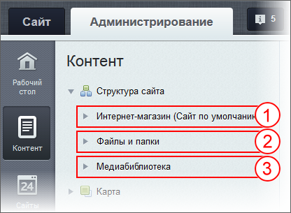
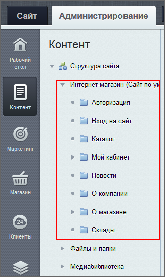
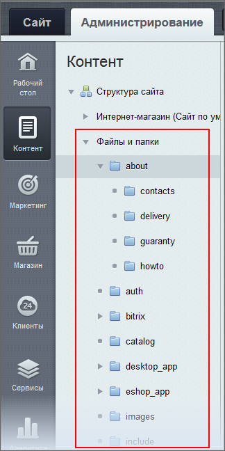

# Файловая система

**Навигация**
- [← Оглавление курса](index.md)
- [← Предыдущий: 3446 — Публичная и административная части](lesson_3446.md)
- [Следующий: 8627 — Информационные блоки →](lesson_8627.md)

Официальная страница урока: https://dev.1c-bitrix.ru/learning/course/index.php?COURSE_ID=34&LESSON_ID=1977

|  | Это ознакомительный материал. Подробнее описано в разделе  Управление структурой сайта Управление структурой сайта включает в себя: 
 
 - Инструмент Структура для работы из публичной части;  
 - Менеджер файлов для работы из административного раздела; 
 - Управление меню и цепочкой навигации;  
 - Работу с медиабиблиотекой .
 [Подробнее ...](lesson_1950.md) |
| --- | --- |

|  | ### Такие же файлы, как и на вашем компьютере |
| --- | --- |

В файлах

			файловой системы

                    Файловая система — это часть "1С-Битрикс: Управление сайтом", включающая в себя все файлы и папки.

		 хранятся статическая информация и программный код самого *"1С-Битрикс: Управление сайтом"*.

Статическая информация - текст, картинки, видео, которые вы размещаете в файлах и папках Структуры сайта. Статическая информация не имеет никакого отношения к Базе данных.

#### Что такое файл и папка в Публичной части

Для статической информации файл - это страница сайта, папка - раздел сайта. Когда вы создаёте раздел на сайте - вы создаёте папку в Структуре сайта. Когда создаёте страницу в разделе - вы создаёте файл в этой папке.

Но есть ещё и файлы, которые не видны в публичной части сайта - это папки с программным кодом. Программный код расположен в папке `/bitrix`, изменять файлы в этой папке категорически запрещается!

#### Где хранятся сами файлы

Файлы и папки в Административном разделе расположены по пути Контент &gt; Структура сайта и визуально это выглядит так:

где:

1 - Логическая файловая структура, она будет называться также как называется ваш сайт и папки в ней будут называться так же как

			разделы на сайте

                    На иллюстрации сайт называется

 "Интернет-магазин". Так же называется и логическая

структура этого сайта.

		.

2 - Физическая файловая структура всегда будет называться "Файлы и папки". Папки в ней будут называться так, как они

			названы в файловой системе

                    

		.

3 - Медиабиблиотека. (Строго говоря, медиабиблиотека хранит файлы не в рамках файловой структуры, а в Базе данных. В Структуре сайта её разместили потому, что работа с ней схожа с работой с файлами.)

|  | #### Важно запомнить! |
| --- | --- |

- Файловая структура  в Административной части расположена в разделе Контент &gt; Структура сайта.
- У сайта есть физическая структура и логическая структура.
- Страница сайта - файл, а раздел сайта - папка с файлами. (Это утверждение касается статической информации. С динамической информацией будет не так.)
