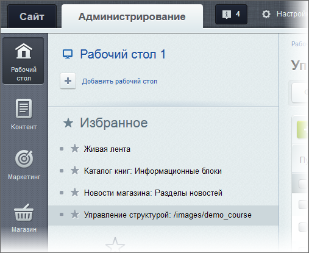

# Избранное

**Навигация**
- [← Оглавление курса](index.md)
- [← Предыдущий: 2774 — Гаджеты на рабочем столе](lesson_2774.md)
- [Следующий: 5081 — Контекстная помощь →](lesson_5081.md)

Официальная страница урока: https://dev.1c-bitrix.ru/learning/course/index.php?COURSE_ID=34&LESSON_ID=1990

### Видеоурок

**Избранное** позволяет в один клик мыши перейти на нужную страницу сайта или в нужный раздел Административного интерфейса. Такой переход возможен как из

			Публичной

                    

		, так и из

			Административной части

                    

		.  В Избранное можно добавить любую страницу как Публичного, так и Административного раздела, а также созданные вами фильтры.

### Добавление в Избранное и его настройка

Добавить страницу в Избранное из Публичного раздела:

- Откройте необходимую страницу.
- Выполните в левом верхнем углу на
  			панели управления
                      На Панели управления собраны все команды, которые доступны контент-менеджеру при работе с сайтом. [Подробнее](lesson_1831.md)...
  
  		 команду Меню &gt; Избранное &gt; Добавить в избранное. В Административном разделе откроется форма редактирования ссылки **Избранного**.
- Заполните поля ссылки и сохраните изменения.

Добавить страницу в Избранное в Административном разделе:

- с помощью специальной
  			кнопки-звёздочки рядом с названием
                      
  		;
- перетаскиванием (drag&drop) страницы (или предустановленного фильтра) из **Меню функций** к правому краю экрана. В начале процесса перетаскивания справа появится специальная панель. После размещения в ней страницы, эта страница добавляется в список избранного и появляется ссылка для перехода в Избранное.
  

Редактирование Избранного производится на странице Административного раздела Настройки &gt; Избранное (с публичной части на неё переходят по команде Закладка Сайты &gt; Меню &gt; Организовать избранное).

### Важно запомнить!

- При редактировании ссылки на странице Настройки &gt; Избранное можно изменить название ссылки, но нельзя менять ее путь (поле **Ссылка**). При необходимости можно добавить комментарий в специальное поле.
- Администратор может добавлять в список Избранного ссылки, которые видны всем.
- Если ссылки в **Меню** добавляет сам пользователь, то они видны только ему.

### Документация по теме

- [Список избранного](https://dev.1c-bitrix.ru/user_help/settings/favorites/favorite_list.php)
- [Создание и редактирование избранной ссылки](https://dev.1c-bitrix.ru/user_help/settings/favorites/favorite_edit.php)
