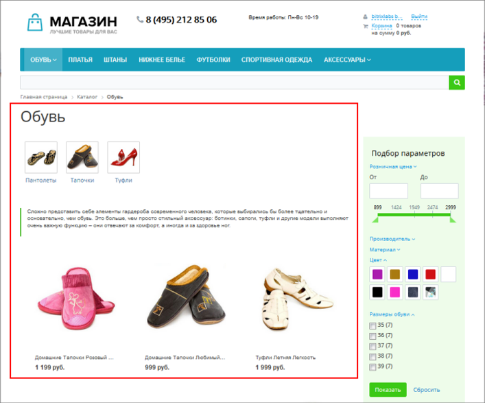
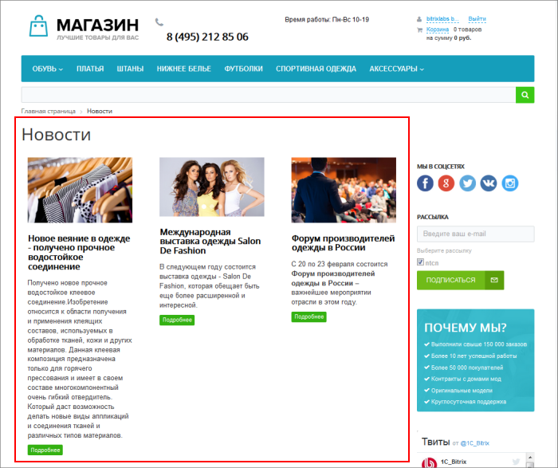
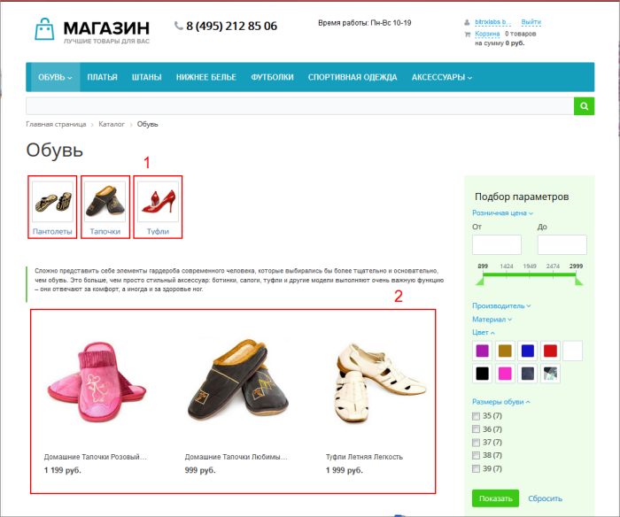

# Что такое компоненты

**Навигация**
- [← Оглавление курса](index.md)
- [← Предыдущий: 10193 — Практические задания](lesson_10193.md)
- [Следующий: 9163 — Как использовать компонент →](lesson_9163.md)

Официальная страница урока: https://dev.1c-bitrix.ru/learning/course/index.php?COURSE_ID=34&LESSON_ID=1992

### Видеоурок

Видеоролик поможет с помощью простой аналогии понять, что такое компоненты.

### Что такое компоненты?

Представьте, что сайт - это дом. Дом состоит из этажей и комнат. Каждая комната выполняет определенную функцию - в спальне мы спим, на кухне готовим еду, а в ванной принимаем душ.
Компонент - это готовая комната нашего дома. Мы просто "выстраиваем" внешний вид сайта из набора разных компонентов. Один компонент показывает новости, другой - сообщение в блоге. Это и есть функции компонентов.

Чтобы было понятнее, приведем примеры использования компонентов в реальной жизни. На картинках ниже компоненты выводят список товаров и список новостей:

**Итак**: компонент - это программный код, оформленный в визуальную оболочку, выполняющий определённую функцию какого-либо модуля по выводу данных в Публичной части.

### Какие бывают компоненты?

Компоненты бывают простые (одностраничные) и комплексные (многостраничные). Отдельная комната в доме - это простой компонент. Теперь представьте, что мы составили из нескольких комнат целый этаж. И использовать готовый этаж еще проще и удобнее. Это и будет аналогией для комплексного компонента.

Комплексный компонент объединяет в себе логику простых компонентов и выполняет уже более широкий набор функций.

Например, Вы хотите показать на сайте каталог товаров. Используйте комплексный компонент **Каталог товаров** и он автоматически создаст страницы для разделов (1) и отдельные страницы для каждого из товаров (2):

Повторим еще раз:

- Мы собираем страницу из **простых** компонентов. Каждый компонент занят показом своего типа информации (будь то новости или сообщения блога).
- **Комплексные** компоненты создают целый раздел. Вы не создаете страницу для каждого товара или новости, компонент делает это за Вас.

### Зачем нужны комплексные компоненты?

Вы можете возразить - почему бы не использовать только простые компоненты? Какие же проблемы решают комплексные компоненты?

- Вы не создаете вручную сложную структуру страниц и разделов сайта, она создается автоматически. Мы видим набор динамических страниц, но на физическом уровне это всего лишь одна страница с комплексным компонентом;
- Вы не задумываетесь как страницы будут связаны между собой. Все пути и связи устанавливаются автоматически.
- Предположим, возникла необходимость изменить внешний вид страниц с новостями. Вы не изменяете каждую страницу по отдельности, а меняете простым действием только комплексный компонент.

### Заключение

Вы разобрались с термином **компонент** и изучили разницу между простыми и комплексными компонентами. В следующих уроках мы детально разберем основные принципы работы с компонентами и покажем примеры использования.
