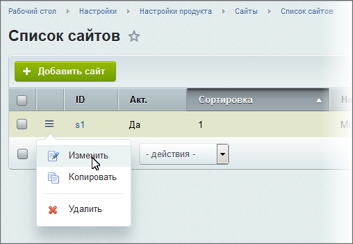

# Как работать с шаблонами сайта

**Навигация**
- [← Оглавление курса](index.md)
- [← Предыдущий: 12617 — Практические задания](lesson_12617.md)
- [Следующий: 4763 — Как заменить favicon.ico →](lesson_4763.md)

Официальная страница урока: https://dev.1c-bitrix.ru/learning/course/index.php?COURSE_ID=34&LESSON_ID=1994

### Введение

Контент-менеджер имеет возможность управлять внешним видом сайта при помощи

			шаблонов

                    [Создают шаблоны сайта](https://dev.1c-bitrix.ru/learning/course/index.php?COURSE_ID=43&CHAPTER_ID=02704) разработчики, т.к. необходимо знать о HTML, PHP и многом другом. Но управление существующими шаблонами доступно контент-менеджеру.

		.

> **Шаблон дизайна** задаёт внешний вид сайта. В нём
>
> 			определяется
>
>
>
>                     Шаблон включает в себя: программный HTML-код, графические элементы, таблицы стилей, дополнительные файлы для отображения контента, а так же шаблоны компонентов, шаблоны готовых страниц и сниппеты.
>
>
>
> 		 расположение различных элементов на сайте, художественный стиль и способ отображения страниц.

*"1С-Битрикс: Управление сайтом"* - очень гибкая система и допускает использование любого количества шаблонов:

- Назначайте собственный шаблон на каждый раздел сайта или на каждую страницу.
- Выводите разные шаблоны для одной и той же страницы в зависимости от
  			разных условий
                      Например: для авторизованных пользователей один шаблон, для неавторизованных - другой
  		.

### Видеоурок

### Как настроить применение шаблонов

Откройте в

			Административном разделе

                    Административный раздел - раздел системы, недоступный для просмотра обычным посетителям сайта. В нём производятся настройки сайта и системы для работы. У контент-менеджера есть к нему доступ, но работать там не рекомендуется. [Подробнее...](https://dev.1c-bitrix.ru/learning/course/index.php?COURSE_ID=34&CHAPTER_ID=04459&LESSON_PATH=3905.4455.4459)

		 страницу Настройки &gt; Настройки продукта &gt; Сайты &gt; Список сайтов. С помощью меню действий

			откройте для редактирования

                    

		 нужный сайт.

**Внимание!** Это очень важная страница! Кроме описанных ниже действий, не вносите других изменений без ведома администратора!

Внизу открывшейся формы есть секция **Шаблон сайта** с полями для заполнения:

Выберите шаблон, который вы хотите применить и условия. Рекомендуем пользоваться функцией предпросмотра с помощью иконки  для проверки верности выбора шаблона.

В полях колонки **Тип условия** укажите одно из условий, при котором шаблон применится:

- **Без условия** - к каждой странице сайта, к которой не указано другого условия. Типовое условие для большинства страниц.
- **Для папки и файла** - к указанной папке (разделу) или файлу (странице). В колонке **Условие** укажите папку или файл. Папка или файл указывается вручную, либо выбирается с помощью кнопки .
- **Для групп пользователей** - для пользователей из указанных групп. В колонке **Условия** выберите одну или
  			несколько
                      Несколько групп выбираются с помощью зажатия клавиши CTRL
  		 групп.
- **Период времени** - в указанный период времени. Используется для каких-то акций или праздников (например, на Новый год).
- **Параметр в URL** - в случае если в адресе страницы стоит
  			определенный параметр
                      Применяется, например, для печати страниц на принтере. На скриншоте выше это шаблон **Версия для печати**. Условие: **print** = **Y**.
  		.
- **Выражение PHP** - в соответствии с заданным выражением PHP.

**Важно**: Использование типов условий **Параметр в URL** и **Выражение PHP** позволяют настраивать очень сложные зависимости для применения шаблона, что требует определенной квалификации. Для использования этих типов лучше обратиться к администратору сайта.

### Про сортировку. Важно запомнить!

Обязательно проработайте порядок сортировки для шаблонов (колонка **Сорт.**). Указанные цифры определят порядок применения шаблонов.

**Важно**:
1. Шаблоны с условием **без условия** применяются последними, независимо от указанных значений сортировки.
2. Если условия имеют **одинаковые** индексы сортировки - раньше применится то условие, которое по порядку выше в списке.

Чтобы не запутаться, следуйте **общему правилу** настройки значений сортировки. Правило подобно перевернутой воронке:

1. Первые: условия частного характера (период времени, URL, PHP);
2. Потом условия выборки (для разделов или для группы пользователей);
3. Все остальное (как правило это - **без условия**).

## Нажмите на [+] для просмотра примеров работы сортировки

Рассмотрим разные варианты настройки шаблонов и их сортировки, и результаты таких настроек:

1. Условия: Стандартный шаблон для всех страниц и отдельный шаблон для страницы **Новости**:
2. Условия: Стандартный шаблон для всех страниц без условий и индивидуальные шаблоны: для страницы **Новости** и для группы пользователей **Администраторы**. Индексы сортировки:
3. Условия: набор шаблонов остается прежним. Но условие для группы **Администраторы** находится выше в списке. Индексы сортировки для условий группы и файла - одинаковые:

### Заключение

Шаблоны сайта применяются на странице настроек сайта, в группе **Шаблоны сайта**. Отображение конкретного вида страницы зависит от выбранных условий и сортировки списка шаблонов.

На странице "Настройки сайта" Контент-менеджеру, кроме шаблонов, менять ничего нельзя!

### Документация по теме

- [Описание условий в пользовательской документации](https://dev.1c-bitrix.ru/user_help/settings/settings/sites/site_edit.php#sets_templates)
