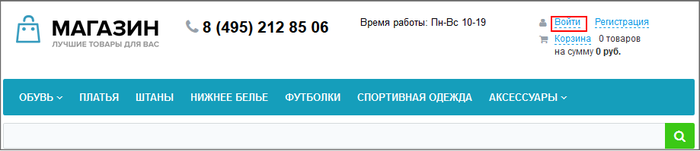
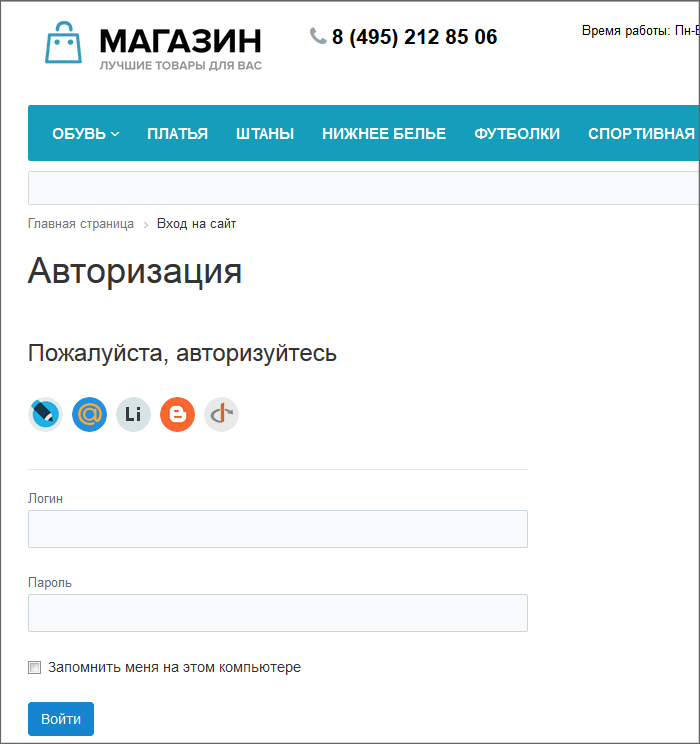
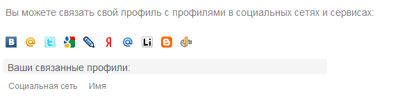
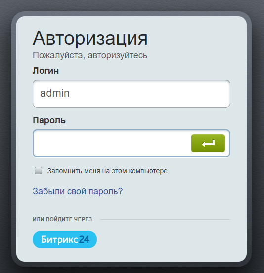
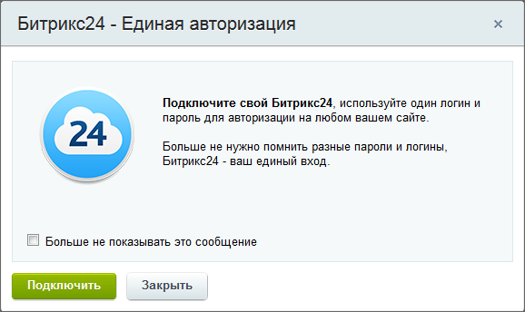
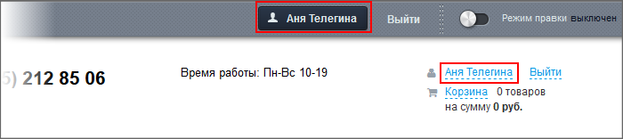
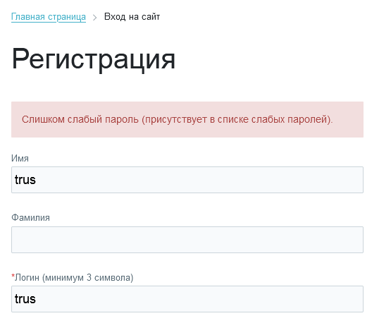

# Авторизация на сайте

**Навигация**
- [← Оглавление курса](index.md)
- [← Предыдущий: 2302 — Проверьте себя](lesson_2302.md)
- [Следующий: 2003 — Двухэтапная авторизация →](lesson_2003.md)

Официальная страница урока: https://dev.1c-bitrix.ru/learning/course/index.php?COURSE_ID=34&LESSON_ID=1996

### Видеоурок

Контент-менеджер перед началом работы должен

			авторизоваться

                    Авторизация - процесс, с помощью которого система отличает тех, кому можно работать с ней, от тех, кто может только просматривать сайт.

		. Процесс авторизации в "1С-Битрикс: Управление сайтом" несложный и понятный:

|  | #### Заключение |
| --- | --- |

- Авторизация - первое, что должен сделать контент-менеджер перед началом работы на сайте.
- Будьте внимательны с паролями доступа, их лучше запоминать, а не держать записанными на бумажке в доступных местах.

### Авторизация - ваш "пропуск" к работе

#### Как авторизоваться?

Ссылка на форму авторизации расположена, как правило, в верхней части сайта:

Клик по этой ссылке откроет форму авторизации:

Введите в ней свой **Логин**, **Пароль** и нажмите кнопку **Войти**. Страница обновится и теперь можно приступать к работе на сайте.

**Примечание**: Если в форме присутствуют

			значки социальных сетей

                    

		, то это значит, что на сайте доступна авторизация через эти сети. Для авторизации через соц. сеть достаточно кликнуть на иконку и ввести

			запрашиваемые данные

                    В зависимости от выбранной соц. сети, данные для авторизации могут несколько различаться. Например, может быть открыта отдельная страница авторизации в соц. сети для ввода логина и пароля.

		. Важно учитывать, что если войти на сайт с данными соц. сети в форме авторизации - будет создан новый аккаунт. Если же вы хотите привязать данные соц. сети к существующему аккаунту, то сначала привяжите социальную сеть

			на странице своего профиля

                    Найдите на сайте страницу редактирования своего профиля. Если там есть значки социальных
сетей, кликните на значок нужной сети и введите необходимые данные для авторизации в этой сети.

		 в *"1С-Битрикс: Управление сайтом"*.

**Примечание**: В коробочной версии *Битрикс24* доступен ещё один вариант входа - с помощью

			QR-кода

                    В коробочной версии Битрикс24, помимо стандартного входа с помощью логина / пароля или через соц. сервисы, доступен вход по QR-коду (как в браузере, так и в десктопе). Включите эту опцию и пользователи смогут быстро выполнять вход в Битрикс24 с помощью мобильного приложения Битрикс24.

Подробнее в курсе [Администратор сервиса Битрикс24 (коробочная версия)](https://dev.1c-bitrix.ru/learning/course/index.php?COURSE_ID=48&LESSON_ID=23420).

		.

#### Авторизация в Административном отделе

Как правило все сайты имеют возможность авторизации из

			публичного раздела

                    Публичный раздел - то, что видит посетитель сайта, но для контент-менеджера - это основное место работы . [Подробнее...](https://dev.1c-bitrix.ru/learning/course/index.php?COURSE_ID=34&CHAPTER_ID=04458&LESSON_PATH=3905.4455.4458)

		. Но на некоторых проектах разработчики оставляют возможность авторизации только в

			административном разделе

                    Административный раздел - раздел системы, недоступный для просмотра обычным посетителям сайта. В нём производятся настройки сайта и системы для работы. [Подробнее...](https://dev.1c-bitrix.ru/learning/course/index.php?COURSE_ID=34&CHAPTER_ID=04459&LESSON_PATH=3905.4455.4459)

		. Если вам понадобится авторизоваться с административной части системы, то в адрес сайта допишите:

			/bitrix/

                    То есть в адресной строке браузера должно быть набрано: https://&lt;название_сайта&gt;/bitrix/

		 и нажмите кнопку

			Ввод

                    Вы должны увидеть форму, как на скриншоте ниже. Если у вас старая версия
продукта и вы видите только серый фон и форма не появляется, возможной
причиной может быть блокирование антивирусной программой.

		.

## Единая авторизация в коробочной версии Битрикс24

При входе в Административный раздел предлагается

			подключить единую авторизацию

                    С версии главного модуля 16.0.0.

		:

**Битрикс24.Паспорт** – единый профиль пользователя, где можно видеть все ваши подключенные Битрикс24. В паспорте объединены легкость управления профилем и единый доступ ко всем Битрикс24, где вы приглашены как обычный пользователь или являетесь администратором. Вы можете быстро отредактировать свой профиль во всех своих Битрикс24 одним кликом без необходимости заходить в каждый из них.

Подключение выполняется с помощью мастера в несколько шагов и не должно вызвать затруднений. А почитать подробнее о Битрикс24.Паспорт и его подключении можно в статьях:

- [Авторизация в Битрикс24.Паспорт](https://helpdesk.bitrix24.ru/open/15883010/)
- [Битрикс24.Паспорт](https://helpdesk.bitrix24.ru/open/9901685/)

#### Как понять, что вы авторизованы

Когда контент-менеджер авторизован на сайте, то на месте ссылки для авторизации (и на

			Панели управления

                    На Панели управления собраны все команды, которые доступны контент-менеджеру при работе с сайтом. [Подробнее](lesson_1831.md)...

		) отображаются его данные:

Кликнув по записи в панели управления вы перейдёте в Административный раздел в свой профиль для изменения данных своего аккаунта. Если, конечно, администратор разрешил такие действия для пользователей.

### Контроль слабых паролей

> **Слабый пароль** - пароль, который может быть легко угадан или подобран методом полного перебора.

Администратор сайта может включить специальный

			функционал

                    Эта опция доступна с версии 21.500 Главного модуля. Контроль слабых паролей может быть включён для любой группы пользователей по отдельности.

[Подробнее в курсе "Администратор.Базовый".](https://dev.1c-bitrix.ru/learning/course/index.php?COURSE_ID=35&LESSON_ID=14172)

			Контроль слабых паролей

                    Для закрепления посмотрите короткий ролик:

		. При включённом этом инструменте пользователь не сможет зарегистрироваться в системе до того, как подберёт себе сильный пароль:

Так же администратор может включить функцию смены пароля. В этом случае, если у вас уже используется слабый пароль, то при попытке авторизации появится надпись:

Вам нужно будет подобрать для себя новый сильный пароль.
