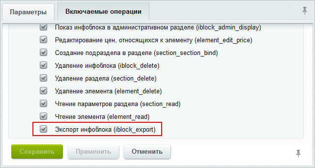

# Экспорт данных

**Навигация**
- [← Оглавление курса](index.md)
- [← Предыдущий: 2000 — Импорт данных](lesson_2000.md)
- [Следующий: 2002 — Импорт данных →](lesson_2002.md)

Официальная страница урока: https://dev.1c-bitrix.ru/learning/course/index.php?COURSE_ID=34&LESSON_ID=2001

### Экспорт данных


Выгружайте данные из инфоблока в формате XML. Встроенный инструмент позволяет переносить не только содержимое инфоблоков, но и все свойства (в том числе и пользовательские свойства разделов) и изображения. Экспорт в XML-файл совершается всего за 3 шага.


**Шаг 1.** Откройте страницу **Экспорт XML** (Контент &gt; Инфоблоки &gt; Экспорт &gt; XML):


**Шаг 2.** Задайте параметры экспорта:


- **Файл для выгрузки** – укажите путь относительно корня сайта к файлу и сам XML-файл, в который будет выгружена информация из инфоблока. Для файла достаточно задать только его имя, а инфоблок выгрузится по указанному пути в файл `<имя_файла>.xml`. По указанному в этом поле пути файл с экспортированными данными можно будет забрать из файловой системы сайта.
- **Информационный блок** – выберите информационный блок для экспорта.
- **Длительность шага в секундах** – укажите количество секунд выполнения шага экспорта. Если указано **0**, то экспорт инфоблока будет осуществлен за один шаг. Учтите, что слишком маленький шаг может существенно нагрузить систему, если элементов очень много, а большой шаг - удлинить процесс экспорта.
- **Разделы** – задайте условия выгрузки разделов.
- **Элементы** – определите условия выгрузки элементов.


**Примечание**: экспорт инфоблока в XML не имеет ограничений на вложенность.


**Шаг 3.** Нажмите кнопку **Экспортировать**. Начинается экспорт инфоблока, над формой отображается ход процесса выгрузки. По окончании выводится соответствующее

			сообщение

                    

		.


Итак, xml-файл с данными доступен для скачивания по указанному в параметре **Файл для выгрузки** пути. Изображения и файлы инфоблока выгружаются в папку с названием `<имя_файла>_files` (она размещается внутри той же папки, где и файл экспорта).


## Таблица соответствия CommerсML и инфоблоков

В таблице ниже приведены соответствия тегов  CommerсML и стандартных полей инфоблоков\(свойств элементов) демо-данных.


| \| Значение \| Тип данных \| Обязательность \| Множественное \| Наименование \|<br>\| --- \| --- \| --- \| --- \| --- \|<br>\| CML2_ACTIVE \| boolean (логический) \| Нет \| Нет \| Активность \|<br>\| CML2_CODE \| string (строка) \| Нет \| Нет \| Символьный код \|<br>\| CML2_SORT \| Число \| Нет. По умолчанию автоматически генерируется \| Нет \| Сортировка \|<br>\| CML2_ACTIVE_FROM \| Дата\Время \| Нет. По умолчанию - не задано \| Нет \| Начало активности \|<br>\| CML2_ACTIVE_TO \| Дата\Время \| Нет. Можно задать продолжительность активности (дней) \| Нет \| Окончание активности \|<br>\| CML2_PREVIEW_TEXT \| HTML/Текст \| Нет \| Нет \| Анонс \|<br>\| CML2_DETAIL_TEXT \| HTML/Текст \| Нет \| Нет \| Описание \|<br>\| CML2_PREVIEW_PICTURE \| Идентификатор файла \| Нет \| Нет \| Картинка для анонса \|<br>\| BLOG_POST_ID \| Число \| Нет \| Нет \| ID блога \|<br>\| REAL_PICTURE \| Файл \| Нет \| Нет \| Оригинал \|<br>\| DESCRIPTION \| Строка \| Нет \| Нет \| Описание \|<br>\| SOURCE \| Строка \| Нет \| Нет \| Источник \|<br>\| KEYWORDS \| Строка \| Нет \| Нет \| Ключевые слова \|<br>\| THEMES \| Привязка к разделам \| Нет \| Да \| Темы \|<br>\| BROWSER_TITLE \| Строка \| Нет \| Нет \| Заголовок окна браузера \|<br>\| AUTHOR \| Строка \| Нет \| Нет \| Автор \|<br>\| FORUM_TOPIC_ID \| Число \| Нет \| Нет \| Идентификатор темы форума \|<br>\| FORUM_MESSAGE_CNT \| Число \| Нет \| Нет \| Количество комментариев \|<br>\| vote_count \| Число \| Нет \| Нет \| Количество голосов \|<br>\| vote_sum \| Число \| Нет \| Нет \| Сумма голосов \|<br>\| rating \| Число \| Нет \| Нет \| Рейтинг \|<br>\| URL \| Строка \| Нет \| Нет \| Адрес сайта \|<br>\| EMAIL \| Строка \| Нет \| Нет \| Ваш e-mail \|<br>\| USER_ID \| Привязка к пользователю \| Нет \| Нет \| Владелец ресурса \|<br>\| PHONE \| Строка \| Нет \| Нет \| Телефон \|<br>\| FILE \| Привязка к файлу (на сервере) \| Нет \| Нет \| Файл \|<br>\| DURATION \| Строка \| Нет \| Нет \| Длительность \|<br>\| type \| Список \| Нет \| Нет \| Тип поля \|<br>\| values \| Строка \| Нет \| Да \| Значения \|<br>\| BIRTHDATE \| Дата\Время \| Нет \| Нет \| Год рождения \|<br>\| YEAR \| Строка \| Нет \| Нет \| Год выпуска \|<br>\| ISBN \| Строка \| Нет \| Нет \| ISBN \|<br>\| PAGES \| Строка \| Нет \| Нет \| Число страниц \|<br>\| PUBLISHER \| Строка \| Нет \| Нет \| Издатель \|<br>\| CML2_BAR_CODE \| Строка \| Нет \| Нет \| Штрихкод \|<br>\| CML2_ARTICLE \| Строка \| Нет \| Нет \| Артикул \|<br>\| CML2_ATTRIBUTES \| Строка \| Нет \| Да \| Характеристики \|<br>\| CML2_TRAITS \| Строка \| Нет \| Да \| Реквизиты \|<br>\| CML2_BASE_UNIT \| Строка \| Нет \| Нет \| Базовая единица \|<br>\| CML2_TAXES \| Строка \| Нет \| Да \| Ставки налогов \|<br>\| MORE_PHOTO \| Файл \| Нет \| Да \| Картинки \|<br>\| FORUM_TOPIC_ID \| Число \| Нет \| Нет \| ID темы форума \|<br>\| FORUM_MESSAGE_CNT \| Число \| Нет \| Нет \| Количество комментариев \|<br>\| BOOK \| Привязка к элементам \| Нет \| Нет \| Рецензия на книгу \|<br>\| PERSON \| Строка \| Нет \| Нет \| Руководитель \| |
| --- |


## Пример файла xml (инфоблок "Новости" демо-данных)

```

<?xml version="1.0" encoding="UTF-8"?>
<КоммерческаяИнформация ВерсияСхемы="2.021" ДатаФормирования="2019-09-17T14:31:35">
	<Классификатор>
		<Ид>clothes_news_s1</Ид>
		<Наименование>Новости</Наименование>
		<Свойства>
			<Свойство>
				<Ид>CML2_ACTIVE</Ид>
				<Наименование>БитриксАктивность</Наименование>
				<Множественное>false</Множественное>
			</Свойство>
			<Свойство>
				<Ид>CML2_CODE</Ид>
				<Наименование>Символьный код</Наименование>
				<Множественное>false</Множественное>
			</Свойство>
			<Свойство>
				<Ид>CML2_SORT</Ид>
				<Наименование>Сортировка</Наименование>
				<Множественное>false</Множественное>
			</Свойство>
			<Свойство>
				<Ид>CML2_ACTIVE_FROM</Ид>
				<Наименование>Начало активности</Наименование>
				<Множественное>false</Множественное>
			</Свойство>
			<Свойство>
				<Ид>CML2_ACTIVE_TO</Ид>
				<Наименование>Окончание активности</Наименование>
				<Множественное>false</Множественное>
			</Свойство>
			<Свойство>
				<Ид>CML2_PREVIEW_TEXT</Ид>
				<Наименование>Анонс</Наименование>
				<Множественное>false</Множественное>
			</Свойство>
			<Свойство>
				<Ид>CML2_DETAIL_TEXT</Ид>
				<Наименование>Описание</Наименование>
				<Множественное>false</Множественное>
			</Свойство>
			<Свойство>
				<Ид>CML2_PREVIEW_PICTURE</Ид>
				<Наименование>Картинка анонса</Наименование>
				<Множественное>false</Множественное>
			</Свойство>
			<Свойство>
				<Ид>240</Ид>
				<Наименование>Картинки новостей</Наименование>
				<Множественное>true</Множественное>
				<БитриксСортировка>500</БитриксСортировка>
				<БитриксКод>PICS_NEWS</БитриксКод>
				<БитриксТипСвойства>F</БитриксТипСвойства>
				<БитриксСтрок>1</БитриксСтрок>
				<БитриксКолонок>30</БитриксКолонок>
				<БитриксТипСписка>L</БитриксТипСписка>
				<БитриксТипыФайлов>jpg, gif, bmp, png, jpeg</БитриксТипыФайлов>
				<БитриксКоличествоПолей>5</БитриксКоличествоПолей>
				<БитриксСвязанныйИнфоблок></БитриксСвязанныйИнфоблок>
				<БитриксОписаниеРазрешено>false</БитриксОписаниеРазрешено>
				<БитриксПоискРазрешен>false</БитриксПоискРазрешен>
				<БитриксФильтрРазрешен>false</БитриксФильтрРазрешен>
				<БитриксРасширениеТипа></БитриксРасширениеТипа>
				<БитриксОбязательное>false</БитриксОбязательное>
				<БитриксЗначениеПоУмолчанию>s:0:"";</БитриксЗначениеПоУмолчанию>
				<Сериализовано>1</Сериализовано>
			</Свойство>
		</Свойства>
		<СвойстваЭлементов>
			<Свойство>
				<Ид>240</Ид>
				<УмныйФильтр>false</УмныйФильтр>
				<ТипОтображения></ТипОтображения>
				<ПоказатьРазвёрнутым>false</ПоказатьРазвёрнутым>
				<Подсказка></Подсказка>
			</Свойство>
		</СвойстваЭлементов>
		<Группы>
		</Группы>
	</Классификатор>
	<Каталог>
		<Ид>clothes_news_s1</Ид>
		<ИдКлассификатора>clothes_news_s1</ИдКлассификатора>
		<Наименование>Новости</Наименование>
		<БитриксКод>news</БитриксКод>
		<БитриксСортировка>500</БитриксСортировка>
		<БитриксURLСписок>#SITE_DIR#/news/</БитриксURLСписок>
		<БитриксURLДеталь>#SITE_DIR#/news/#ELEMENT_CODE#/</БитриксURLДеталь>
		<БитриксURLРаздел></БитриксURLРаздел>
		<БитриксURLКанонический></БитриксURLКанонический>
		<БитриксКартинка></БитриксКартинка>
		<БитриксИндексироватьЭлементы>true</БитриксИндексироватьЭлементы>
		<БитриксИндексироватьРазделы>false</БитриксИндексироватьРазделы>
		<БитриксДокументооборот>false</БитриксДокументооборот>
		<БитриксПодписи>
			<БитриксПодпись>
				<Ид>ELEMENT_NAME</Ид>
				<Значение>Новость</Значение>
			</БитриксПодпись>
			<БитриксПодпись>
				<Ид>ELEMENTS_NAME</Ид>
				<Значение>Новости</Значение>
			</БитриксПодпись>
			<БитриксПодпись>
				<Ид>ELEMENT_ADD</Ид>
				<Значение>Добавить новость</Значение>
			</БитриксПодпись>
			<БитриксПодпись>
				<Ид>ELEMENT_EDIT</Ид>
				<Значение>Изменить новость</Значение>
			</БитриксПодпись>
			<БитриксПодпись>
				<Ид>ELEMENT_DELETE</Ид>
				<Значение>Удалить новость</Значение>
			</БитриксПодпись>
			<БитриксПодпись>
				<Ид>SECTION_NAME</Ид>
				<Значение>Раздел</Значение>
			</БитриксПодпись>
			<БитриксПодпись>
				<Ид>SECTIONS_NAME</Ид>
				<Значение>Разделы</Значение>
			</БитриксПодпись>
			<БитриксПодпись>
				<Ид>SECTION_ADD</Ид>
				<Значение>Добавить раздел</Значение>
			</БитриксПодпись>
			<БитриксПодпись>
				<Ид>SECTION_EDIT</Ид>
				<Значение>Изменить раздел</Значение>
			</БитриксПодпись>
			<БитриксПодпись>
				<Ид>SECTION_DELETE</Ид>
				<Значение>Удалить раздел</Значение>
			</БитриксПодпись>
		</БитриксПодписи>
		<Товары>
			<Товар>
				<Ид>1</Ид>
				<Наименование>Форум производителей одежды в России</Наименование>
				<БитриксТеги></БитриксТеги>
				<Группы>
				</Группы>
				<Картинка>news_files/iblock/2f3/2f3e6f7f62c65af3cb2e311311892a93.jpg</Картинка>
				<ЗначенияСвойств>
					<ЗначенияСвойства>
						<Ид>CML2_ACTIVE</Ид>
						<Значение>true</Значение>
					</ЗначенияСвойства>
					<ЗначенияСвойства>
						<Ид>CML2_CODE</Ид>
						<Значение>forum_of_producers_of_clothes_in_russia</Значение>
					</ЗначенияСвойства>
					<ЗначенияСвойства>
						<Ид>CML2_SORT</Ид>
						<Значение>500</Значение>
					</ЗначенияСвойства>
					<ЗначенияСвойства>
						<Ид>CML2_ACTIVE_FROM</Ид>
						<Значение></Значение>
					</ЗначенияСвойства>
					<ЗначенияСвойства>
						<Ид>CML2_ACTIVE_TO</Ид>
						<Значение></Значение>
					</ЗначенияСвойства>
					<ЗначенияСвойства>
						<Ид>CML2_PREVIEW_TEXT</Ид>
						<Значение>С 20 по 23 февраля состоится <strong>Форум производителей одежды в России</strong> &ndash; важнейшее мероприятии отрасли в этом году.</Значение>
						<Тип>html</Тип>
					</ЗначенияСвойства>
					<ЗначенияСвойства>
						<Ид>CML2_DETAIL_TEXT</Ид>
						<Значение><p>С 20 по 23 февраля этого года состоится <strong>Форум производителей одежды в России</strong> &ndash; важнейшее мероприятии отрасли в текущем году. В экспозиции принимают участие свыше 160 компаний из <em>Беларуси, Австрии, Латвии, Литвы, России, Польши </em>и<em> Украины</em>. В составе форума состоится пять выставок:&quot;Московский Фэшн Салон&quot;, &quot;Технологии в Одежде&quot;, &quot;Офис Комфорт&quot;, &quot;Повседневная одежда&quot; и &quot;Детская одежда&quot;. Экспозиция будет строиться по принципу двух тематических секторов:<em> одежда</em> и <em>материалы для ее производства</em>.
					<br />
					</p>

					<p>В секторе готовой одежды будут представлены:</p>

					<ul>
					<li>одежда для дома;</li>

					<li>одежда для детей и молодежи;</li>

					<li>аксессуары в одежде;</li>

					<li>одежда для спорта и отдыха;</li>

					<li>одежда для офиса.</li>
					</ul>

					<p>В секторе материалов для производства одежды будут демонстрироваться новинки рынка одежной фурнитуры, материалов, тканей, элементов и аксессуаров для производства одежды.
					<br />
					</p>

					<p>Помимо расширенной экспозиции пяти тематических выставок &quot;Экспофорум&quot; подготовил разнообразную деловую программу форума производителей Одежды. В рамках выставки состоятся семинары и мастер-классы. И поистине масштабным в этом году обещает стать республиканский конкурс форума &quot;<strong>Народное признание</strong>&quot;. В этом году он выходит за рамки выставки и становится республиканским смотром образцов одежды.   </p>

					<p><strong>Форум производителей Одежды</strong> предоставляет специалистам возможность познакомиться с тенденциями моды, провести переговоры, получить практические предложения рынка, увидеть перспективы развития и новые конкурентные преимущества. Впервые для участников конкурса будет подготовлен маркетинговый отчет по результатам опроса посетителей выставок <strong>Форума производителей Одежды</strong>.
					<br />
					</p>

					<p><em>Прием заявок на участие в конкурсе осуществляется до 12 января этого года.</em></p>

					<ul> </ul>
 </Значение>
						<Тип>html</Тип>
					</ЗначенияСвойства>
					<ЗначенияСвойства>
						<Ид>CML2_PREVIEW_PICTURE</Ид>
						<Значение>news_files/iblock/9cb/9cb4477b7b086001cba0a24be9d1ad8a.jpg</Значение>
					</ЗначенияСвойства>
					<ЗначенияСвойства>
						<Ид>240</Ид>
						<Значение></Значение>
					</ЗначенияСвойства>
				</ЗначенияСвойств>
			</Товар>
			<Товар>
				<Ид>8</Ид>
				<Наименование>Международная выставка одежды Salon De Fashion</Наименование>
				<БитриксТеги></БитриксТеги>
				<Группы>
				</Группы>
				<Картинка></Картинка>
				<ЗначенияСвойств>
					<ЗначенияСвойства>
						<Ид>CML2_ACTIVE</Ид>
						<Значение>true</Значение>
					</ЗначенияСвойства>
					<ЗначенияСвойства>
						<Ид>CML2_CODE</Ид>
						<Значение>exhibition_salon_de_fashion</Значение>
					</ЗначенияСвойства>
					<ЗначенияСвойства>
						<Ид>CML2_SORT</Ид>
						<Значение>500</Значение>
					</ЗначенияСвойства>
					<ЗначенияСвойства>
						<Ид>CML2_ACTIVE_FROM</Ид>
						<Значение></Значение>
					</ЗначенияСвойства>
					<ЗначенияСвойства>
						<Ид>CML2_ACTIVE_TO</Ид>
						<Значение></Значение>
					</ЗначенияСвойства>
					<ЗначенияСвойства>
						<Ид>CML2_PREVIEW_TEXT</Ид>
						<Значение>В следующем году состоится выставка одежды - Salon De Fashion, которая обещает быть еще более расширенной и интересной.</Значение>
						<Тип>html</Тип>
					</ЗначенияСвойства>
					<ЗначенияСвойства>
						<Ид>CML2_DETAIL_TEXT</Ид>
						<Значение>В следующем  году выставка Salon De Fashion обещает быть еще более расширенной и интересной. На выставке Salon De Fashion будут представлены все типы одежды для офиса и дома от платьев и шорт до VIP-аксессуаров, включая оборудование для производства и детской одежды.
					<div>
					<br />
					</div>

					<div>Заявки на участие подали более чем 1 500 компаний со всего мира. Предполагается, что за время проведения выставки ее посетят более 300 000 тысяч человек. Экспозиция выставки разместится на общей площади 149 871 кв.м. В следующем году эта поистине грандиозная выставка будет проводиться уже в 14-й раз.</div>
				</Значение>
						<Тип>html</Тип>
					</ЗначенияСвойства>
					<ЗначенияСвойства>
						<Ид>CML2_PREVIEW_PICTURE</Ид>
						<Значение>news_files/iblock/093/093e2024f3fac9f2fd918d3a48eb7ee8.jpg</Значение>
					</ЗначенияСвойства>
					<ЗначенияСвойства>
						<Ид>240</Ид>
						<Значение>news_files/iblock/724/724fe965bd20759d515fb9037b0f23bf.jpg</Значение>
						<ЗначениеСвойства>
							<Значение>news_files/iblock/724/724fe965bd20759d515fb9037b0f23bf.jpg</Значение>
							<Описание></Описание>
						</ЗначениеСвойства>
						<Значение>news_files/iblock/e2f/e2fe8b9ff65f860c2c129a5be68f0707.jpg</Значение>
						<ЗначениеСвойства>
							<Значение>news_files/iblock/e2f/e2fe8b9ff65f860c2c129a5be68f0707.jpg</Значение>
							<Описание></Описание>
						</ЗначениеСвойства>
						<Значение>news_files/iblock/20b/20b92dc30a248caa61f40f0eb4fc2eec.jpg</Значение>
						<ЗначениеСвойства>
							<Значение>news_files/iblock/20b/20b92dc30a248caa61f40f0eb4fc2eec.jpg</Значение>
							<Описание></Описание>
						</ЗначениеСвойства>
					</ЗначенияСвойства>
				</ЗначенияСвойств>
			</Товар>
			<Товар>
				<Ид>9</Ид>
				<Наименование>Новое веяние в одежде - получено прочное водостойкое соединение</Наименование>
				<БитриксТеги></БитриксТеги>
				<Группы>
				</Группы>
				<Картинка>news_files/iblock/d2d/d2d919405b231070995cf88eb671ea68.jpg</Картинка>
				<ЗначенияСвойств>
					<ЗначенияСвойства>
						<Ид>CML2_ACTIVE</Ид>
						<Значение>true</Значение>
					</ЗначенияСвойства>
					<ЗначенияСвойства>
						<Ид>CML2_CODE</Ид>
						<Значение>waterproof_connection</Значение>
					</ЗначенияСвойства>
					<ЗначенияСвойства>
						<Ид>CML2_SORT</Ид>
						<Значение>500</Значение>
					</ЗначенияСвойства>
					<ЗначенияСвойства>
						<Ид>CML2_ACTIVE_FROM</Ид>
						<Значение></Значение>
					</ЗначенияСвойства>
					<ЗначенияСвойства>
						<Ид>CML2_ACTIVE_TO</Ид>
						<Значение></Значение>
					</ЗначенияСвойства>
					<ЗначенияСвойства>
						<Ид>CML2_PREVIEW_TEXT</Ид>
						<Значение>Получено новое прочное водостойкое клеевое соединение.Изобретение относится к области получения и применения клеящих составов, используемых в обработке тканей, кожи и других материалов. Данная клеевая композиция предназначена только для горячего прессования и имеет в своем составе многокомпонентный очень гибкий отвердитель. Который даст возможность делать новые виды аппликаций и соединения тканей и различных типов материалов.</Значение>
						<Тип>html</Тип>
					</ЗначенияСвойства>
					<ЗначенияСвойства>
						<Ид>CML2_DETAIL_TEXT</Ид>
						<Значение><b>Авторы изобретения</b>: Разиньков Егор Михайлович и Зайцева Анна Анатольевна
					<br />
					Патент Российской Федерации RU2277566
					<br />

					<h3>Описание изобретения</h3>

					<p>Изобретение относится к области получения и применения клеящих составов, используемых в производстве одежды и аксессуаров. Данная клеевая композиция предназначена только для горячего прессования и имеет в своем составе многокомпонентный гибкий отвердитель. Прототипом клеевой композиции является клей, состоящий из карбамидоформальдегидной смолы, сополимера акрилонитрила с N-винилкапролактамом и отвердитель. В качестве отвердителя применяют хлористый аммоний либо акриловую кислоту. </p>

					<p>Изобретение решает задачу по получению прочного и водостойкого клеевого соединения. Это достигается тем, что клеевая композиция, включающая синтетическую смолу и отвердитель, согласно изобретению, дополнительно содержит модификатор, причем в качестве синтетической смолы клеевая композиция включает карбамидомеламиноформальдегидную смолу с отвердителем 2542, в качестве модификатора - карбамидоформальдегидную смолу, а в качестве отвердителя - 10%-ный раствор щавелевой кислоты при следующем соотношении компонентов, мас.ч.: </p>

					<table cellspacing="0">
					<tbody>
					<tr> <td>Карбамидомеламиноформальдегидная смола</td><td>64,5-79,2</td> </tr>

					<tr> <td>10%-ный Раствор щавелевой кислоты</td><td>4,4-20,5</td> </tr>

					<tr> <td> Отвердитель для карбамидомеламиноформальдегидной </td><td>0,6-2,0</td> </tr>

					<tr> <td> смолы 2542</td><td>13,0-15,8</td> </tr>
					</tbody>
					</table>
</Значение>
						<Тип>html</Тип>
					</ЗначенияСвойства>
					<ЗначенияСвойства>
						<Ид>CML2_PREVIEW_PICTURE</Ид>
						<Значение>news_files/iblock/bc8/bc8a6974a75616f2f085cc5b913e0650.jpg</Значение>
					</ЗначенияСвойства>
					<ЗначенияСвойства>
						<Ид>240</Ид>
						<Значение></Значение>
					</ЗначенияСвойства>
				</ЗначенияСвойств>
			</Товар>
		</Товары>
	</Каталог>
</КоммерческаяИнформация>

```


### Кто может выполнять экспорт?


С версии 15.0.6 модуля **Информационные блоки** выгружать данные могут те пользователи, которым разрешена операция

			Экспорт инфоблока

                    

		. По умолчанию такая операция входит только в уровень доступа **Полный доступ**.


Создавайте собственные

			уровни доступа,


Система разграничения доступа позволяет гибко управлять правами пользователей. В системе введено понятие уровней доступа, которые состоят из набора разрешенных операций (например, права на создание файлов, управление пользователями и другие) и привязываются к модулям и группам пользователей.


Уровни доступа — определенный комплекс операций в системе, доступный для выполнения пользователем. Они предназначены для создания системы управления пользователями. Уровни доступа определяются администратором и могут быть как изменены, так и созданы. Обладают свойством "наследования", то есть если для текущего раздела/страницы явно не задан уровень прав, тогда устанавливается то право, которое задано для вышележащего раздела.

[Подробнее](/learning/course/index.php?COURSE_ID=35&LESSON_ID=2015#create)...

		 чтобы пользователи не имели полного доступа, но могли экспортировать инфоблок.


**Примечание:** для создания уровней доступа необходимо обладать правами администратора. Если такой возможности нет, то обратитесь за помощью к администратору сайта.


### Заключение


Итак, вы познакомились, как выгрузить данные из инфоблока в XML-файл, а также узнали, кто может это делать. Почитайте [следующий урок](lesson_2002.md) и узнайте, как загружать в инфоблок данные в XML формате.


### Документация по теме


- [Экспорт в формате XML](https://dev.1c-bitrix.ru/user_help/content/iblock/export/export_xml.php)
- [Описание структуры файлов XML](https://dev.1c-bitrix.ru/api_help/sale/xml/index.php)
