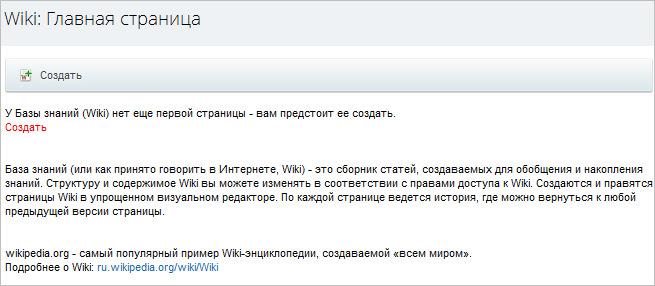
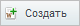

# Создание самой Wiki и страниц

**Навигация**
- [← Оглавление курса](index.md)
- [← Предыдущий: 2049 — Основные понятия](lesson_2049.md)
- [Следующий: 2052 — Редактирование страницы и история →](lesson_2052.md)

Официальная страница урока: https://dev.1c-bitrix.ru/learning/course/index.php?COURSE_ID=34&LESSON_ID=2005

Размещение Wiki на проекте осуществляется типовым для продуктов компании *"1С-Битрикс"* способом:

			добавлением

                    В визуальном редакторе переместите мышкой компонент в рабочую область страницы.

 

[Читать подробнее...](lesson_9163.md)

		 комплексного

			компонента

                    Компонент – это программный код, оформленный в визуальную оболочку, выполняющий определённую функцию какого-либо модуля по выводу данных в Публичной части. Мы можем вставлять этот блок кода на страницы сайта без непосредственного написания кода. [Подробнее...](https://dev.1c-bitrix.ru/learning/course/index.php?COURSE_ID=34&CHAPTER_ID=04457)

		 **Wiki** (**bitrix:wiki**) на страницу сайта. Параметры настроек полей компонента смотрите в разделе [Wiki](http://dev.1c-bitrix.ru/user_help/content/wiki/index.php) документации к продукту.

### Видеоурок

**Примечание**: Перед размещением компонента предварительно

			создайте тип информационного блока

Откройте страницу Контент &gt; Инфоблоки &gt; Типы инфоблоков и нажмите **Добавить новый тип**.

 

[Читать подробнее...](lesson_2010.md)

		 и

			информационный блок

Откройте страницу Контент &gt; Инфоблоки &gt; Типы инфоблоков &gt; название_типа (где вместо
*название_типа* у вас отображается реальное название нужного типа инфоблоков) и нажмите

**Добавить инфоблок**.

 

[Подробнее](lesson_4534.md)...

		 для Wiki. Это делает администратор сайта.

### Создание первой страницы

Если еще не создано ни одной страницы, посетитель сайта увидит Главную страницу в таком виде:

Для создания первой страницы нажмите красную ссылку **Создать** или кнопку  . По этой команде откроется

			форма создания страницы

                     

		 с упрощенным визуальным редактором.

Текст рекомендуется добавлять с помощью упрощенного визуального редактора. В режиме **Текст** вместо привычного форматирования выводится специальная wiki-разметка, понятная программистам и программе. В режиме **Визуальный редактор** текст отображается сразу отформатированным.

Упрощенный визуальный редактор имеет кнопки, недоступные в других модулях системы:

-  **Формат** - доступна вставка заголовка вплоть до 6-го уровня вложений
-  **Ввод внутренней гиперссылки**. По этой кнопке создается внутренняя гиперссылка на пока еще не созданную страницу (красная ссылка). Название гиперссылки и название создаваемой страницы могут не совпадать.
  
  **Примечание**: В поле **Ссылка** нужно вводить не URL адрес ссылки, а название страницы, на которую вы хотите сослаться.
-  **Указать категорию**. Указываются [категория](lesson_2054.md) для страницы. Можно
  			выбрать из списка
                       
  		 уже существующих, можно добавить новую. Каждой странице можно назначить несколько категорий воспользовавшись этой кнопкой несколько раз.
-  **Ваша подпись и момент времени**. Кнопка вставляет имя и фамилию автора статьи (в том виде как он зарегистрирован в системе), дату и время создания (правки) статьи.
-  **Игнорировать Wiki-форматирование**. Текст отображается без учёта Вики-форматирования.
-  **Оформление текста в виде кода**. Позволяет вводить в текст сообщения программные коды без их искажения при просмотре.

**Примечание**: Wiki допускает настройку переадресации страниц. Если по каким-то причинам страница не должна отображаться, но удалять её нежелательно, то можно использовать переадресацию. Для этого необходимо в режиме текста добавить на страницу выражение `#REDIRECT [[**********]]`. Вместо звёздочек вставьте имя страницы, на которую производится перенаправление. Редактирование исходной страницы становится доступным только администратору.

Заполните текстом страницу и нажмите **Опубликовать**. Страница будет создана.

### Создание страницы из Красной ссылки

Для создания новой страницы по красной ссылке просто нажмите на нее. Откроется форма создания новой страницы.

**Примечание**: Возможен вариант, когда связанная страница создается не по красной ссылке, а самостоятельно по кнопке **Создать**. В этом случае произойдет автоматическая привязка вновь созданной страницы к существующей ссылке. И наоборот: можно сначала создать страницу, а потом создать на нее гиперссылки на других страницах.

**Примечание**: При создании (редактировании) страницы в рамках рабочей группы доступна опция **Опубликовать в живой ленте**. Если флажок установлен, то любое действие над данной страницей будет отмечено в Живой ленте сообщением. Статья, которая предварительно редактировалась без галочки, при установке галочки все равно остается скрытой.
