# Создание календаря событий

**Навигация**
- [← Оглавление курса](index.md)
- [← Предыдущий: 20620 — Умный фильтр для новостей](lesson_20620.md)
- [Следующий: 5193 — Медиа проигрыватель и Видеотека, в чём разница →](lesson_5193.md)

Официальная страница урока: https://dev.1c-bitrix.ru/learning/course/index.php?COURSE_ID=34&LESSON_ID=2007

Задумались о создании календаря на сайте? Инфоблоки выручат вас в этой ситуации.

### Видеоурок

Посмотрите видеоролик и вы узнаете, как всего за несколько минут создать календарь событий на своем сайте.

### Как создать календарь событий?

Создать календарь событий можно с помощью модуля **Информационные блоки**:

1. Добавьте
  			новый тип информационных блоков
                      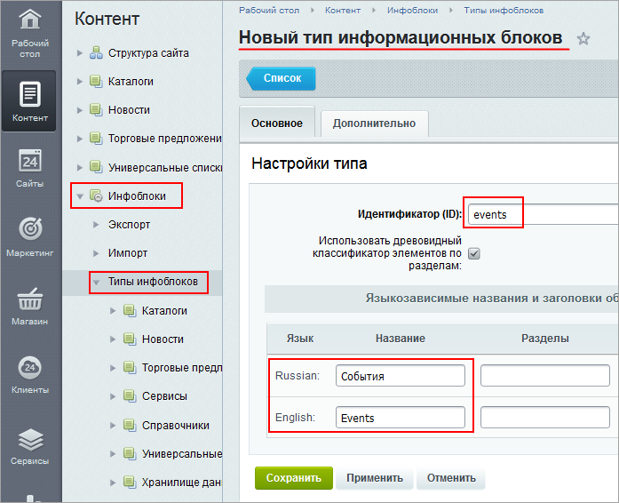
  		. Укажите идентификатор и название для типа на разных языках.
2. В новом типе
  			создайте инфоблок
                      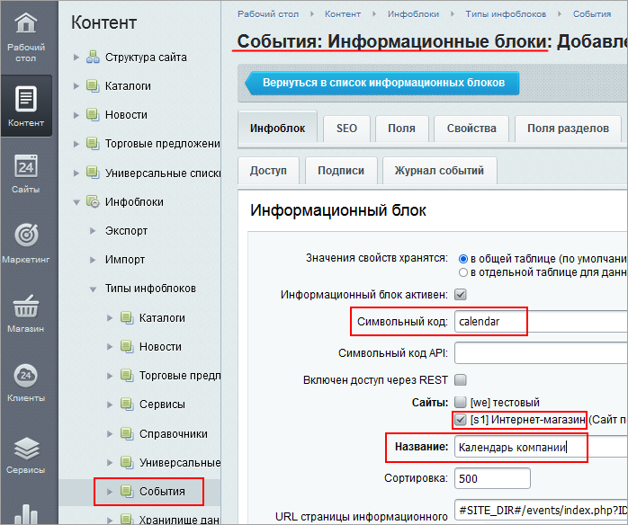
  		. Укажите для него символьный код, привязку к сайту, название.
3. Добавьте в инфоблок элементы. В
  			форме создания элемента
                      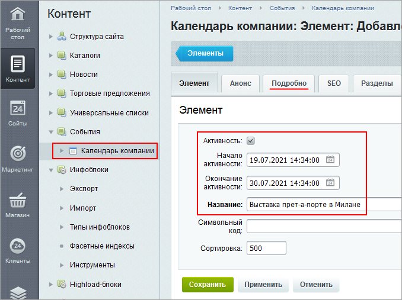
  		 проверьте:

  - проставлен флаг **Активность**;
  - заполнен период активности;
  - введено название;
  - на вкладке **Подробно** введена детальная информация по событию.
4. Создайте страницу календаря
                      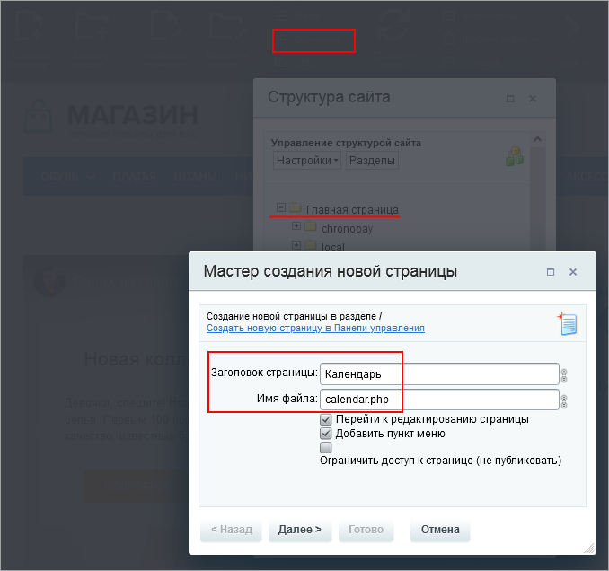
  		 на сайте: в **Публичном разделе** в меню **Структура** выберите раздел и приступите к созданию с помощью **Мастера создания новой страницы**:

  - задайте имя файла (страницы);
  - укажите название для пункта меню и
    			выберите его расположение
                        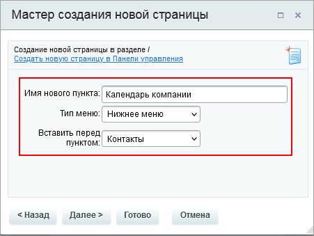
    		;
5. Разместите и настройте компонент:

  - перетащите компонент **Календарь** на страницу;
  - в параметрах компонента
    			укажите тип инфоблока
                        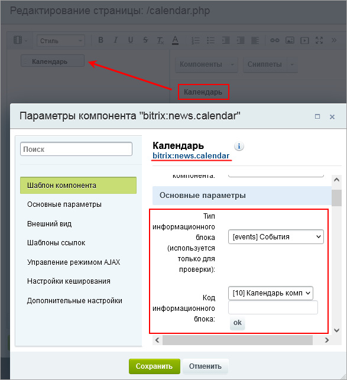
    		 и сам информационный блок событий;
  - задайте путь
                        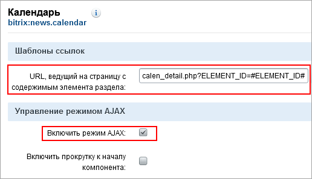
    		 к странице детального просмотра события;
  - включите режим AJAX;
  - задайте отображение событий по началу даты активности;
  - в качестве типа календаря выберите **Событийный**;
  - остальные параметры можно оставить по умолчанию.
6. Откройте
  			страницу календаря
                      
  		. На странице будет представлена
  			сетка календаря
                      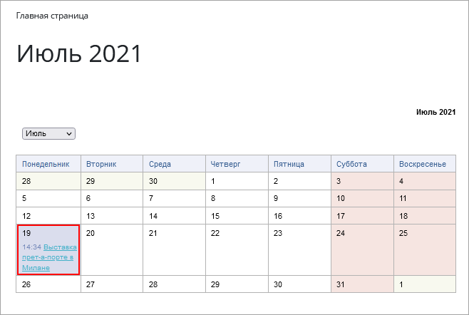
  		, элементы для навигации по календарю.
7. Создайте
  			страницу для детального просмотра события
                      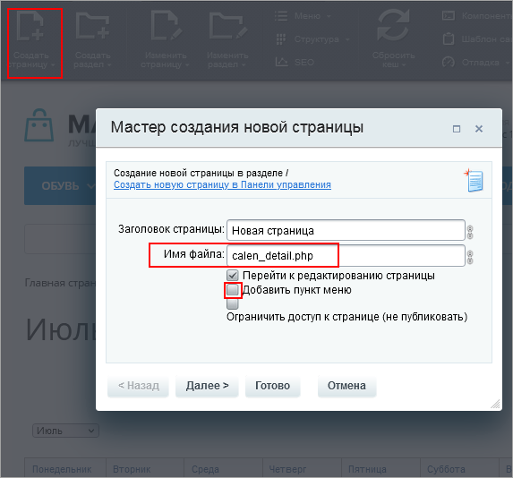
  		:

  - имя файла укажите то, которое ввели в настройках компонента **Календарь**;
  - снимите флаг добавления страницы в меню, нажмите **Готово**;
  - разместите на странице компонент **Новость детально**;
  - в
    			параметрах
                        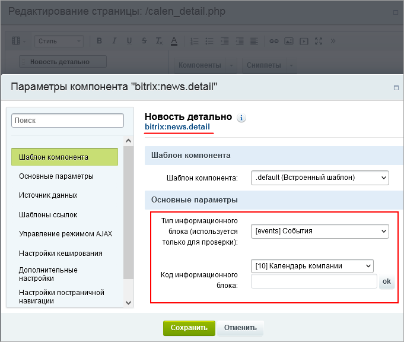
    		 укажите тип инфоблока, инфоблок событий;
  - снимите флаг **Показывать только активные на данный момент элементы**, чтобы можно было просматривать как прошедшие, так и предстоящие события;
  - укажите
    			путь к странице календаря
                        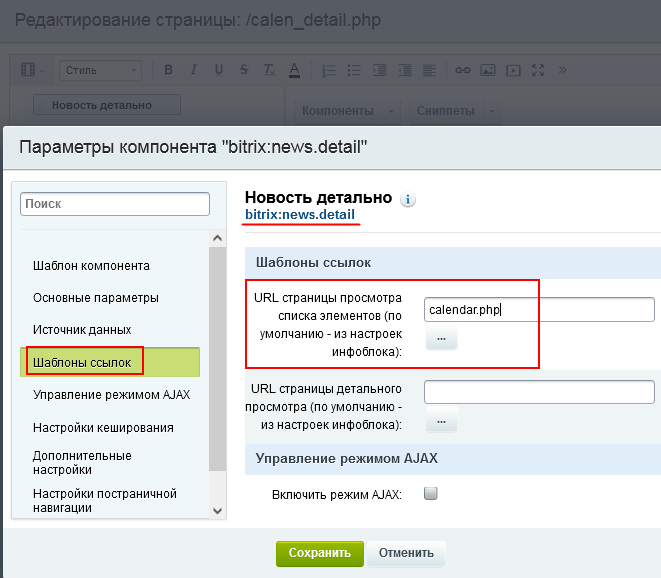
    		;
  - добавьте название элемента в цепочку навигации;
8. Теперь клик по названию события открывает страницу с подробным описанием.
