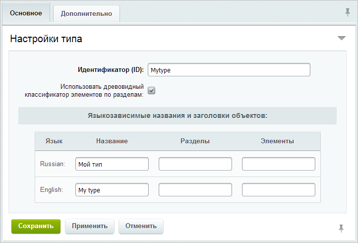

# Типы информационных блоков

**Навигация**
- [← Оглавление курса](index.md)
- [← Предыдущий: 2039 — Общий порядок работы с информационными блоками](lesson_2039.md)
- [Следующий: 4534 — Создание, редактирование и удаление инфоблока →](lesson_4534.md)

Официальная страница урока: https://dev.1c-bitrix.ru/learning/course/index.php?COURSE_ID=34&LESSON_ID=2010

### Типы инфоблоков

Вам предстоит работа с новым видом информации? Создайте под него свой тип инфоблоков:

1. В административном разделе сайта откройте страницу **Типы информационных блоков** (Контент &gt; Инфоблоки &gt; Типы инфоблоков).
2. Нажмите кнопку **Добавить новый тип**. Откроется форма
  			создания типа инфоблоков
                      
  		.
3. В поле **Идентификатор** введите латинскими буквами краткое название для вашего типа.
4. Поставьте флаг **Использовать древовидный классификатор элементов по разделам**, чтобы в инфоблоках этого нового типа можно было создавать разделы. Если вам нужны простые инфоблоки без разделов, то флаг не ставьте.
5. Укажите название типа для разных языков интерфейса в поле **Название**. Также вы можете переопределить слова *Разделы* и *Элементы*, например, на *Группы товаров* и *Товары*.
6. На этом настройку нового типа можно закончить - нажмите кнопку **Сохранить** (пока для нового типа не создан ни один инфоблок, этот тип не будет отображаться в разделе **Контент**).
  **Примечание:** на закладке **Дополнительно** располагаются необязательные и более экспертные настройки. Подробное их описание приведено в [документации по продукту](https://dev.1c-bitrix.ru/user_help/content/iblock/iblock_type_edit.php#create).

**Важно!** Создавать тип инфоблоков могут те пользователи, которые имеют полный доступ к главному модулю.

### Пример создания типа инфоблоков

### Заключение

Создание типа инфоблоков выполняется очень просто. Указывается только идентификатор, название и определяется использование разделов. Научитесь теперь [создавать и настраивать инфоблок](https://dev.1c-bitrix.ru/learning/course/index.php?COURSE_ID=34&CHAPTER_ID=02011&LESSON_PATH=3905.4477.2011).

|  |
| --- |

|  | ### Документация по теме |
| --- | --- |

- [Типы информационных блоков](https://dev.1c-bitrix.ru/user_help/content/iblock/iblock_type_admin.php)
- [Создание и редактирование типа информационных блоков](https://dev.1c-bitrix.ru/user_help/content/iblock/iblock_type_edit.php)
