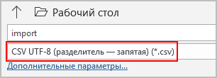
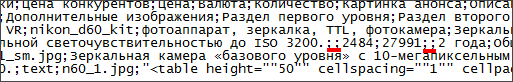

# Как подготовить CSV-файл для загрузки данных

**Навигация**
- [← Оглавление курса](index.md)
- [← Предыдущий: 1999 — Экспорт данных](lesson_1999.md)
- [Следующий: 2000 — Импорт данных →](lesson_2000.md)

Официальная страница урока: https://dev.1c-bitrix.ru/learning/course/index.php?COURSE_ID=34&LESSON_ID=2012

### Видеоурок

Когда наполняете сайт данными через инструмент импорта, то вас, несомненно, волнует вопрос успешности загрузки данных. Избегайте ошибок и траты времени впустую, подготавливайте csv-файл правильно. Рассмотрим основные вопросы подготовки файла с данными.

### В какой программе создавать файл?

Используйте **MS Excel**. Вы, конечно, можете пользоваться и другими, вплоть до простого текстового редактора **Блокнот**, но привычный табличный редактор более удобен. Создайте в **MS Excel** новый файл, заполните таблицу данными (подробнее остановимся ниже) и сохраните его с расширением

			csv.


**CSV** — текстовый формат, предназначенный для представления табличных данных. Строка таблицы соответствует строке текста, которая содержит одно или несколько полей, разделенных одинаковыми символами (запятой, точкой с запятой и т.д.).

## Пример итогового файла .csv

```

Название;Название раздела;Название подраздела;Фото;Анонс;Детальное описание
Чемпионы мира сыграли с детьми;Новости спорта;Футбол;child.jpg;Команда профессиональных футболистов провела дружеский матч с дворовыми командами города.;Это было сюрпризом для ребят. Участники сборной подъехали к полю, где играли ребята, и предложили сыграть дружеский матч.
Проведены первые тренировки;Новости спорта;Хоккей;hockey.jpg;Долгожданное открытие секции по хоккею;Всего за неделю был полностью оборудован каток для проведения игр, а также организованы раздевалки и зоны питания.
Новое кино - о любви и литературе;Новости кино;Русское кино;girl.jpg;По мотивам нашумевшего романа.;Деликатно и вместе с тем чувственно описаны события прошедшего столетия.
Результаты ожидаемой кинопремии;Новости кино;Зарубежное кино;cinema.jpg;Победители кинопремии поделились эмоциями.;Кто-то из них даже не ожидал, что именно он получит премию.
```

По умолчанию в 1С-Битрикс для файлов импорта используется разделитель «**;**» (точка с запятой). Если вы в своем файле используете иной, то при выполнении импорта не забудьте указать в настройках нужный.

**Примечания:**

1) Если при сохранении файла в csv-формате в **MS Excel** нет формата разделителя «;», то выберите разделитель «,». На самом же деле файл все равно сохранится с нужным разделителем – точка с запятой.

2) Сохранять файл нужно

			в кодировке вашего сайта


В нашем случае кодировка сайта UTF-8,

поэтому выбираем формат

**CSV UTF-8 (разделитель - запятая)**:



		 – эту информацию можно уточнить у администратора сайта или посмотреть в

			региональных настройках.


**Региональная настройка** - набор параметров, которые имеют разные значения в зависимости от культурных особенностей той или иной местности. Например: формат даты и времени, формат имени, первый день недели и другие. Управление языками интерфейса системы выполняется на странице **Языки интерфейса** (Настройки &gt; Настройки продукта &gt; Языковые параметры &gt; Языки интерфейса).

[Подробнее в курсе Администратор.Базовый](https://dev.1c-bitrix.ru/learning/course/index.php?COURSE_ID=35&LESSON_ID=2071&LESSON_PATH=3906.4493.4505.2071).

### Технический минимум полей

В файле **CSV** должно присутствовать хотя бы одно из двух полей (по этим полям элементы сопоставляются с базой данных):

- **Название** элемента (так элемент будет отображаться в каталоге);
- уникальный идентификатор элемента **XML_ID**.


Рассмотрим случаи, когда и какое из полей должно быть **обязательно**:

- Если Вы только **вносите изменения** в уже существующие на сайте элементы, то можно указывать только XML_ID (т.к. в первую очередь база данных сверяется именно по XML_ID);
- Если Вы **создаете новый элемент**, то Вам
  			достаточно
  При создании нового элемента можно (но не обязательно) добавить колонку с уникальными идентификаторами элементов **XML_ID** (в этом случае Вы самостоятельно сможете задать этот идентификатор — можно использовать буквы латинского алфавита и цифры).
  Если же такую колонку не создавать, то уникальные идентификаторы будут присвоены новым элементам **автоматически** (уникальный идентификатор XML_ID будет равен порядковому номеру ID).
  		 указать название элемента, а XML_ID будет добавлен автоматически при импорте.

### Создание структуры каталога

Часто при импорте необходимо, чтобы элементы попадали строго в нужные разделы уже созданного каталога. В этом случае в файле создайте колонки, которые будут объяснять системе, куда какой элемент распределять. Рассмотрим крайне простую структуру с двумя уровнями вложенности.

1. Создайте колонку для первого уровня и назовите ее, например, **Название раздела**.
2. Создайте колонку для второго уровня, например, **Название подраздела**.
3. Заполните колонки **Название раздела** и **Название подраздела** для всех элементов, согласно вашей структуре.
  **Примечания**:
  - Названия, вводимые в эти колонки, должны точно совпадать с теми названиями, которые используются в каталоге. Если названия не будут совпадать, то система при импорте создаст разделы с новыми названиями и в них поместит импортируемые элементы.
  - Структуру каталога можно заранее не создавать. При первом импорте будут созданы разделы нужного уровня вложенности с названиями, заданными в колонках файлах. Но при регулярном импорте важно указать точное  название разделов для импорта элементов.
  - Если будут указаны названия разделов нижнего уровня, но не указаны имена разделов верхнего уровня, то будут созданы папки верхнего уровня с именем «Пустое название». Если у вас случайно произошла такая ошибка, то повторного импорта можно не производить. Просто перенесите добавленные элементы в нужную папку.
  - Уровень глубины вложенности разделов для импорта определяется настройками модуля **Информационные блоки**.
4. Создайте колонки, соответствующие необходимым данным для импорта.
5. Заполните колонки данными.

### Некоторые моменты

- Название колонок с параметрами не обязательно должно совпадать с названиями параметров в системе. Главное, чтобы они были понятны пользователю, выполняющему импорт, и при задании условий импорта у него не возникло затруднений в определении соответствий полей создаваемого файла **CSV** и полей формы импорта.
- Добавление элемента в колонки со свойством типа **Привязка к элементу** не произведет автоматического привязывания элемента, если элементы еще не созданы (так как заполнить эту  колонку можно только **ID** элементов, а они еще неизвестны). Привязку необходимо осуществить после импорта вручную, как это делается при ручном добавлении. Однако если элементы инфоблоков уже созданы, то можно в соответствующие колонки ввести код элемента.
- При добавлении численных значений необходимо следить, чтобы разделитель десятичных знаков, используемый в 1С-Битрикс, совпадал с разделителем, используемым в csv-файле. В системе 1С-Битрикс в качестве разделителя десятичных знаков используется точка.
- Если для элемента отсутствует значение для некоторого типа данных, то нужно просто поставить
  			второй знак разделителя
                      Например: в описании товара отсутствуют данные в двух типах данных, соотвественно, эти пустые места выделены двумя разделителями: 
  		.
- Для загрузки данных для свойств с признаком  множественности необходимо повторить строку с элементом столько раз, сколько будет значений множественного поля.
  Например, множественное поле имеет
  			три значения
                      Три картинки к товару или к новости
  		. Следовательно, в csv-файле получится по три строки элемента на каждое значение поля. (Если множественных свойств несколько, то число строк должно равняться числу параметров наибольшего свойства. Ячейки для параметров свойств с меньшим числом можно просто оставить пустыми). Все строки должны быть одинаковыми по содержанию, за исключением множественных полей, которые изменяются указанием новых данных для этого свойства. Подобная особенность импорта с помощью стандартного механизма приводит к распуханию файла, если количество множественных свойств велико, и они интенсивно используются. При импорте больших файлов следует использовать пошаговые операции.
- Проверьте настройки
  			инфоблока
  В данном примере опция **Начало активности** отмечена как обязательная, поэтому в создаваемом
  файле csv тоже должна быть колонка с указанием начала активности элемента.
  
  		 (Контент &gt; Инфоблоки &gt; Типы инфоблоков &gt; [ваш тип инфоблока]/[ваш инфоблок]), в который Вы хотите загрузить файл: если во вкладках **Поля** или **Поля разделов** какие-либо поля отмечены как **обязательные**, то эти колонки должны быть **обязательно** и в загружаемом csv-файле. Например, таким полем может оказаться **Символьный код** и при импорте файла с элементами без символьных кодов вы получите
  			ошибку
                      Ошибка загрузки элемента: Обязательное поле "Символьный код"
  		.

### Изображения для элементов

Перед импортом загрузите изображения в систему. В csv-файле для них должны быть выделена своя отдельная колонка. Картинки могут быть расположены в любом месте в рамках файловой структуры, главное – указать при импорте правильный путь до них. Рекомендуется использовать папку `/upload`.

**Примечание:** Изображения также можно добавить со сторонних сайтов (но не из облачных хранилищ), прописав

			полные URL этих картинок

                    В случае, если в URL содержатся кириллические символы, они должны быть кодированы в формате Unicode. То есть, например, вместо https://www.google.ru/search?q=кодирование+кириллицы должно быть https://www.google.ru/search?q=%D0%BA%D0%BE%D0%B4%D0%B8%D1%80%D0%BE%D0%B2%D0%B0%D0%BD%D0%B8%D0%B5+%D0%BA%D0%B8%D1%80%D0%B8%D0%BB%D0%BB%D0%B8%D1%86%D1%8B.

		.

Этот способ не рекомендуется для загрузки больших каталогов, т.к. при импорте каталога изображения будут копироваться на Ваш сайт (если php на сервере это разрешает), и сам процесс импорта займёт значительно большее время.

### Заключение

Вы ознакомились с важными моментами создания csv-файла. Почитайте [следующий урок](lesson_2000.md) и приступайте к процедуре импорта.
