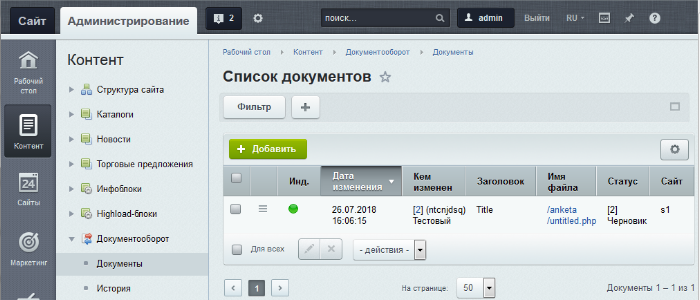
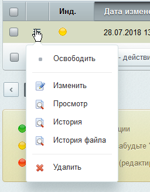
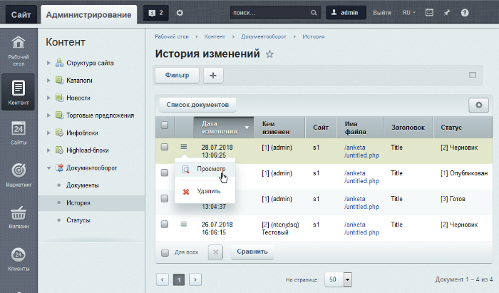

# Документы и история

**Навигация**
- [← Оглавление курса](index.md)
- [← Предыдущий: 2008 — Возможности модуля](lesson_2008.md)
- [Следующий: 3447 — Создание страниц через документооборот →](lesson_3447.md)

Официальная страница урока: https://dev.1c-bitrix.ru/learning/course/index.php?COURSE_ID=34&LESSON_ID=2038

### Список документов

На странице **Документы** (Контент &gt; Документооборот &gt; Документы) отображены статические страницы сайта, находящиеся не в статусе **Опубликован**:

На странице списка документов можно

			создать страницу

                    Нажмите кнопку 

		 и

			изменить, просмотреть, удалить

                    

		 документ.

Если к документу имеют доступ несколько человек, то возможна ситуация, когда кто-то уже редактирует документ. Обращайте внимание на

			цветовые индикаторы

                    Индикатор, показывающий, в каком состоянии редактирования находится документ:

 - документ свободен для редактирования;

 - документ временно заблокирован вами. Помните, кроме вас его никто не сможет редактировать. Максимальное время блокировки устанавливается в [настройках](/learning/course/index.php?COURSE_ID=41&LESSON_ID=3130) модуля **Документооборот**;

 - документ редактируется в данный момент другим пользователем.

		 блокировки документа.

### История изменений

На странице **История** (Контент &gt; Документооборот &gt; История) отображены изменения статусов статических страниц сайта с указанием всех необходимых данных (кем была изменена, когда, в каком статусе находится):

### Документация по теме

- [Статусы](https://dev.1c-bitrix.ru/user_help/content/workflow/workflow_status_list.php)
- [Документы](https://dev.1c-bitrix.ru/user_help/content/workflow/workflow_list.php)
- [История](https://dev.1c-bitrix.ru/user_help/content/workflow/workflow_history_list.php)
