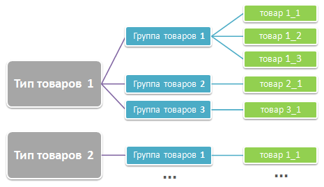

# Общий порядок работы с информационными блоками

**Навигация**
- [← Оглавление курса](index.md)
- [← Предыдущий: 1882 — Как устроены информационные блоки](lesson_1882.md)
- [Следующий: 2010 — Типы информационных блоков →](lesson_2010.md)

Официальная страница урока: https://dev.1c-bitrix.ru/learning/course/index.php?COURSE_ID=34&LESSON_ID=2039

|  | ### Общий порядок работы с информационными блоками |
| --- | --- |

Создание любого раздела сайта с использованием информационных блоков необходимо проводить в следующем порядке:

1. Внимательное продумывание структуры информационных блоков.
  **Примечание**. На начальном этапе создания сайта еще можно будет переделать всю работу без особых временных потерь. Однако после импорта какой-нибудь большой базы данных при неудачно созданной структуре возможна ситуация, когда потребуется повторить весь импорт заново. Информационные блоки не могут менять свой тип. И если вам нужно перенести данные из одного типа инфоблока в другой, то сделать это можно только экспортом данных и импортом их в новый инфоблок другого типа. Аналогично и с разделами и элементами.

Создание нужного типа инфоблоков с настройкой параметров.
Создание самих инфоблоков с настройкой параметров.
Создание разделов - структуры внутри инфоблока.
Создание элементов.
Создание физической страницы (в случае использования комплексного компонента) или страниц (при использовании простых компонентов) и размещение на ней компонента (компонентов) с последующей настройкой свойств компонента.
Кастомизация работы компонента под потребности ТЗ сайта.

Четвертый и пятый пункт, как правило, выполняют контент-менеджеры, если наполнение инфоблока производится вручную, а не импортом.

Одной из самых простых и распространенных схем структуры информационных блоков является обычная древовидная система типа:

В зависимости от целей проекта эту структуру можно реализовать разными способами. Например, через один тип инфоблока и несколько информационных блоков. В этом варианте типу товаров будет соответствовать инфоблок, группе товаров — раздел инфоблока, товару — элемент. Более сложные схемы каталогов можно реализовать, создавая разные типы инфоблока и разветвляя разделы инфоблока за счет вложенных подразделов.
