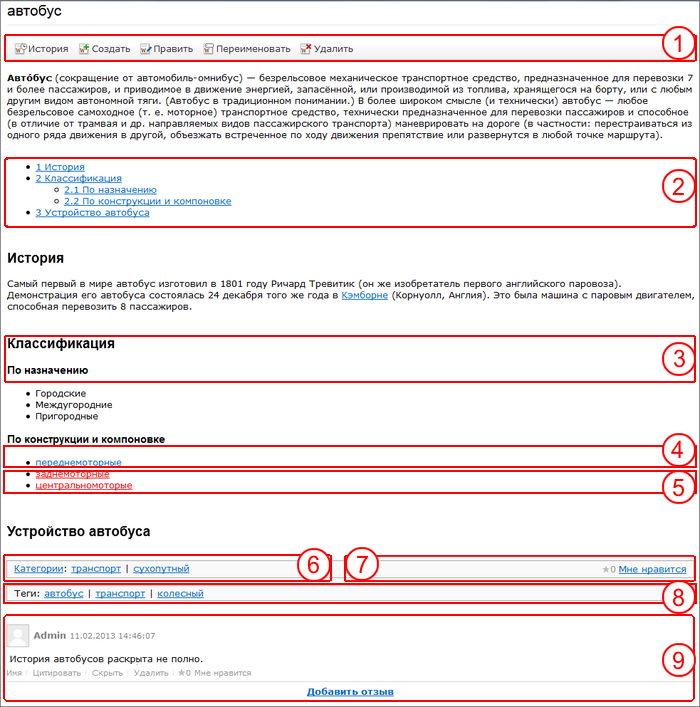

# Основные понятия

**Навигация**
- [← Оглавление курса](index.md)
- [← Предыдущий: 2876 — Возможности модуля](lesson_2876.md)
- [Следующий: 2005 — Создание самой Wiki и страниц →](lesson_2005.md)

Официальная страница урока: https://dev.1c-bitrix.ru/learning/course/index.php?COURSE_ID=34&LESSON_ID=2049

### Основные понятия и термины

- **Внутренняя ссылка** – гиперссылка на вики-страницу в рамках одного вики-сайта. В тексте помечается обычным для гиперссылок синим цветом.
- **Красная ссылка** – внутренняя ссылка на несуществующую (еще не созданную) вики-страницу. В тексте помечается красным цветом.
- **Внешняя ссылка** – гиперссылка на внешний сайт.
- **Вики разметка** – разметка, которая позволяет легко и быстро размечать в тексте структурные элементы и гиперссылки; форматировать и оформлять отдельные элементы.
- В **Категорию** объединяют схожие по смыслу страницы. Одна страница может быть в нескольких категориях. Категории могут быть вложенными.
- **Тегами** помечают страницы для быстрого их поиска.
- **Версия** – одна из сохраненных правок вики-страницы.
- **Текущая версия** – последняя версия вики-страницы, которая в данный момент видна на сайте.

### Общий вид вики-страницы

Вики-страница состоит из:

1. **Контекстной панели**, кнопки которой позволяет:

  - **История** - просмотреть версии страниц в их историческом развитии. Кнопка не отображается, если не установлен модуль **Бизнес-процессов**.
  - **Создать** - создать новую страницу.
  - **Править** - редактировать содержание страницы.
  - **Переименовать** - переименовывается название страницы (категории). Изменения отображаются сразу на всех страницах, где есть упоминание о переименованной странице.
  - **Удалить** - удалить страницу. Удаление происходит вместе с историей ее изменений. Все ссылки на эту страницу станут "красными ссылками".
2. **Оглавление**. Формируется автоматически, если на странице есть не менее 5 заголовков.
3. **Заголовок**. Заголовки могут быть различного уровня.
4. **Внутренняя** или **Внешняя** ссылки.
5. **Красная ссылка** - ссылка на еще не созданную страницу.
6. **Категории**. Список категорий, к которым привязана данная страница.
7. **Рейтинги**. Голосование за статью. Вид может отличаться, зависит от настроек, сделанных администратором.
8. **Теги**. Список тегов, которые соответствуют данной странице.
9. **Комментарии**. Добавленные комментарии к статье.
