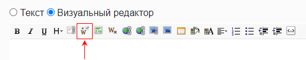
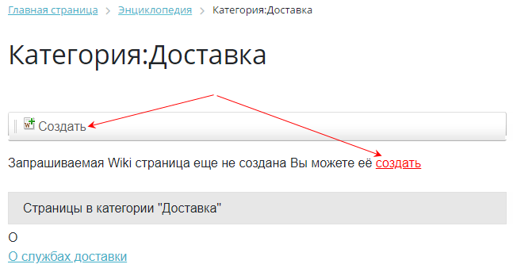
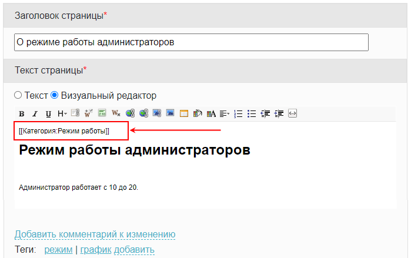

# Категории

**Навигация**
- [← Оглавление курса](index.md)
- [← Предыдущий: 2052 — Редактирование страницы и история](lesson_2052.md)
- [Следующий: 24536 — Теги →](lesson_24536.md)

Официальная страница урока: https://dev.1c-bitrix.ru/learning/course/index.php?COURSE_ID=34&LESSON_ID=2054

**Категории** - один из механизмов классификации создаваемых страниц. Они помогают в поиске страниц, связанных каким-то общим смыслом.

### Категории

Категории создаются при создании (редактировании) страниц с помощью кнопки

			**Указать категорию**

                    

		 и выводятся под текстом страницы. Категории могут иметь подкатегории, их вложенность не ограничена.

Ссылка Категории отображается под текстом всегда, независимо от того, добавлена ли конкретная страница в какую-либо категорию. Переход по этой ссылке ведет к общему списку категорий:

В скобках указано число страниц, включенных в категорию.

Для категории можно создать страницу, например, с описанием какая информация входит в эту категорию. Создаётся она аналогично обычной странице, только название задано автоматически и равно названию категории.

Если страница категории не создана, она будет высвечиваться красной ссылкой, как и в случае с обычными страницами. Для создания страницы категории откройте категорию и воспользуйтесь кнопкой или ссылкой

			Создать

                    

		.

Создавая страницу категории, можно задать, какая категория будет для нее старшей. Для этого также воспользуйтесь кнопкой  **Указать категорию**. Итоговая страница категории с описанием, подкатегориями и входящими страницами выглядит так:

**Примечание:** на странице категории происходит указание вышестоящей категории, а не подкатегорий, входящих в эту категорию.

### Как отвязать страницу от категории и удалить категорию

Подчиненность категории несложно сменить, если ошибочно была назначена неверная привязка. Для этого нужно отвязать страницы от категории в режиме редактирования страницы, а после уже задавать новые отношения иерархии страниц и категорий.

Откройте страницу на редактирование. Вверху рабочей зоны редактора вы увидите текст `[[Категория:_название категории_]]`. Для отвязки страницы от категории просто удалите вручную этот текст (аналогично работе с обычным текстом):

**Примечание:** категория будет автоматически **удалена**, если у неё не останется ни одной привязанной страницы.
