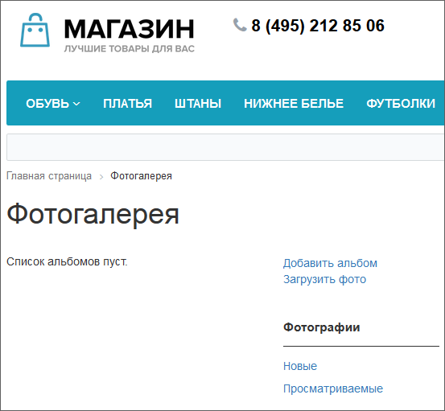
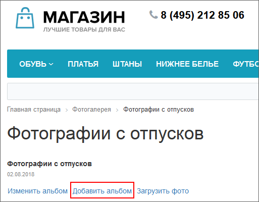
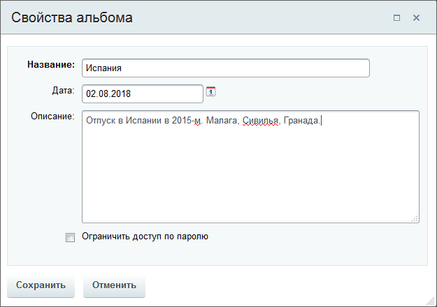

# Создание фотоальбома

**Навигация**
- [← Оглавление курса](index.md)
- [← Предыдущий: 5365 — Настройка простой фотогалереи](lesson_5365.md)
- [Следующий: 2064 — Загрузка фотографий →](lesson_2064.md)

Официальная страница урока: https://dev.1c-bitrix.ru/learning/course/index.php?COURSE_ID=34&LESSON_ID=2055

Создание фотоальбома - первый шаг по созданию работающей фотогалереи. Далее создаются вложенные альбомы, если требуется многоуровневая иерархия альбомов.

### Видеоурок

### Создание фотоальбома

Опишем простые действия добавления альбомов.

Если создаётся основной фотоальбом, то воспользуйтесь ссылкой

			Добавить альбом

                    Ссылки справа автоматически выводятся комплексным компонентом [Фотогалерея 2.0](https://dev.1c-bitrix.ru/user_help/components/content/photogallery2/photogallery.php)

		, расположенной на главной странице фотогалереи.

Если создаётся вложенный альбом, то перейдите к просмотру основного фотоальбома, в котором будет размещаться новый альбом, и тоже воспользуйтесь ссылкой

			Добавить альбом

                    

		. Откроется форма создания, заполните её. Значения полей понятны из их названий.

### Пример создания фотоальбома

Например, создадим новый альбом на первой странице фотогалереи, при этом форма создания (редактирования) фотоальбома выглядит так:

Заполните поля формы. (Для ограничения доступа, установите пароль.) После сохранения вы будете переведены на страницу нового альбома. Он сразу добавляется в

			общий список альбомов

                    

		. Доступно изменение его параметров или удаление.
