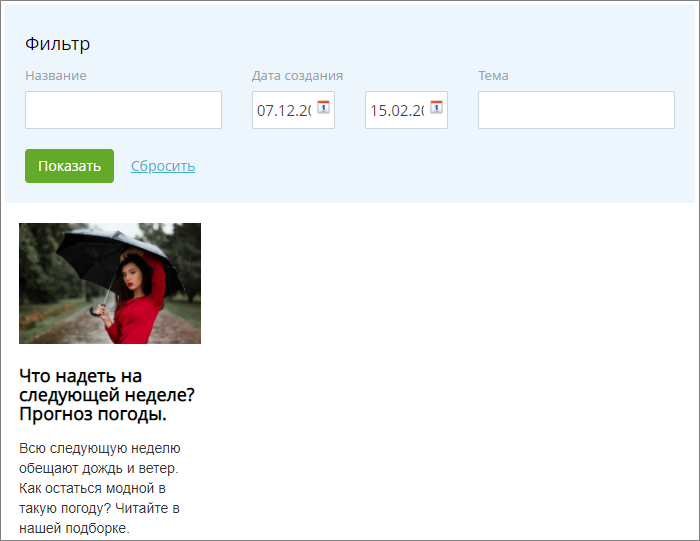
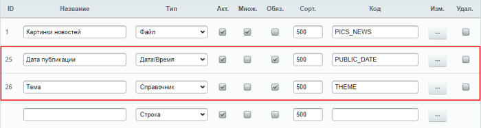
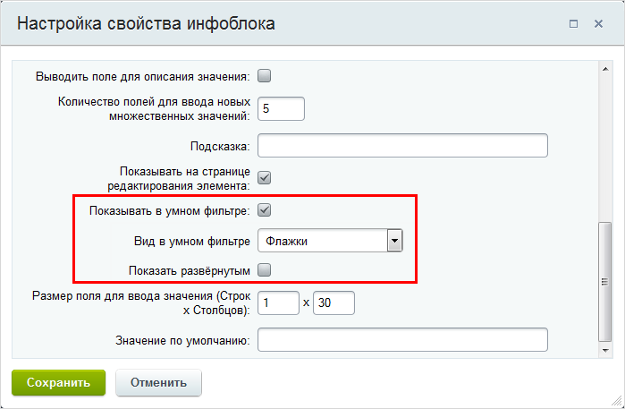
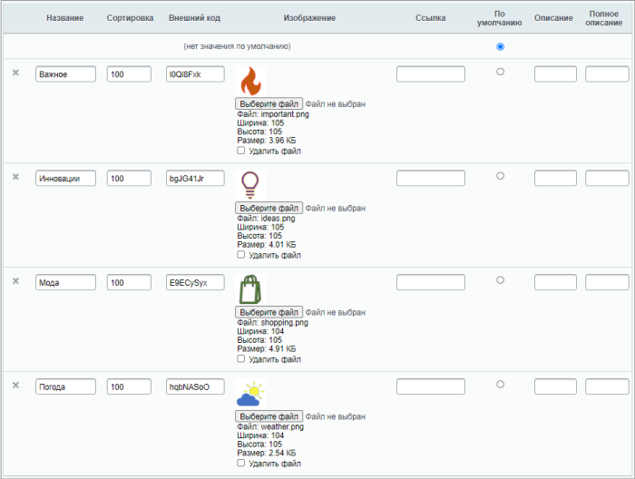
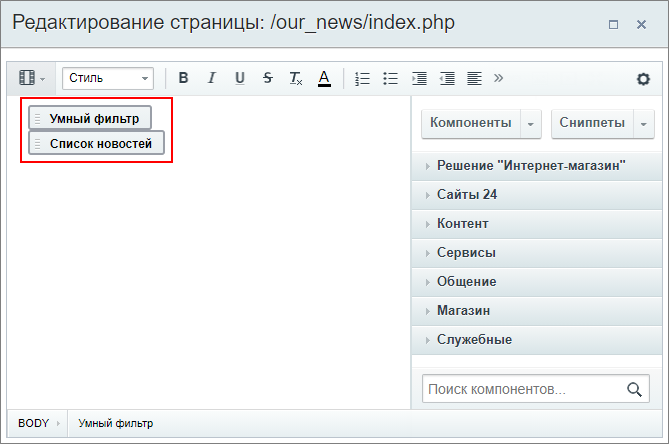
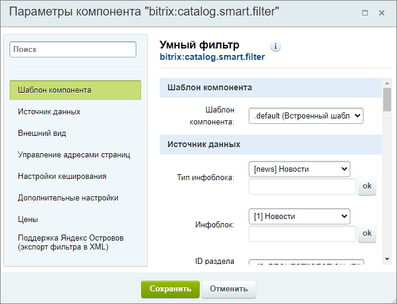
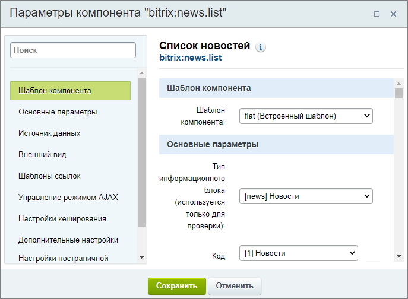
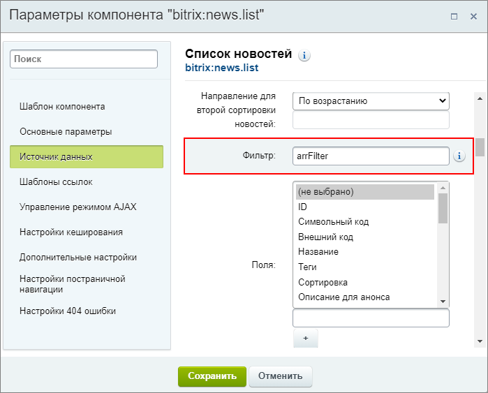
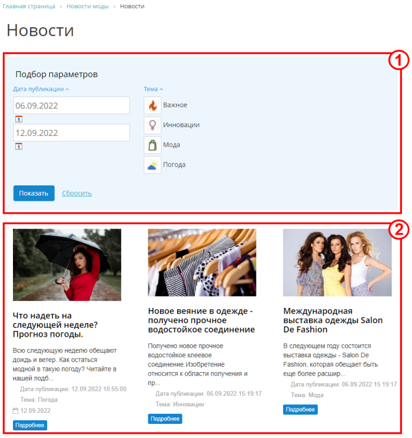
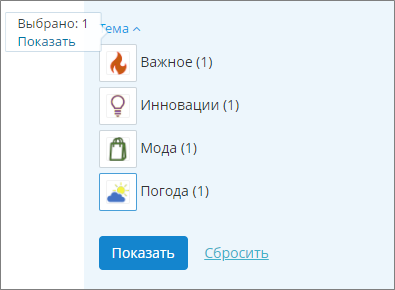

# Умный фильтр для новостей

**Навигация**
- [← Оглавление курса](index.md)
- [← Предыдущий: 4515 — Добавление товаров через импорт](lesson_4515.md)
- [Следующий: 2007 — Создание календаря событий →](lesson_2007.md)

Официальная страница урока: https://dev.1c-bitrix.ru/learning/course/index.php?COURSE_ID=34&LESSON_ID=20620

Пусть у нас есть простой инфоблок с новостями (без древовидной структуры). И мы хотим иметь возможность фильтровать новости на сайте.

### О задаче

У комплексного компонента

			Новости

                    Комплексный компонент позволяет создать новостной раздел на сайте. Доступен просмотр детальной информации, списка элементов, настройка экспорта в rss, организация голосования за новости (или другие элементы инфоблоков), настройка отзывов, вывода материалов по темам, настройки ЧПУ и многое другое.

						[Описание компонента «Новости (комплексный компонент)» в пользовательской документации.](http://dev.1c-bitrix.ru/user_help/detail.php?ID=62967)

		 есть встроенный фильтр. Его возможности и внешний вид довольно просты, зато поиск можно настроить как по полям, так и по свойствам инфоблока. Включается работа такого фильтра с помощью опции **Показывать фильтр** в настройках компонента. Результат выглядит так:

Более сложный и красивый фильтр предоставляет компонент

			Умный фильтр

                    Компонент подготавливает фильтр для выборки из инфоблока и выводит форму фильтра для фильтрации элементов.

						[Описание компонента «Умный фильтр» в пользовательской документации.](http://dev.1c-bitrix.ru/user_help/detail.php?ID=541722)

		, который обычно используется в каталоге товаров Интернет-магазина.

**Важно понимать:** Умный фильтр работает только со свойствами инфоблока. Фильтровать по значениям

			полей

                    Таким как Название, Дата создания и т.д.

		 в таком варианте не получится.

В этом уроке мы рассмотрим, какие конкретные настройки необходимо выполнить для работы компонента умного фильтра со списком новостей. Без подробного рассмотрения как работать с тем или иным функционалом.

**Примечание**: темы, которые нужно знать, чтобы понять урок и легко выполнить настройки:

- [Работа с компонентами](https://dev.1c-bitrix.ru/learning/course/index.php?COURSE_ID=34&CHAPTER_ID=06945&LESSON_PATH=3905.4457.6945)
- [Создание и настройка инфоблока](https://dev.1c-bitrix.ru/learning/course/index.php?COURSE_ID=34&CHAPTER_ID=02011&LESSON_PATH=3905.4477.2011)
- [Свойства элементов](lesson_9407.md)
- [Пример работы с компонентами: создаем новостной раздел](lesson_4486.md)

Теперь перейдем к практическому примеру.

### Видеоурок

В видеоролике показываем как включить фильтр в комплексном компоненте Новости, как создать свойства инфоблока для Умного фильтра и какие настройки нужно выполнить для работы Умного фильтра с новостями.

### Подготовка инфоблока

В нашем примере инфоблок с новостями уже существует. Создадим для него свойства, по которым будет удобно и наглядно фильтровать наши новости:

1. **Дата публикации** - простое свойство типа "Дата/Время", в котором будем указывать дату публикации новости на сайте;
2. **Тема** - выберем свойство типа "Справочник". Так мы получим возможность выводить красивый фильтр по темам новостей с иконками.

Для обоих свойств откроем форму настроек (кнопка с тремя точками) и настроим параметры

			умного фильтра

                    

		. Отметим опции **Показывать в умном фильтре** и **Показать развернутым**. Для Даты публикации выберем вид **Календарь**, а для Темы - **Флажки с названиями и картинками**.

В свойстве **Тема** создадим четыре варианта тем и для каждой добавим картинку (секция **Дополнительные настройки** в форме настроек свойства):

**Примечание**: Не забудьте заполнить значения новых свойств для уже существующих в инфоблоке элементов.

### Настройка компонентов

Создадим новый раздел для новостей на сайте. И

			разместим на странице

                    

		 два простых компонента: **Умный фильтр** и

			Список новостей

                    Одностраничный компонент выводит список новостей из одного информационного блока.

						[Описание компонента «Список новостей» в пользовательской документации.](http://dev.1c-bitrix.ru/user_help/detail.php?ID=62968)

		.

**Примечание:** Компонент **Умный фильтр** должен подключаться **перед** компонентом вывода элементов инфоблока, иначе список элементов фильтроваться не будет.

#### Умный фильтр

В настройках умного фильтра для примера достаточно указать тип инфоблока и инфоблок:

Дополнительно скопируем значение из поля **Имя выходящего массива для фильтрации**. Оно нужно нам для настройки компонента Список новостей. По умолчанию в поле указано значение `arrFilter`.

#### Список новостей

Сначала так же выберем

			тип инфоблока и сам инфоблок

                    

		 Новости. И обязательно заполним поле **Фильтр**, указав в нём скопированное ранее значение (`arrFilter`):

Остальные настройки выполните по желанию. Например, у нас выбран шаблон компонента **flat**.

### Результат

Все необходимые настройки выполнены. Посмотрим на результат:

1 - умный фильтр с возможностью фильтрации по двум свойствам. При выборе параметров появится всплывающее окно со ссылкой

			Показать

                    

		 по нажатии на которую применится фильтр.

2 - под фильтром отображается список наших новостей. Он будет меняться в зависимости от выбранных в фильтре параметров.

**Примечание**: В уроке мы использовали простой компонент **Список новостей**. Для полноценной работы новостного раздела не забудьте настроить детальный просмотр новостей и URL-ы страниц. В уроке [Пример работы с компонентами: создаем новостной раздел](lesson_4486.md) вы найдете полный пример создания новостного раздела на простых компонентах.
