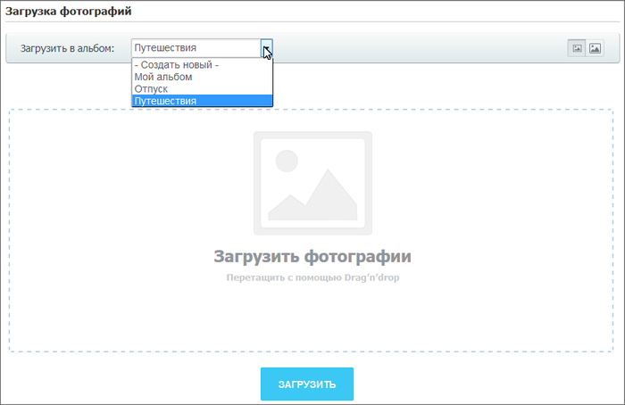
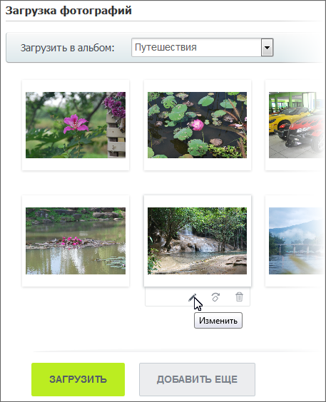

# Загрузка фотографий

**Навигация**
- [← Оглавление курса](index.md)
- [← Предыдущий: 2055 — Создание фотоальбома](lesson_2055.md)
- [Следующий: 2065 — Режимы просмотра фотографий →](lesson_2065.md)

Официальная страница урока: https://dev.1c-bitrix.ru/learning/course/index.php?COURSE_ID=34&LESSON_ID=2064

### Видеоурок

### Грузим фотографии

Для загрузки фотографий перейдите в нужный альбом и воспользуйтесь ссылкой

			Загрузить фото

                    

		. Откроется форма:

Фотографии добавляются в рабочую область с помощью

			drag'n'drop

                    Drag’n’Drop – это технология, когда мышью захватывают элемент и переносят его в нужное место: другую программу, другое место.

		 либо выбираются из диалогового окна, открывающегося с помощью кнопки **Загрузить** (если рабочая область еще пуста). Для добавления дополнительных фотографий можно также воспользоваться механизмом drag'n'drop либо нажать кнопку **Добавить еще**. При наведении курсора мыши на фотографию появляются поля для описания, кнопки

			изменения

                    

		, поворота или удаления  фотографии.

## Если выбрано действие Изменить

Если выбрано действие *изменить*, то фотография откроется в новом окне для редактирования:

- с помощью поля Описание задаётся описание фотографии;
-  - поворот фотографии против часовой стрелки;
-  - поворот по часовой стрелке;
-  - вертикальное отражение изображения;
-  - горизонтальное отражение изображения;
-  - обрезка фотографии;
-  - градация в сером цвете;
-  - добавление подписи к фотографии.

Кнопки **Применить** и **Отменить** сохраняют или отменяют внесенные изменения.

По кнопке **Загрузить** все фотографии из рабочей области будут загружены в указанный существующий или новый альбом.

## Если у вас старая фотогалерея (до версии 15.0)

Если версия модуля ниже, чем 15.0, то загрузка фотографий определяется настройками создающего интерфейс фотогалереи компонента и выполняется с помощью:

- [упрощенной формы](#old_upload) загрузки или загрузчика HTML5, доступного с версии 14.5;
- множественного загрузчика ([Java/ActiveX](#old_upload));
- множественного [Flash-загрузчика](#old_upload).

Причем, если в настройках компонента выбран множественный загрузчик, то всегда доступно переключение к упрощенной форме/загрузчику HTML5 и обратно. Если в настройках выбрана упрощенная форма/загрузчик HTML5, то переключение к множественному загрузчику невозможно.

В любой форме указывается альбом, в который будут загружены фотографии, а также по ссылке **Дополнительные настройки** доступны следующие возможности:

- выбор размера отправляемых фотографий; доступны следующие размеры фотографий:

  - 1280х960;
  - 1024х768;
  - 800х600;
- добавление авторского знака; здесь вводится текст или изображение, которое будет добавлено на фото.

Если используется множественный загрузчик, то дополнительно в рабочей области формы загрузчика вы можете выполнить поворот фотографий и отредактировать их описание.

#### Загрузка фотографий с помощью множественного загрузчика (Java/ActiveX)

При загрузке используется технология Java и элемент управления ActiveX: *Bitrix Image Uploader*. Это позволяет быстро загружать файлы, не осуществляя поиск на диске и не вводя имена и свойства файлов в явном виде. Когда фотографии загружаютcя в системе впервые, то выводится сообщение о необходимости установить *Bitrix uploader*.

В дереве папок формы загрузки фотографий выберите папку, из которой должны быть загружены фотографии, и отметьте флагом необходимые фотографии. Если же вы хотите добавить все фотографии из папки, то отметьте папку флагом.

По кнопке **Загрузить** все фотографии из рабочей области будут загружены в альбом и откроется страница просмотра альбома.

#### Загрузка фотографий с помощью множественного Flash-загрузчика

На форме загрузки фотографий нажмите кнопку **Добавить изображения** и выберите необходимые файлы для загрузки. Они добавятся в рабочую область формы:

По кнопке **Загрузить** все фотографии из рабочей области будут загружены в альбом и откроется страница просмотра альбома.

#### Одиночная загрузка фотографий

Форма одиночной загрузки фотографий имеет следующий вид (ссылка **Множественная загрузка** доступна только в том случае, если было осуществлено переключение из формы множественной загрузки):

Загрузка фотографии происходит сразу, как только вы ее выбрали с диска по кнопке **Добавить файлы**.

Используя кнопку **Добавить файлы** загрузите необходимые вам фотографии, и перейдите к просмотру альбома по кнопке **Перейти в альбом**.

### Важно запомнить!

В процессе загрузки каждая фотография генерируется в двух видах:

- предпросмотр (эскиз или анонс) - минимальный размер;
- оригинал (максимальный размер).

Кроме того, вне зависимости от формата добавляемых фотографий в альбом они будут загружены в формате ***.jpg**.
