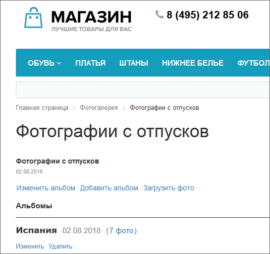

# Управление альбомами

**Навигация**
- [← Оглавление курса](index.md)
- [← Предыдущий: 2065 — Режимы просмотра фотографий](lesson_2065.md)
- [Следующий: 2075 — Публикация фотогалереи →](lesson_2075.md)

Официальная страница урока: https://dev.1c-bitrix.ru/learning/course/index.php?COURSE_ID=34&LESSON_ID=2066

Созданный альбом сразу или через какое-то время требует изменения свойств, а то и удаления. Рассмотрим, как это можно сделать.

### Видеоурок

### Изменение альбома

Вызов формы редактирования свойств альбома делается прямо с

			главной страницы

                    

		 фотогалереи по ссылке **Изменить**, не заходя во внутрь каждого. Отсюда же и удаляются альбомы по ссылке **Удалить**. Причем, если удаляется альбом, который имеет вложенные в себя альбомы, то они все также будут удалены.

Форма изменения свойств альбома позволяет отредактировать его название и описание. Кроме того, по ссылке **Дополнительные настройки** отображаются поля с настройками даты и доступа:

В режиме редактирования альбома выполняется и редактирование фотографий: можно изменить описание фотографии, добавить теги, повернуть фотографию или удалить. Отмеченные флагом фотографии можно удалить или перенести в другой альбом с помощью ссылок, расположенных

			внизу страницы

                    

		.

### Изменение обложки

Ссылка **Изменить обложку** служит для перехода к форме выбора обложки для альбома. Отметьте флагом одну или несколько фотографий, чтобы сгенерировать обложку, и нажмите **Сохранить**.

### Важно запомнить!

Если удаляется альбом, в который вложены другие альбомы, то они все также будут удалены.
