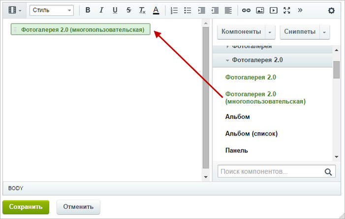
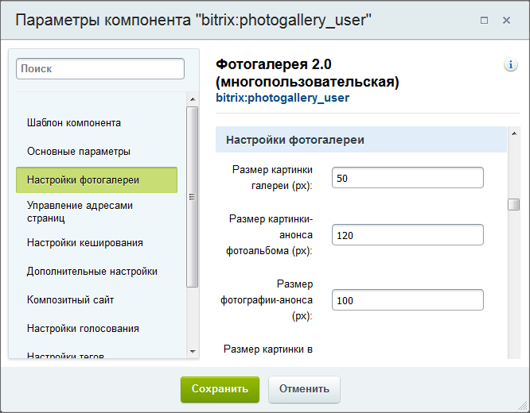
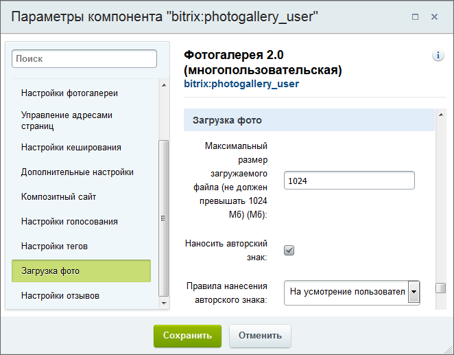
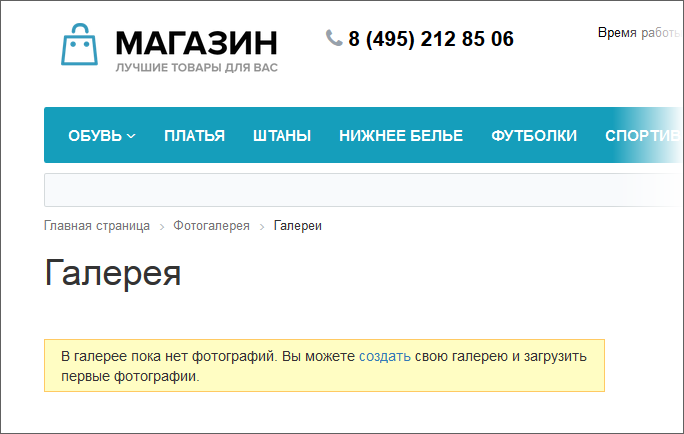

# Публикация фотогалереи

**Навигация**
- [← Оглавление курса](index.md)
- [← Предыдущий: 2066 — Управление альбомами](lesson_2066.md)
- [Следующий: 2123 — Создание фотогалереи →](lesson_2123.md)

Официальная страница урока: https://dev.1c-bitrix.ru/learning/course/index.php?COURSE_ID=34&LESSON_ID=2075

Если, вдруг, фотогалерея не создана разработчиком сайта, то создать её придется контент-менеджеру.

### Видеоурок

### Создание страницы и размещение компонента

Думается, что вы уже освоили типовой порядок создания функционала в "1С-Битрикс: Управление сайтом":

			создаём физическую страницу

                    Для создания страницы с помощью Мастера нажмите **Создать страницу**.

[Подробнее](lesson_1911.md)...

		 в нужном разделе,

			размещаем компонент

                    

		 и настраиваем его. В нашем случае этот компонент -

			Фотогалерея 2.0 (многопользовательская)

                    Комплексный компонент **Фотогалерея 2.0 (многопользовательская)** позволяет получить полнофункциональную многопользовательскую фотогалерею, создавая физически только одну страницу.

						[Описание компонента «Фотогалерея 2.0 (многопользовательская) (комплексный компонент)» в пользовательской документации.](http://dev.1c-bitrix.ru/user_help/detail.php?ID=139125)

		.

Следующий шаг -  настройка компонента. Приведём описание некоторых параметров.

### Основные параметры

Обязательно настраивается только группа Основные параметры: задаются тип информационного блока и инфоблок для хранения фотографий. Здесь же укажите права доступа для групп: кому из пользователей доступно создание галереи, а кому - нет.

При отключении простого режима настройки появится поле **Разрешать создавать пользователям только одну галерею**. Установка флага в этом поле позволяет пользователям создавать только **одну** галерею (кроме тех, кто имеет права "запись" на инфоблок фотогалереи - на них это ограничение не действует).

Флаг в поле **Включить премодерацию фото** означает, что для показа добавленных фотографий необходимо одобрение модератора. Все ожидающие проверку фотографии доступны модератору по ссылке **Фото ожидает проверки модератора**. Модератор переходит к детальному просмотру фото и нажимает ссылку **Одобрить**.

### Необязательные параметры

- В группе
  			Настройки фотогалереи
                      
  		, если необходимо, укажите или измените различные размеры фотографий, установите ограничение на размер оригинала фотографии.
- В группе
  			Загрузка фото
                      
  		 выберите максимальный размер загружаемого файла, а также установите настройки нанесения авторского знака.
  **Внимание**: Функционал авторского знака устарел и не поддерживается с версии **14.5.0** Главного модуля (**main**).
- В группе
  			Дополнительно
                      
  		 есть настройки Главной страницы фотогалереи.
   Опция **[Главная страница] Включить премодерацию опубликованных фото** - для показа фотографий на главной странице требуется подтверждение модератора.
   Опция **[Главная страница] Показывать только опубликованные фото** - фотографии со статусом опубликованные будут показываться только на главной странице.
- С помощью соответствующих групп задайте параметры голосования, отзывов, вывода тегов и параметры отображения фотографий в галерее.

Сохраните страницу. В результате созданная страница в публичной части будет выглядеть так:

### Важно запомнить!

Обязательно настройте группу Основные параметры в настройках компонента: укажите инфоблок и его тип, а также группы, которым доступно создание фотогалерей.
