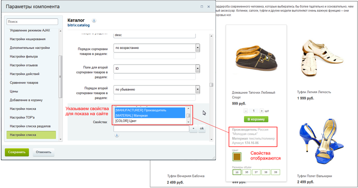
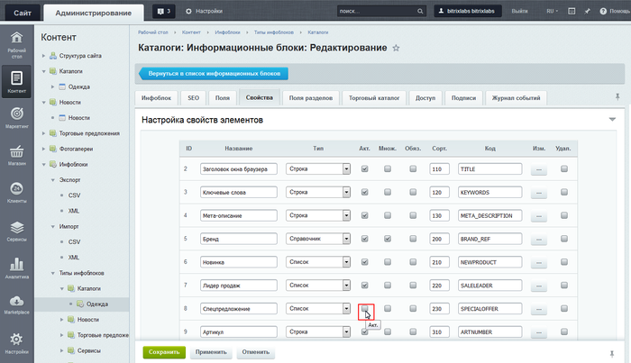
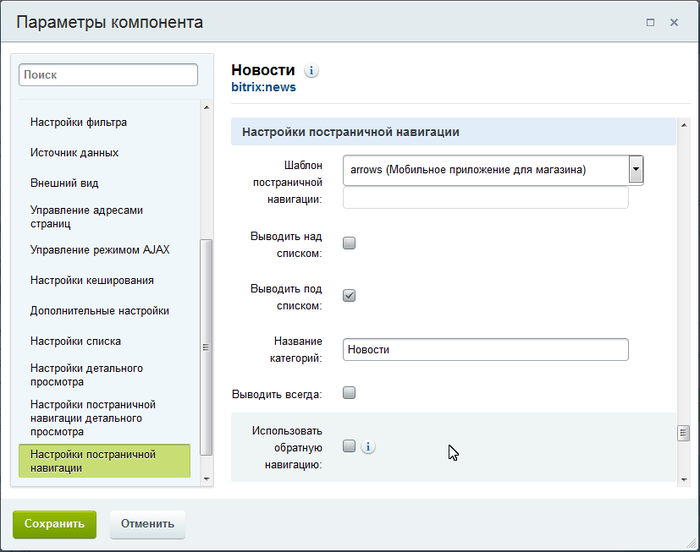

# Информационные блоки

**Навигация**
- [← Оглавление курса](index.md)
- [← Предыдущий: 12998 — Основные задачи менеджера интернет-магазина](lesson_12998.md)
- [Следующий: 2149 — Ошибки при работе со структурой →](lesson_2149.md)

Официальная страница урока: https://dev.1c-bitrix.ru/learning/course/index.php?COURSE_ID=34&LESSON_ID=2099

Решение типовых проблем не требует вмешательства программистов. Контент-менеджер в большинстве случаев может разрешить их самостоятельно. Самые частые ошибки совершаются при работе с информационными блоками. Это естественно, так как в инфоблоках хранится большая часть информации на сайте.

### Видеоурок

### Типовые проблемы

Описание ошибок даётся в формате: Проблема &gt; ошибка &gt; решение, чтобы вам было проще перейти к исправлению ситуации.

- ## Выводится сообщение: "У вас нет прав на просмотр ..."
  **Ошибка**: ненастроенные права доступа к детальной информации: новостей и фотогалереи.
  **Решение**: Настроить группы пользователей для доступа в настройках комплексного компонента в группе параметров **Дополнительные настройки**:
  
- ## На странице не выводится информация, добавленная в поля свойств элемента инфоблока. Например, добавляется информация в поле Производитель и Материал, а она не видна у товара
  **Ошибка**: в настройках компонента не указаны свойства инфоблока, которые должны отображаться на данной странице.
  **Решение**: В настройках параметров инфоблока указать какие свойства должны отображаться. Для этого надо сначала понять на какой странице не выводятся нужные свойства: на детальной странице товара или на странице списка товаров. Отличить не трудно: на странице списка товаров выводятся все товары раздела. На странице детального отображения товара - только выбранный товар. Соответственно нужно выбирать свойства для показа в нужной секции настроек компонента.
  
- ## В форме добавления элементов не видны добавленные свойства инфоблока
  **Ошибка**: добавленное свойство либо неактивно, либо свойство не выведено в измененной (кастомизированной) форме добавления элемента.
  **Решения**:
  - активируйте свойство в форме редактирования инфоблока (Контент &gt; Инфоблоки &gt; Типы инфоблоков &gt; _ваш_тип_инфоблока &gt; _ ваш_инфоблок_) на закладке **Свойства**.
    
  - добавьте новые свойства в форму создания элемента, как это рассказано в уроке [Настройка форм элементов и разделов под себя](lesson_1883.md).
  Прав контент-менеджера на эти операции может не хватить. В этом случае обратитесь к администратору сайта.
- ## При создании элемента инфоблока не удается прикрепить файл, выводится сообщение: Неверный тип файла. При этом не происходит сохранение элемента
  **Ошибка**: в свойствах инфоблока типа **Файл** не указаны разрешенные для загрузки форматы.
  **Решение**: разрешенные форматы указываются на закладке **Свойства** формы настройки инфоблока (Контент &gt; Инфоблоки &gt; Типы инфоблоков &gt; _ваш_тип_инфоблока &gt; _ ваш_инфоблок_). В строке свойства типа **Файл** с помощью кнопки **[...]** вызовите форму детальной настройки свойства и в поле **Типы загружаемых файлов** введите нужные форматы или выберите форматы в выпадающем списке:
  
- ## Не удается прикрепить файл к элементу инфоблока, выводится сообщение: Превышен максимальный размер файла. При этом не происходит сохранение элемента.
  **Ошибка**: ограничения администратора сайта на размер загружаемого файла.
  **Решение**: Для снятия этого ограничения необходимо обратиться к администратору сайта.
- ## При переходе из списка элементов к странице детального просмотра появляется сообщение: Элемент не найден .
  **Ошибка**: неправильно формируется адрес страницы (не передается идентификатор открываемого элемента или в настройках компонента ошиблись).
  **Решение**: [проверить настройки компонента](lesson_3579.md) в группе параметров **Управление адресами страниц** или обратиться к администратору сайта.
- ## Количество сообщений (тем форума, новостей, количество фотографий и т.д.) на странице не совпадает с количеством, указанном в настройке компонента
  **Ошибка**: в настройках используемого компонента отмечена опция **Использовать обратную постраничную навигацию**. В этом режиме происходит вывод страниц в обратном порядке (последняя страница становится первой).
  
  **Решение**: исправить настройки компонента в группе параметров **Настройки постраничной навигации**.
  **Необязательная информация: зачем нужна обратная навигация**.
  Обратную навигацию используют если необходимо чтобы при добавлении элемента инфоблока он всегда попадал наверх списка. Таким образом, меняется лишь последняя страница.
  При обратной страничной навигации количество сообщений на странице либо равно числу, указанному в настройках компонента, либо больше его. Разбиение на страницы произойдёт, если остаток при делении количества сообщений на первой странице на число, указанное в настройках компонента, будет больше или равен двум.
  **Например**: 170 сообщений в форуме, а в настройках компонента указано число сообщений на странице равное 20. В этом случае будет образовано 8 страниц. На первой - 30 сообщений, на остальных - 20. При данных настройках число сообщений станет равным 180, будут образованы 9 страниц по 20 сообщений.
