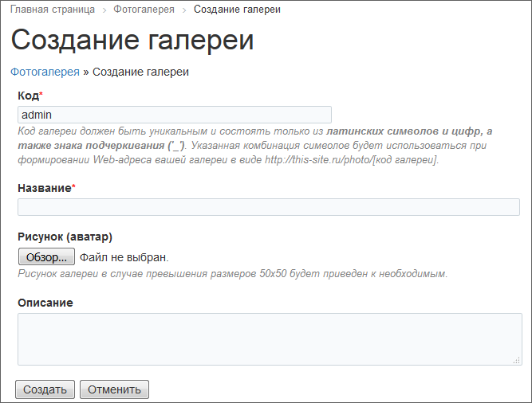
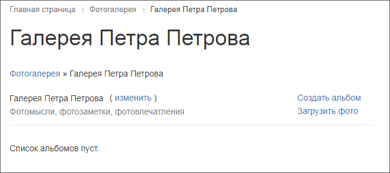
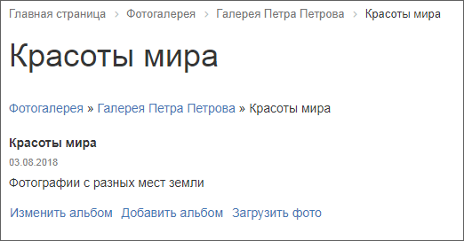
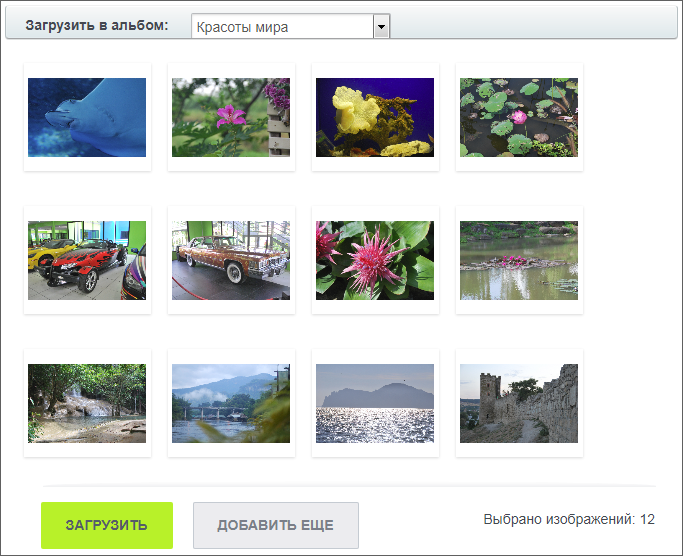
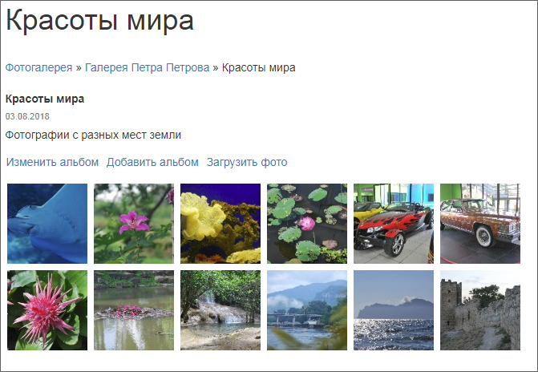

# Создание фотогалереи

**Навигация**
- [← Оглавление курса](index.md)
- [← Предыдущий: 2075 — Публикация фотогалереи](lesson_2075.md)
- [Следующий: 6471 — Работа с комментариями многопользовательской галереи →](lesson_6471.md)

Официальная страница урока: https://dev.1c-bitrix.ru/learning/course/index.php?COURSE_ID=34&LESSON_ID=2123

### Создание пользователем собственной галереи

- Кликните по ссылке **Создать галерею**, доступной на главной странице фотогалереи, и в открывшейся форме заполните обязательные поля **Код** фотогалереи и **Название** фотогалереи:
  
- Остальные поля заполните по желанию и нажмите кнопку **Создать**.

Галерея создана:

**Примечание**: В зависимости от настроек компонента и от прав пользователя на инфоблок, пользователям доступно создание только одной галереи либо неограниченного количества галерей.

### Добавление альбомов

Нажмите ссылку **Создать альбом** и в

			открывшейся форме

                    

		 укажите **Название** альбома, дату создания (по умолчанию устанавливается текущая дата) и **Описание** альбома. Если есть необходимость ограничения доступа к альбому, добавьте

			пароль

                    В этом случае открыть альбом смогут только те пользователи, которые знают пароль.

		.

В результате страница созданного альбома выглядит следующим образом:

Аналогичным способом выполняется создание вложенного альбома.

### Добавление фотографий в альбом

- На странице просмотра альбома нажмите ссылку **Загрузить фото**. Откроется окно загрузки фотографий.
- С помощью кнопки **Добавить ещё**
  			выберите фотографии
                      
  		  (или просто перетащите картинки в окно загрузки) и нажмите кнопку **Загрузить**.

В результате созданный альбом выглядит так:

