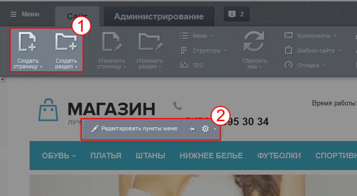

# Ошибки при работе со структурой

**Навигация**
- [← Оглавление курса](index.md)
- [← Предыдущий: 2099 — Информационные блоки](lesson_2099.md)
- [Следующий: 7959 — Нельзя делать! →](lesson_7959.md)

Официальная страница урока: https://dev.1c-bitrix.ru/learning/course/index.php?COURSE_ID=34&LESSON_ID=2149

### Видеоурок

Ошибки при работе со структурой просто исправить, но лучше их не делать совсем.

### Создание страниц через меню

Частая ошибка - создание страницы (раздела) через пункты меню. Для добавления страницы кликают **Редактировать пункты меню**, вписывают новый пункт и ждут чуда. Такой алгоритм действий контент-менеджера навеян некоторыми бесплатными CMS. Этот алгоритм интуитивно удобен (ведь в конечном итоге хотят увидеть именно пункт меню), но неверен для "1С-Битрикс: Управление сайтом".

1 - верный путь. В Меню вновь [созданная страница](lesson_1911.md) добавляется через [редактирование меню](lesson_10239.md), если она не добавлена в него при создании страницы.

2 - неверный путь. Приведёт к тому, что пункт в меню появится, но не приведёт на страницу с этим же названием.

### Создание страниц в другом разделе

Другая частая ошибка - создание страниц не в том разделе, где нужно. Решение этой проблемы простое - воспользуйтесь

			инструментом Структура

                    Структура позволяет редактировать и удалять файлы и папки, а также задавать их свойства.

 

[Подробнее](lesson_1852.md)

		, который позволит легко перенести ошибочно созданные страницы в нужные места.

### Загрузка файлов

В визуальном редакторе при загрузке файлов с локального компьютера у контент-менеджера вкладка **Загрузить файл** неактивная. Причём администратор сайта без проблем загружает файлы. Ошибка в неверно заданных правах на доступ для контент-менеджера. Для решения проблемы обратитесь к администратору сайта.

### Загрузка файлов через медиабиблиотеку

Ошибки возникают при загрузке файлов с несоответствующим настройкам

			расширением или размером

                    

[Подробнее](lesson_1854.md)...

		.

Если файл не соответствует разрешенному расширению, то выведется сообщение:

При добавлении файла с размером в пикселях больше, чем указано в настройках, файл загрузится, но произойдет автоматическое пропорциональное изменение размера под заданные в настройках величины. Это не страшно, но качество нового изображения, уменьшенного средствами системы, будет хуже, чем файлы, уменьшенные в графических редакторах. Рекомендуется готовить файлы заранее в нужный размер.
