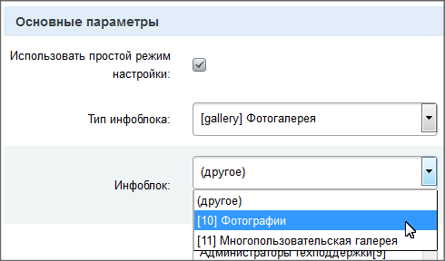
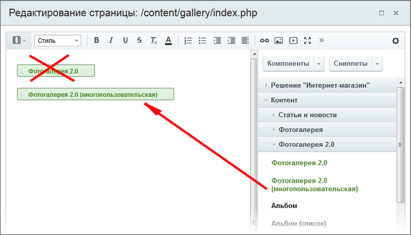
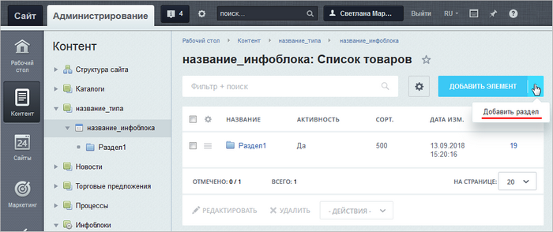

# С простой на многопользовательскую

**Навигация**
- [← Оглавление курса](index.md)
- [← Предыдущий: 2133 — Перенос фотогалереи на другой сайт](lesson_2133.md)
- [Следующий: 26230 — Проверьте себя →](lesson_26230.md)

Официальная страница урока: https://dev.1c-bitrix.ru/learning/course/index.php?COURSE_ID=34&LESSON_ID=2153

Технически сделать это не сложно. Надо просто на странице с фотогалереей поменять компонент Фотогалерея 2.0 на Фотогалерея 2.0 (многопользовательская) и настроить новый компонент на информационный блок, который использовался

			для простой галереи

                    

		. Потребуется дополнительная работа с инфоблоками.

### Как переехать с простой на многопользовательскую галерею

Структура однопользовательской и многопользовательской галерей отличаются. Если первая состоит просто из альбомов (разделов инфоблока), то вторая в первую очередь состоит из галерей пользователей (головных разделов), а уже галереи включают в себя альбомы (вложенные разделы).

Если просто назначить для компонента старый инфоблок, то все альбомы будут выглядеть как галереи и при переходе по ним фото отображаться не будут, так как они лежат в корне галереи (головном разделе), а должны быть в альбомах (дочерних разделах).

Для корректной работы многопользовательской фотогалереи

			создайте в корне инфоблока раздел

                    Откройте страницу инфоблока: Контент &gt; название_типа &gt; название_инфоблока

 (где вместо *название_типа*, *название_инфоблока* будут реальные названия вашего типа и инфоблока)
и воспользуйтесь **Добавить раздел**.

[Подробнее...](lesson_10077.md)

		, присвойте ему символьный код и перенесите все остальные разделы в только что созданный. В итоге в корне инфоблока будет один раздел - галерея, а в ней остальные разделы - альбомы. Созданная галерея будет принадлежать её создателю (либо администратору, либо редактору сайта).

### Видеоурок

### Важно запомнить!

Перед указанием инфоблока в настройках компонента создайте в корне инфоблока раздел и перенесите в него все разделы и элементы, созданные в простой фотогалерее.
