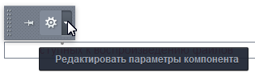
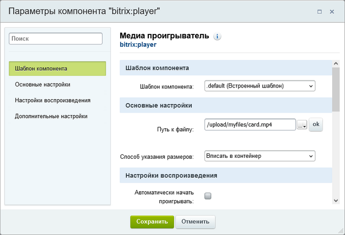
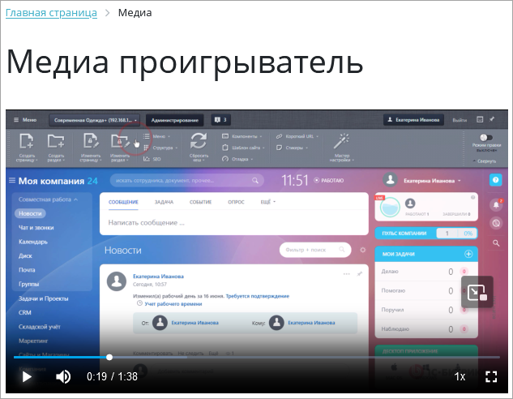

# Настройки компонента

**Навигация**
- [← Оглавление курса](index.md)
- [← Предыдущий: 2197 — Размещение](lesson_2197.md)
- [Следующий: 5216 — Размещение Видеотеки →](lesson_5216.md)

Официальная страница урока: https://dev.1c-bitrix.ru/learning/course/index.php?COURSE_ID=34&LESSON_ID=2198

Настройки выполняются в базовом либо расширенном режиме.  Расширенный режим рекомендуется для первичной настройки, а базовый — для повседневной работы. Настроить Медиа проигрыватель можно из публичного раздела в режиме

			Правки

		 с помощью команды

			Редактировать параметры компонента

                    Вызвать форму настройки компонента можно с помощью команды:

или, проще, кликнув на "шестерёнку".

[Подробнее...](lesson_9165.md)

		 или через панель **Свойства** при редактировании страницы с помощью визуального редактора.

### Базовый режим

Режим используется по умолчанию. Форма настройки компонента включает в себя четыре группы параметров.

#### Шаблон компонента

- Шаблон компонента — выберите шаблон отображения Медиа проигрывателя.

#### Основные настройки

- Путь к файлу — укажите путь к файлу для воспроизведения. Если не указан файл, то отобразится надпись:
  			Нет доступных к воспроизведению файлов
                      
  		.
- Способ указания размеров — выберите вариант задания размеров видеоплеера:

  - Абсолютные размеры — в поля **Ширина** и **Высота** внесите требуемые размеры блока в пикселях. Значение по умолчанию — 400х300 пикселей;
  - Вписать в контейнер — размер плеера примет размеры родительского контейнера. Для адаптивного отображения сайта рекомендуется использовать этот параметр;
  - Подстроиться под размеры видео — размер видеоплеера будет соответствовать размеру ролика.

#### Настройки воспроизведения

- Автоматически начать проигрывать — при выбранной опции проигрывание видео начнется сразу после загрузки страницы.
- Автоматически начинать проигрывать при появлении плеера на экране — проигрывание видео начнется при прокрутке страницы до плеера.
- Настройки повторения — повторять или не повторять ролик.
- Уровень громкости — уровень громкости в процентах от 0 до 100.

#### Дополнительные настройки

- Начинать загрузку видео сразу — при выбранной опции браузер начнет скачивать ролик сразу после загрузки страницы.
- Показывать панель управления — опция отображения элементов управления (старт/стоп, громкость).
- Расширенный режим настройки компонента — отображение дополнительных настроек компонента.

### Расширенный режим

Расширенный режим включается установкой флажка в поле Расширенный режим настройки компонента:

Этот режим подходит для более точной настройки плеера. Среди дополнительных параметров вам могут быть полезны настройки:

- рисунка для предварительного просмотра,
- звука, времени начала и скорости проигрывания,
- MIME-типа файла.

Подробная информация по расширенному режиму настройки представлена [в пользовательской документации](https://dev.1c-bitrix.ru/user_help/components/content/media/player.php).

### Интерфейс Медиа проигрывателя

После сохранения изменений и обновления страницы медиаплеер появится на странице. Для начала просмотра кликните указателем мыши на кнопку в центре окна или в левом нижнем углу.

