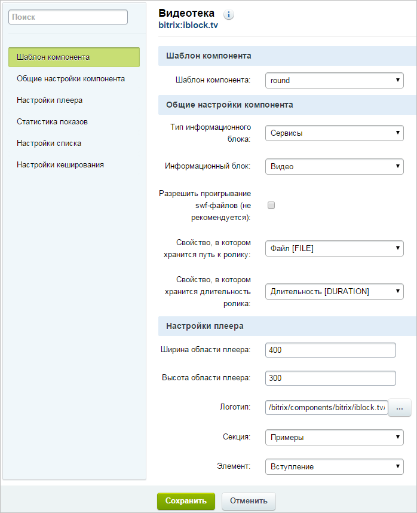

# Настройка компонента

**Навигация**
- [← Оглавление курса](index.md)
- [← Предыдущий: 2202 — Создание инфоблока](lesson_2202.md)
- [Следующий: 2204 — Создание видеоальбомов и элементов →](lesson_2204.md)

Официальная страница урока: https://dev.1c-bitrix.ru/learning/course/index.php?COURSE_ID=34&LESSON_ID=2203

Настроить Видеотеку можно из публичного раздела в режиме

			Правка

		 с помощью команды

			Редактировать параметры компонента

                    Вызвать форму настройки компонента можно с помощью команды:

или, проще, кликнув на "шестерёнку".

[Подробнее...](lesson_9165.md)

		 или через панель **Свойства** при редактировании страницы с помощью визуального редактора.

### Видеоурок

### Настраиваем Видеотеку

Окно редактирования параметров компонента Видеотека. Часть полей в этом окне вам знакомы по компоненту **Медиа проигрыватель**. Поэтому в уроке коснемся только того, что еще неизвестно.

- Выберите подходящий шаблон компонента, например **round**.
- Выберите в поле **Тип информационного блока** тип инфоблока, где создан инфоблок для Видеотеки, в случае нашего примера - **Сервисы**.
- В поле **Информационный блок** выберите созданный в предыдущем уроке инфоблок.
- Укажите свойства, в которых хранятся путь к видеоролику и его длительность.

В группе **Настройки плеера** обратите внимание на два поля: **Секция** и **Элемент**. Списки в этих полях появятся после наполнения информационного блока разделами и элементами (см. [следующий урок](lesson_2204.md) курса).

- В поле **Секция** выберите видеоальбом, который будет демонстрироваться. Это поле обязательное для заполнения. Если значение не указать, то ничего воспроизводиться не будет.
- В поле **Элемент** выберите видеоролик, который будет по умолчанию подключаться первым.
- В поле **Логотип** укажите файл с логотипом вашего сайта для замены логотипа по умолчанию.

В группе **Настройки списка** изображения по умолчанию заменяются на ваши картинки. Изображения из поля по умолчанию показываются, если при создании элементов инфоблока не заданы картинки в закладках **Анонс** и **Подробно**.

В **Поле для первой сортировки новостей** - указывается параметр, по которому производится

			первичная расстановка

                    Первая сортировка - это основной тип сортировки роликов. Скажем, если  выбрано значение "по названию", то ролики расположатся в алфавитном порядке. Если встретились ролики с одинаковыми названиями то, в расчет вступит вторая, системная, ненастраиваемая сортировка: по ID роликов.

		 роликов в списке. По умолчанию используется сортировка по **Дата начала активности**.

В поле **Направление для первой сортировки новостей** - как сортировать. Например, при сортировке по названию ролики сортируются по возрастанию (от А до Я) или по убыванию (от Я до А).

Настройки кеширования по умолчанию не рекомендуется изменять.

- Сохраните внесенные изменения.

После перезагрузки страницы вы увидите Медиа проигрыватель и под ним список роликов:

### Важно запомнить!

Кроме полей Тип информационного блока и Информационный блок обязательное для заполнения поле - **Секция**.
