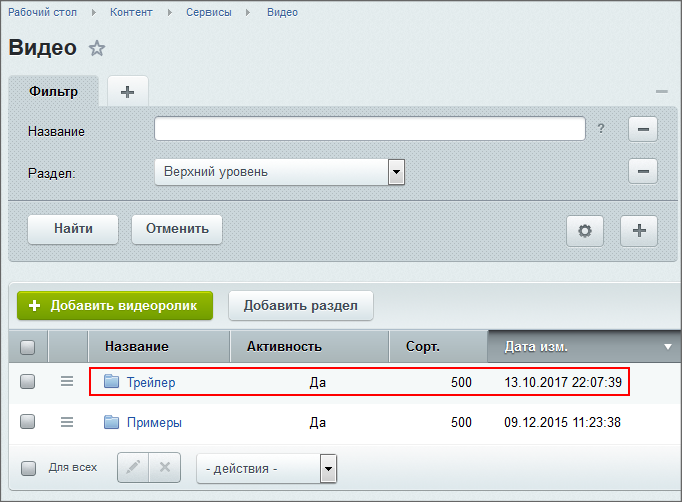

# Создание видеоальбомов и элементов

**Навигация**
- [← Оглавление курса](index.md)
- [← Предыдущий: 2203 — Настройка компонента](lesson_2203.md)
- [Следующий: 2205 — Настройка Медиа проигрывателя в Видеотеке →](lesson_2205.md)

Официальная страница урока: https://dev.1c-bitrix.ru/learning/course/index.php?COURSE_ID=34&LESSON_ID=2204

Создавать видеоальбом можно только в

			административном разделе

                    **Административный раздел** - раздел системы, недоступный для просмотра обычным посетителям сайта. В нём производятся настройки сайта и системы для работы.

[Подробнее...](https://dev.1c-bitrix.ru/learning/course/index.php?COURSE_ID=34&CHAPTER_ID=04459&LESSON_PATH=3905.4455.4459)

		. Если для выполнения этой операции у контент-менеджера не хватает прав, необходимо обратиться к администратору сайта.

### Видеоурок

### Создание видеоальбома

- Перейдите на страницу Контент &gt; Сервисы &gt; &lt;имя_инфоблока&gt;. (Путь указан для примера, на вашем сайте он будет другим.)
- В контекстной панели нажмите **Добавить раздел**. Откроется форма создания видеоальбома.
- В поле **Название** введите название.
- В поле **Изображение** можно вставить маленькую картинку, ассоциирующуюся с видеоальбомом.
- В поле **Описание** введите текстовое описание видеоальбома.
- Сохраните внесенные изменения. Видеоальбом создастся и
  			отобразится в списке
                      
  		.

### Создание элементов

Создание элементов возможно и из публичного раздела. Добавим видеоролик в альбом.

- Включите режим
  			Правка
                      Режим Правки - специальный режим работы "1С-Битрикс: Управление сайтом", в котором
  происходит изменение информации на сайте.
  
  [Подробнее...](lesson_1832.md)
  		 на странице с компонентом **Видеотека**.
- Откройте форму настройки
  			параметров компонента
                      Вызвать форму настройки компонента можно с помощью команды:
  
  или, проще, кликнув на "шестерёнку".
  [Подробнее...](lesson_9165.md)
  		 и выберите только что созданный раздел инфоблока.
- Сохраните изменения.
- Наведите курсор на зону плеера и нажмите пункт всплывающего меню
  			Добавить видеоролик
                      
  		.
- В появившемся окне введите название, выберите файл из локальной структуры (или введите прямую ссылку на видео в интернете):
  
- Зайдите на вкладку **Разделы** и
  			выберите раздел
                      
  		, в котором разместится загружаемый видеоролик.
- Нажмите **Сохранить**. Новый элемент отобразится в списке воспроизведения.

### Возможные проблемы

При создании элементов инфоблока элемент создаётся, но не происходит сохранения указанных в нём видеофайлов. Причина: добавленные файлы очень больших размеров. Если такая проблема обнаружилась, то исправьте её

			самостоятельно

                    Проверьте настройки параметров **post_max_size** и **upload_max_filesize**.

[Читать подробнее..](lesson_4832.md)

		, или обратитесь к администратору.
