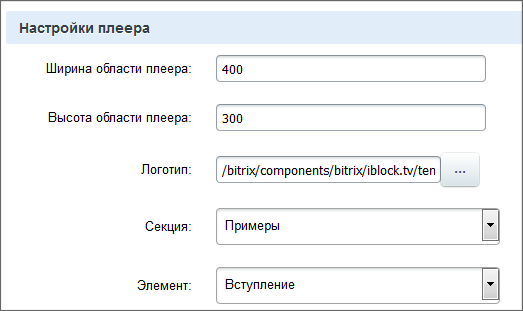

# Настройка Медиа проигрывателя в Видеотеке

**Навигация**
- [← Оглавление курса](index.md)
- [← Предыдущий: 2204 — Создание видеоальбомов и элементов](lesson_2204.md)
- [Следующий: 8623 — HTML-код с видеохостинга →](lesson_8623.md)

Официальная страница урока: https://dev.1c-bitrix.ru/learning/course/index.php?COURSE_ID=34&LESSON_ID=2205

### Как настроить Медиа проигрыватель в Видеотеке

Медиа проигрыватель встроен в Видеотеку и размещён в ней в шаблоне компонента. Настройки проигрывателя в Видеотеке через форму настроек компонента ограничены, фактически это

			Ширина и Высота

                    

		. Полностью настроить плеер можно через исправление файлов компонентов в папках. К этой операции нужно подходить внимательно с полным пониманием того, что вы делаете. Если не уверены в своих силах, обратитесь к администратору сайта или разработчику.

- Откройте страницу Контент &gt; Структура сайта&gt; Файлы и папки &gt; bitrix/components/bitrix/iblock.tv/templates/.default . (В рамках локальной установки это соответствует папке `C:\Program Files\Bitrix Environment\www\bitrix\components\bitrix\iblock.tv\templates\.default\`, если не менялся стандартный путь установки.)
- Откройте для редактирования файл **template.php** из этой папки.

Начиная с пятой строки начинается код компонента **bitrix:player**. Это и есть Медиа проигрываетель в **Видеотеке**. Изменяя параметры плеера непосредственно в коде компонента вы добьетесь нужных результатов. В качестве образца настроек можно взять настройки простого плеера, открыв страницу с размещенным плеером для редактирования в режиме PHP. Какие параметры соответствуют каким полям в настройках можно узнать в документации к *"1С-Битрикс: Управление сайтом"* на странице

			Медиа проигрыватель

                    Компонент осуществляет проигрывание медиафайлов на веб-страницах.

						[Описание компонента «Медиа проигрыватель» в пользовательской документации.](http://dev.1c-bitrix.ru/user_help/detail.php?ID=102532)

		.

### Важно запомнить!

Модификация шаблона компонента требует выполнения определенных правил. В частности, копирования шаблона в своё пространство имен и применение нового шаблона к компоненту. Подробнее об этом можно почитать в уроке

			Шаблоны компонентов

                    **Шаблон компонента** - программный код, преобразующий данные, подготовленные компонентом, непосредственно в HTML-код.

[Читать подробнее...](/learning/course/index.php?COURSE_ID=43&LESSON_ID=2829)

		 курса **Разработчик Bitrix Framework**. Если вы не уверены в своих силах, то лучше обратитесь к администратору или разработчику проекта.
