# Страница с файлами для скачивания

**Навигация**
- [← Оглавление курса](index.md)
- [← Предыдущий: 7153 — Каталог товаров без использования модуля Торговый каталог](lesson_7153.md)
- [Следующий: 5346 — Основные сведения →](lesson_5346.md)

Официальная страница урока: https://dev.1c-bitrix.ru/learning/course/index.php?COURSE_ID=34&LESSON_ID=23876

Допустим, мы хотим разместить на сайте страницу со списком файлов для скачивания. Рассмотрим два способа организации такой страницы:

### Видеоурок

### Способ №1: с помощью визуального редактора

Этот наиболее простой способ размещения файлов для скачивания. Такой способ подходит, если требуется просто выложить файлы для скачивания (без дополнительных возможностей вроде поиска по файлам). Данный способ доступен во всех редакциях продукта.

1. Загрузим
  Загрузка из Административного раздела
  Этот способ используется для загрузки файлов в роли статического контента. Например, вывести
  файл формата PDF для загрузки его пользователем.
  В административном разделе системы перейдите в папку, в которой будет храниться загружаемый
  файл. Нажмите на кнопку Загрузить файл под фильтром, откроется форма для загрузки. Добавьте
  файлы для загрузки и сохраните их.
  
  [Подробнее](lesson_1880.md)...
  		 на сайт все необходимые файлы через административный раздел (например, в папку **/upload**).
2. Создадим страницу
  Создавать страницу лучше сразу в том разделе, где она должна "жить". Перенести неверно созданную
  страницу можно, но зачем лишние действия? Создание страниц доступно с помощью Мастера, по
  шаблону и через документооборот. Самый простой и рекомендуемый нами способ - с
  помощью Мастера.
  
  [Подробнее](lesson_1911.md)...
  		, на которой хотим выводить файлы для скачивания.
3. Откроем созданную страницу на редактирование в
  			визуальном редакторе
  Редактирование страниц
  На панели управления нажмем кнопку **Изменить страницу**:
  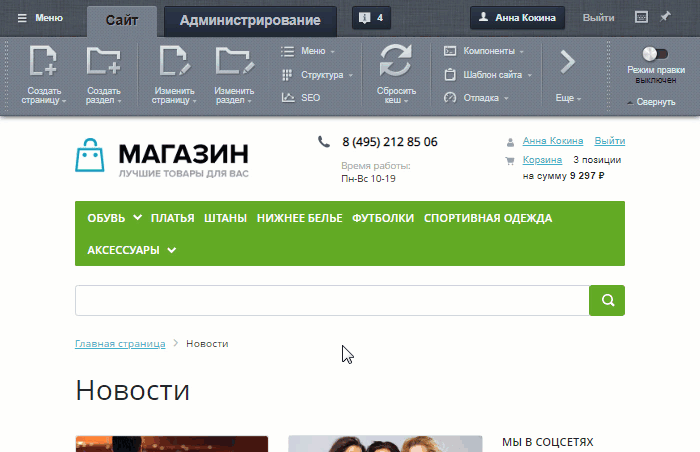
  [Подробнее](lesson_9201.md)...
  		:
  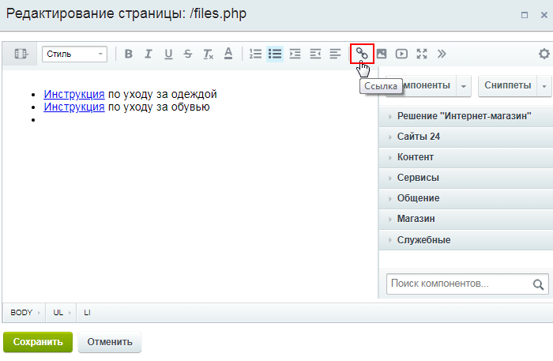
  С помощью инструмента **Ссылка** добавим
  			ссылки
  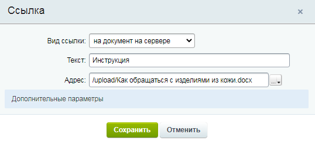
  		 на файлы, загруженные ранее в структуру сайта, и сохраним изменения.
  ## Процесс добавления ссылки пошагово
  1. Укажем **Вид ссылки**: `на документ на сервере` и пропишем текст ссылки. В поле **Адрес** можно либо прописать путь до файла, либо найти его в структуре сайта (в данном примере мы будем искать файл в структуре сайта):
    
  2. В фильтре установим значение `Все файлы`. В левом окне найдём папку, в которую ранее загружали файлы (папка **/upload**), кликнем по ней и в левом окне выберем нужный файл. Нажмём кнопку **Открыть**:
    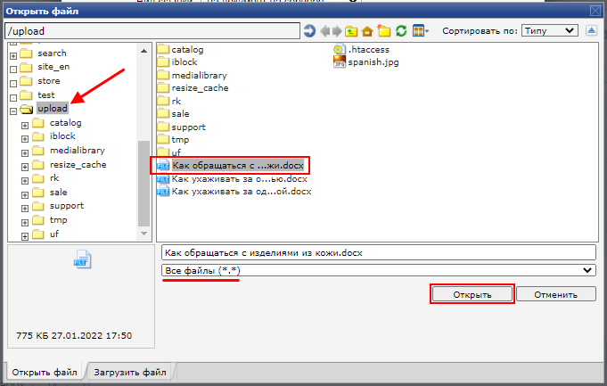
    **Примечание**: Здесь же внизу можно перейти во вкладку **Загрузить файл** и добавить новый файл.
  3. Путь до загруженного документа подставился в поле **Адрес**. На этом основные шаги по добавлению ссылки выполнены. При желании можно кликнуть меню **Дополнительные параметры** и заполнить остальные поля:
    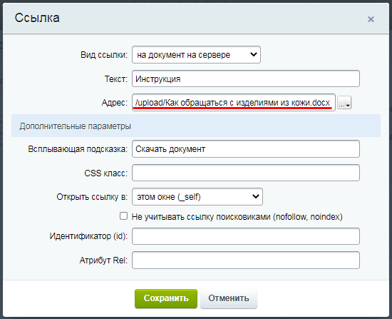
    Дополнительные поля (заполнять **не обязательно**):
    - **Всплывающая подсказка** - текст подсказки, которую увидят пользователи при наведении курсора на ссылку;
    - **CSS класс** - опция для подключения
      			класса стилей
      Таблицы стилей представляют собой совокупность правил, применяемых для оформления определенных элементов на страницах сайта. Технология каскадных стилей (CSS) позволяет хранить всю информацию о разметке страницы, используемых на ней шрифтах, цветах, стилях оформления меню и т.д. в определенном месте (одном или нескольких файлах).
      [Подробнее](https://dev.1c-bitrix.ru/learning/course/index.php?COURSE_ID=43&CHAPTER_ID=04938)...
      		;
    - **Открыть ссылку в** - где открыть ссылку: в этом окне, в родительском, в новом или в самом наружном;
    - **Не учитывать ссылку поисковиками (nofollow, noindex)** - при отмеченной опции ссылка не будет индексироваться поисковыми роботами;
    - **Идентификатор (id):** - идентификатор ссылки;
    - **Атрибут Rel** -
      			атрибут
      Несмотря на то, что браузеры в большинстве своем не поддерживают атрибут rel, на сайтах часто можно встретить код rel="nofollow", предназначенный для поисковых систем Google и Яндекс. Ссылки, помеченные таким образом, не передают PageRank и ТИЦ.
      [Подробнее](http://htmlbook.ru/html/a/rel)...
      		, определяющий отношения между текущим документом и документом, на который ведет ссылка.

В результате на странице будет отображаться

			список документов

		, доступных для скачивания.

**Важно!** Если после загрузки файла его название отображается некорректно, то откройте настройки **Главного модуля** (Настройки &gt; Настройки продукта &gt; Настройки модулей &gt; Главный модуль) и отметьте опцию **Сохранять исходные имена загружаемых файлов**.

## Если нужный документ открывается в браузере, но не скачивается

Если при клике по ссылке нужный документ открывается в браузере, но **не скачивается**, то откройте страницу в визуальном редакторе, перейдите в

			совмещенный режим редактирования

Визуальный редактор может работать в двух режимах. Визуальный режим - более простой и интиутивно понятный вариант. Мы сразу видим как будут выглядеть элементы на странице. Второй вариант - режим исходного кода. Он предназначен для опытных пользователей и позволяет произвести дополнительную настройку (например, задать значения параметров). Также существует совмещенный режим - экран делится на две части для визуального режима и режима кода.

[Подробнее](lesson_6301.md)...

		 (или в режим исходного кода) и добавьте атрибут

			download

При наличии атрибута **download** браузер не переходит по ссылке, а предложит скачать документ, указанный в адресе ссылки.

[Подробнее](http://htmlbook.ru/html/a/download)...

		 в тег **&lt;a&gt;** (этот тег отвечает за создание ссылки). Должно получиться вот так:

**&lt;a href="адрес_ссылки" download&gt;Текст ссылки&lt;/a&gt;**:

### Способ №2: с помощью универсальных списков

Этот способ сложнее и требует навыков работы с функционалом

			Универсальные списки

**Универсальные списки** - инструмент для удобного хранения и работы с любой структурированной информацией.

[Подробнее](https://dev.1c-bitrix.ru/learning/course/index.php?COURSE_ID=34&CHAPTER_ID=02722&LESSON_PATH=3905.4753.2722)...

		. Такой способ подходит, если нужно структурировать файлы по темам (используя разные списки и разделы) и/или организовать возможность

			поиска

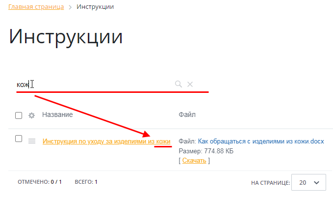

		.

**Примечание**: Модуль **Универсальные списки** доступен в редакции **Бизнес** и выше.

1. Откроем страницу **Типы информационных блоков** (Контент &gt; Инфоблоки &gt; Типы инфоблоков), добавим новый
  			тип инфоблоков
  Вам предстоит работа с новым видом информации? Создайте под него свой тип инфоблоков.
  
  [Подробнее](lesson_2010.md)...
  		 с идентификатором
  			download_files
  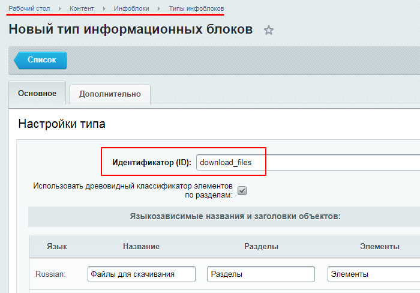
  		 и назовём его **Файлы для скачивания**.
2. Откроем
  			настройки модуля
  На закладке Права доступа определяется, какие группы пользователей имеют доступ к инфоблокам, используемым в качестве списков. Для настройки доступа нужно в столбце **Группы пользователей** выбрать нужную группу пользователей, а в столбце **Типы инфоблоков** - назначить соответствующий тип инфоблока для выбранной группы.
  [Подробнее](https://dev.1c-bitrix.ru/learning/course/index.php?COURSE_ID=41&LESSON_ID=9093)...
  		 **Универсальные списки** (Настройки &gt; Настройки продукта &gt; Настройки модулей &gt; Универсальные списки) и во вкладке **Права доступа** укажем созданный тип инфоблока и группу пользователей, которая может управлять списками в этом типе:
  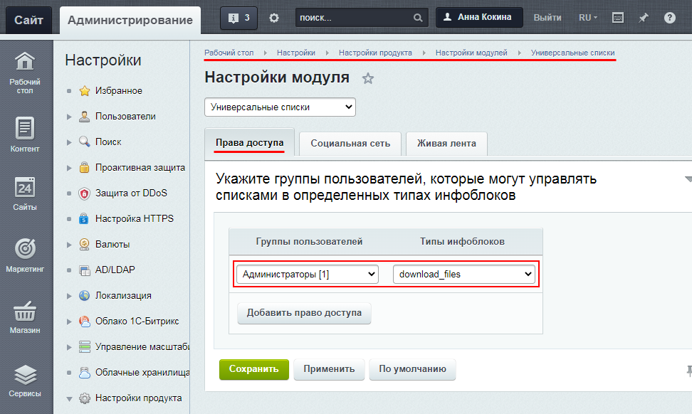
3. Создадим страницу
  Создавать страницу лучше сразу в том разделе, где она должна "жить". Перенести неверно созданную
  страницу можно, но зачем лишние действия? Создание страниц доступно с помощью Мастера, по
  шаблону и через документооборот. Самый простой и рекомендуемый нами способ - с
  помощью Мастера.
  
  [Подробнее](lesson_1911.md)...
  		, на которой хотим выводить файлы для скачивания. Разместим на ней
  			компонент
  Как разместить компонент на странице?
  Просто переместите его мышкой в рабочую область слева от списка. Заметьте, что у простых
  компонентов серая иконка, а у комплексных - зеленая.
  
  [Подробнее](lesson_9163.md)...
  		 **Универсальные списки** и настроим его на работу с созданным ранее типом инфоблоков
  			download_files
  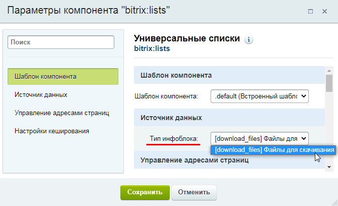
  		.
4. В результате этих действий на странице отобразится
  			форма добавления новых списков.
  
  		 Кликнем по кнопке **Создать новый** и добавим новый
  			универсальный список
  Заполните поля закладок формы создания списка. Значения большинство полей понятно из их названия, поясним только то, что может вызвать непонимание.
  [Подробнее](lesson_2955.md)...
  		:
  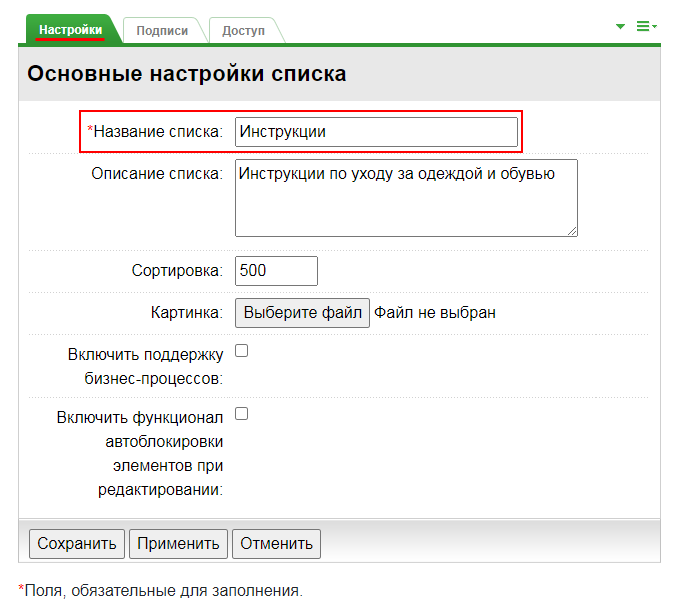
  Сохраните изменения.

  - **Вкладка Настройки:** обязательно укажем название. Остальные параметры можно не заполнять.
  - **Вкладка Подписи:** при желании можно заменить стандартные системные
    			подписи
    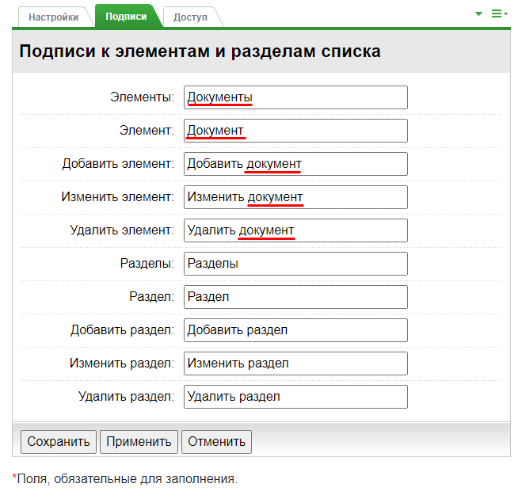
    		 на собственные (например, вместо слова "Элемент" выводить слово "Документ").
  - **Вкладка Доступ:** зададим
    			права доступа
    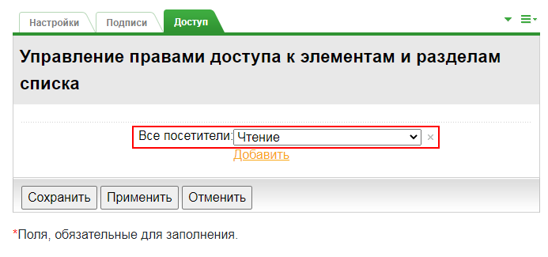
    		 к создаваемому списку (например, для всех пользователей доступ уровня **Чтение**).
5. Откроем созданный список и в меню действий выберем пункт
  			Настроить поля.
  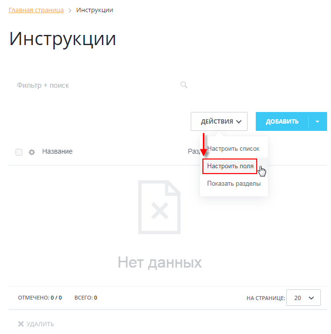
  		 Добавим
  			новое поле
  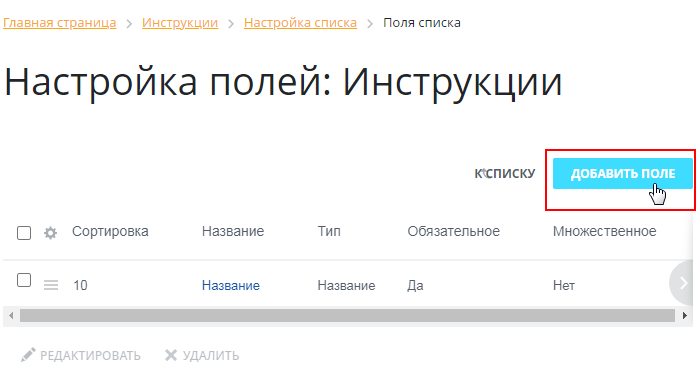
  		:
  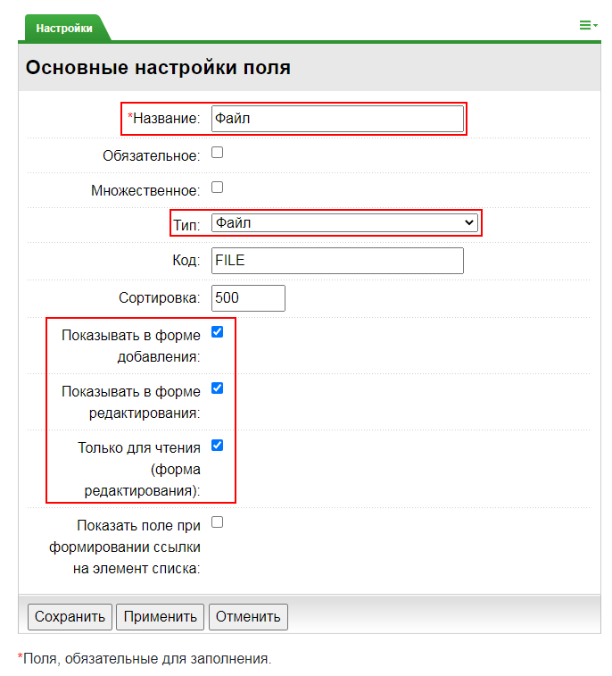

  - Укажем название.
  - Выберем тип **Файл**.
  - Отметим опции **Показывать в форме добавления** и **Показывать в форме редактирования**.
  - В форме редактирования разрешим только просмотр документа (но не его изменение), отметив опцию **Только для чтения (форма редактирования)**.

На этом настройка универсального списка окончена. Теперь можно

			добавлять элементы

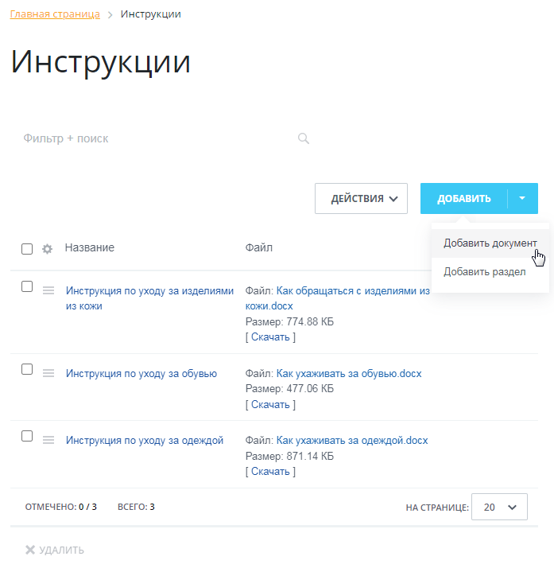

		 этого списка.

**Примечание**: Можно настроить отображаемые в списке колонки, кликнув по значку

			шестерёнки

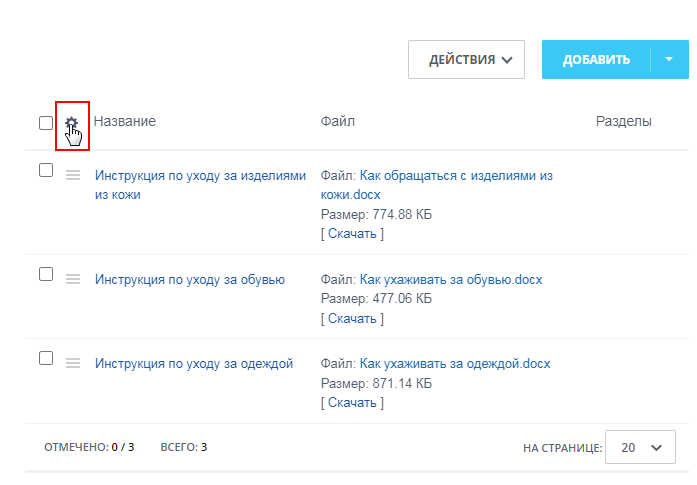

		 и выбрав необходимые поля

В результате на странице будет отображаться

			список документов

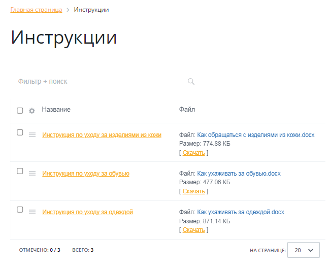

		, доступных для скачивания.

Желательно это знать:

- [HTMLbook](http://htmlbook.ru/) - справочник по HTML
