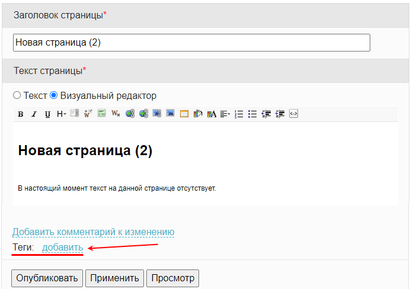

# Теги

**Навигация**
- [← Оглавление курса](index.md)
- [← Предыдущий: 2054 — Категории](lesson_2054.md)
- [Следующий: 6774 — Пошаговый пример создания статьи в Wiki →](lesson_6774.md)

Официальная страница урока: https://dev.1c-bitrix.ru/learning/course/index.php?COURSE_ID=34&LESSON_ID=24536

|  | ### Теги |
| --- | --- |

> **Теги** - инструмент для поиска страниц штатными поисковыми механизмами.

**Примечание**: Теги недоступны в Wiki, работающей в рамках модуля **Социальная сеть**.

Теги добавляются при редактировании страницы нажатием кнопки **Добавить**:

При постановке курсора в поле появляется список

			уже использованных

                    Например, если в ранее созданных в Wiki страницах уже добавлялись теги.

		 в системе тегов с указанием числа страниц с выбранным тегом:

Можно выбрать уже существующий тег или вписать новый. Несколько тегов указываются через запятую и пробел.

**Примечание:** для коробочной версии Битрикс24 существует [способ](https://dev.1c-bitrix.ru/learning/course/index.php?COURSE_ID=48&LESSON_ID=4562#user_lists) создавать

			автоматически формируемые

                    Такие списки похожи на списки страниц по Категориям. Отличие в том, что добавление страниц в список и их удаление из него, происходит автоматически по заданным параметрам (это может быть идентификатор пользователя, создавшего страницу, или дата создания и т.д.) Для категории же страницы указываются вручную (привязываются при создании страницы).

		 списки страниц. Для реализации такой задачи надо обратиться к администратору.

Теги нужны для функционала поиска по сайту. По нажатии на тег вы увидите страницу с результатами поиска, где будут собраны все страницы, для которых он указан. Больше информации о поиске по тегам вы найдете в уроке [Облако тегов](https://dev.1c-bitrix.ru/learning/course/index.php?COURSE_ID=35&LESSON_ID=2067) курса Администратор. Базовый, в том числе о добавлении тегов к элементам инфоблока (товарам, новостям и т.д.).
