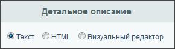
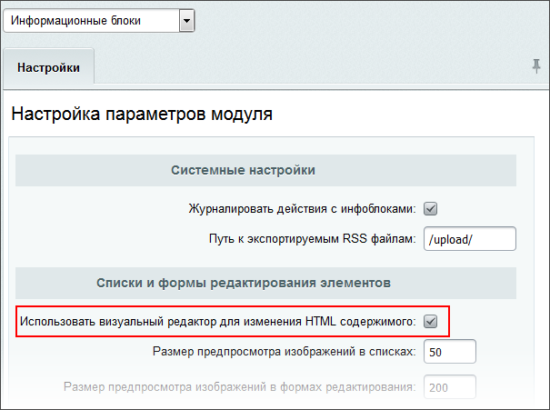

# Визуальный редактор

**Навигация**
- [← Оглавление курса](index.md)
- [← Предыдущий: 10231 — Практические задания](lesson_10231.md)
- [Следующий: 9201 — Где используется редактор →](lesson_9201.md)

Официальная страница урока: https://dev.1c-bitrix.ru/learning/course/index.php?COURSE_ID=34&LESSON_ID=2484

В любой работе важен хороший инструмент. И работа с веб-сайтами не исключение. *"1С-Битрикс: Управление сайтом"* обладает мощным встроенным

			WYSIWYG

                    **WYSIWYG** (произносится как «ви-зи-виг», от англ. What You See Is What You Get — «что видишь, то и получишь») —  свойство программ или веб-интерфейсов, в которых содержание отображается в процессе редактирования и выглядит максимально близко похожим на конечную продукцию. То есть вы вносите изменения и сразу видите результат. В настоящее время для подобных программ также широко используется понятие «визуальный редактор».

		 редактором для работы со страницами сайта. Благодаря визуальному редактору мы прямо в браузере выполняем многие операции: от простого редактирования текста до настройки компонентов. По сути, с помощью визуального редактора мы способны редактировать любую информацию на сайте.

Визуальный редактор позволяет работать с:

- текстом;
- изображениями и видео;
- компонентами и
  			сниппетами
                      Cохранённые фрагменты текста или кода. Мы расскажем о них подробнее чуть дальше.
  		.

Уточним, что редактор поддерживает все современные браузеры:

- Mozilla Firefox
- Microsoft Edge
- Safari
- Google Chrome
- Яндекс Браузер

 <!-- &lt;ul class="fa fa-circle sz-sm"&gt;

  &lt;li&gt;&lt;i&gt;Firefox&lt;/i&gt; версии 3.x и выше;&lt;/li&gt;

  &lt;li&gt;&lt;i&gt;Opera&lt;/i&gt; версии 12.x и выше;&lt;/li&gt;

  &lt;li&gt;&lt;i&gt;Safari&lt;/i&gt; версии 5 и выше;&lt;/li&gt;

  &lt;li&gt;&lt;i&gt;Google Chrome&lt;/i&gt; версии 7 и выше;&lt;/li&gt;

  &lt;li&gt;&lt;i&gt;Internet Explorer&lt;/i&gt; версии 11.&lt;/li&gt;
 &lt;/ul&gt; -->

|  | ### Важно запомнить! |
| --- | --- |

Визуальный редактор не отображается в формах редактирования, если:

1. его использование
  			запрещено
                      
  		 администратором сайта;
2. в форме редактирования
  			включён иной режим
                      
  		 работы с текстом;
3. он отключен в
  			настройках
                      
  		 модуля **Информационные блоки** (это касается только форм редактирования элементов и разделов инфоблоков).
