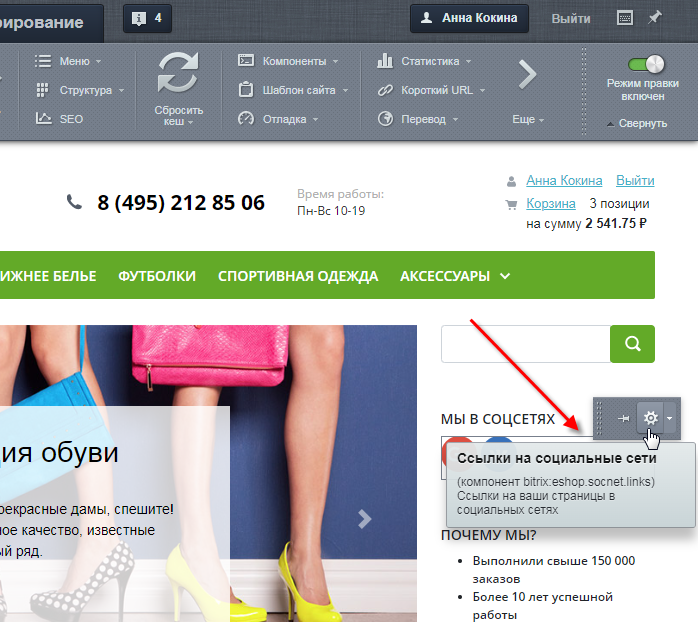
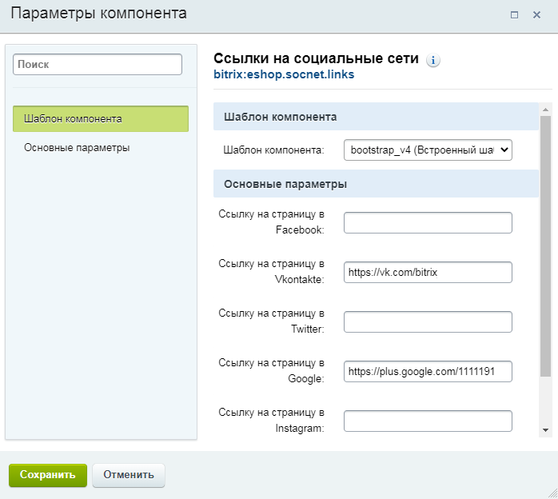
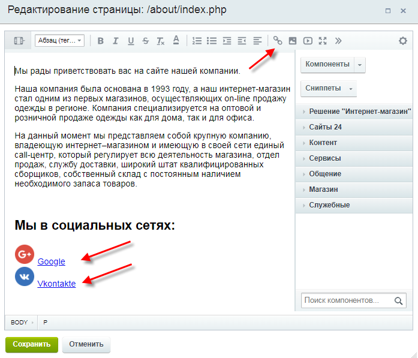
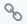
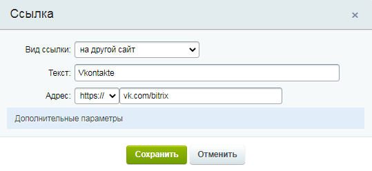
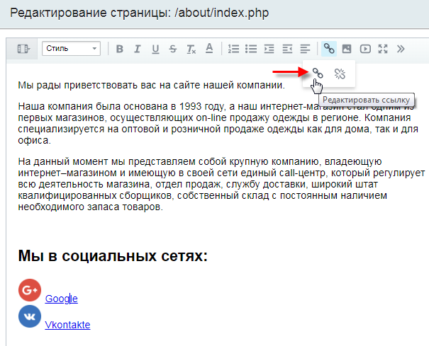

# Как изменить ссылки на социальные сети

**Навигация**
- [← Оглавление курса](index.md)
- [← Предыдущий: 12852 — Как поменять фон сайта](lesson_12852.md)
- [Следующий: 12882 — Проверьте себя →](lesson_12882.md)

Официальная страница урока: https://dev.1c-bitrix.ru/learning/course/index.php?COURSE_ID=34&LESSON_ID=25034

Допустим, на сайте необходимо изменить/добавить ссылки на социальные сети.

### Видеоурок

### Как могут выводиться ссылки

Сначала контент-менеджеру нужно определить, в какой части сайта располагаются ссылки на социальные сети:

- в шаблоне сайта (header и footer);
- в основной рабочей области (work area).

## Из каких частей формируется страница сайта

Страница сайта формируется системой динамически из трёх частей:

Подробнее о частях сайта можно прочитать [в уроке.](lesson_1847.md)

Ссылки на социальные сети могут быть:

- компонентом в шаблоне сайта или в основной рабочей области;
- статической информацией в шаблоне сайта или в основной рабочей области.

Если в режиме

			Правка

                    
 [Подробнее](lesson_1832.md)

		 при наведении курсора мыши на информацию, которую мы хотим отредактировать, появится панель со значком шестерёнки – это

			компонент

                    Представьте, что сайт - это дом. Дом состоит из этажей и комнат. Каждая комната выполняет определенную функцию - в спальне мы спим, на кухне готовим еду, а в ванной принимаем душ. Компонент - это готовая комната нашего дома. Мы просто "выстраиваем" внешний вид сайта из набора разных компонентов. Один компонент показывает новости, другой - сообщение в блоге. Это и есть функции компонентов.

[Подробнее](lesson_1992.md)

		.

**Внимание**! Если признаков компонента нет (т.е. при наведении курсора в режиме **Правка** панель со значком шестерёнки не появляется), значит, ссылки на социальные сети размещены в виде статической информации либо в основной рабочей области, либо в шаблоне сайта. В

			последнем случае

В случае, когда ссылки на социальные сети размещены **в виде статической информации в шаблоне сайта**.

		 необходимо

			обратиться к разработчикам

                    Статическая информация, которая не нуждается (либо редко нуждается) в замене, как правило, размещается в статических зонах **footer** и **header**. Заменить её можно в кодах самих файлов, но делать это придется квалифицированному разработчику, либо разработчик должен организовать такую замену с помощью компонентов системы силами редакторов сайта.

		, т.к. контент-менеджер работает только с **основной рабочей областью** и с **компонентами**.

Далее в уроке рассмотрим случаи, когда контент-менеджер сможет изменить ссылки на социальные сети:

- ссылки выводятся **компонентом** в шаблоне сайта или в основной рабочей области;
- ссылки представляют собой **статическую информацию в основной рабочей области**.

### Компонент

И в шаблоне сайта, и в основной рабочей области, можно легко изменить параметры компонента:

1. В режиме
  			Правка
                      
   [Подробнее](lesson_1832.md)
  		 наведите курсор мыши на область компонента – появится панель настроек.
2. Кликните по значку
  			шестерёнки
  
  		.
3. В параметрах компонента пропишите ссылки на Ваши социальные сети:
  
4. Сохраните изменения.

**Примечание**: Компонент **Ссылки на социальные сети** (eshop.socnet.links) доступен только в редакциях "Малый бизнес" и "Бизнес", т.к. он является компонентом решения

			Современный интернет-магазин

**Современный интернет-магазин** (bitrix.eshop) – готовый интернет-магазин, включающий в себя новые яркие шаблоны дизайнов, а также уникальные возможности для повышения эффективности бизнеса, помогающие продавать через Интернет.

[Подробнее](https://marketplace.1c-bitrix.ru/solutions/bitrix.eshop/)...

		, включенного в дистрибутивы этих редакций.

* Социальные сети Facebook и Instagram признаны экстремистскими и запрещены на территории Российской Федерации.

### Статическая информация в основной рабочей области

1. В режиме
  			Правка
                      
   [Подробнее](lesson_1832.md)
  		 наведите курсор мыши на рабочую область. Кликните по появившейся кнопке
  			Изменить страницу в редакторе
                      
  		.
2. В открывшемся
  			Визуальном редакторе
                       В любой работе важен хороший инструмент. И работа с веб-сайтами не исключение. "1С-Битрикс: Управление сайтом" обладает мощным встроенным WYSIWYG редактором для работы со страницами сайта. Благодаря визуальному редактору мы прямо в браузере выполняем многие операции: от простого редактирования текста до настройки компонентов. По сути, с помощью визуального редактора мы способны редактировать любую информацию на сайте.
  [Подробнее](https://dev.1c-bitrix.ru/learning/course/index.php?COURSE_ID=34&CHAPTER_ID=06299&LESSON_PATH=3905.6299)
  		 отредактируйте информацию основной рабочей области (в данном случае –
  			ссылки
  Ссылки обладают большими возможностями: мы можем создать ссылку на другой сайт, на документ, на часть страницы или даже на создание электронного письма. Рассмотрим работу со ссылками в визуальном редакторе *"1С-Битрикс: Управление сайтом"*. Кнопки для управления ссылками находятся на панели инструментов.
  [Подробнее](lesson_9241.md)...
  		):
  

  - Для **создания** новой ссылки кликните по значку , в поле "Вид ссылки" выберите **На другой сайт** и укажите текст ссылки и саму ссылку:
    
  - Для **редактирования** существующей ссылки сначала кликните по тексту ссылки, затем по значку , выберите пункт
    			Редактировать ссылку
    
    		 и в открывшейся форме откорректируйте информацию.

Для улучшения визуального восприятия можно добавить изображения значков социальных сетей. О том, как разместить изображения, читайте в

			соответствующем уроке

Визуальный редактор *"1С-Битрикс: Управление сайтом"* позволяет загружать графику с вашего компьютера и размещать ее на страницах сайта. Для размещения изображения нажмите кнопку **Изображение** на панели инструментов редактора.

[Подробнее](lesson_9247.md)...

		.

### Заключение

Контент-менеджер может легко изменить ссылки на социальные сети в следующих случаях:

- ссылки выводятся **компонентом** в шаблоне сайта или в основной рабочей области;
- ссылки представляют собой **статическую информацию в основной рабочей области**.

Но если ссылки на социальные сети размещены **в виде статической информации в шаблоне сайта**, то нужно обратиться к разработчику.
