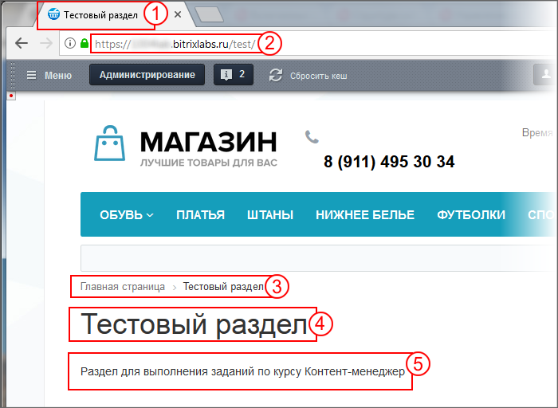
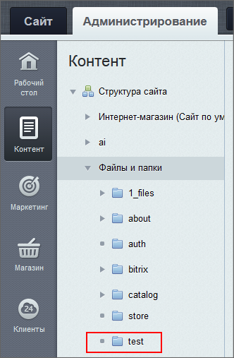
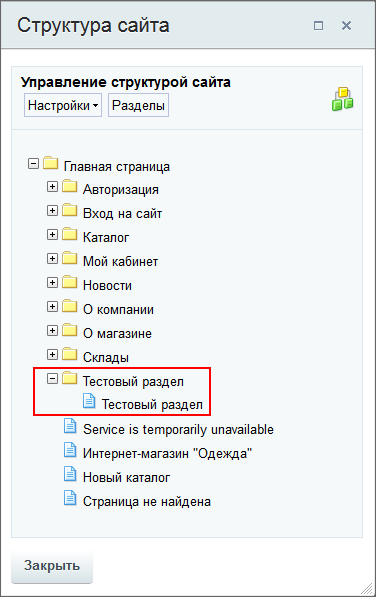
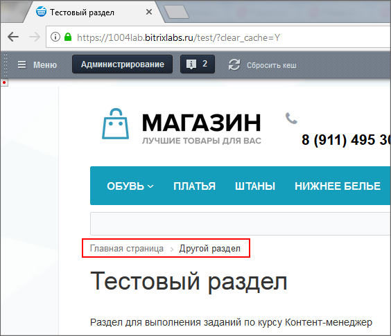

# Структура сайта

**Навигация**
- [← Оглавление курса](index.md)
- [← Предыдущий: 2528 — С чего начать](lesson_2528.md)
- [Следующий: 7719 — Права доступа на статические страницы →](lesson_7719.md)

Официальная страница урока: https://dev.1c-bitrix.ru/learning/course/index.php?COURSE_ID=34&LESSON_ID=2581

|  | **Справочные материалы**: 
 [Управление структурой](https://dev.1c-bitrix.ru/learning/course/index.php?COURSE_ID=34&CHAPTER_ID=04460&LESSON_PATH=3905.4460) 
 [Создание новых страниц и разделов](lesson_1911.md) |
| --- | --- |

Установленный демо Интернет-магазин состоит из динамических страниц, за исключением раздела О магазине. Меню этого раздела размещено в

			"подвале" сайта

                    

		. С этим разделом и будем работать при выполнении задач со структурой сайта. Тип меню этого раздела - Нижнее меню, мы также будем использовать это название.

#### Основное задание

Создайте раздел с названием **Тестовый раздел**, именем папки **test**. В логической структуре раздел разместите на втором уровне, в физической структуре - на первом. В Нижнем меню раздел - на последнем месте. Заголовок окна браузера соответствует названию раздела. В теле страницы укажите текст: "Раздел для выполнения заданий по курсу Контент-менеджер".

## Результат выполнения задания:

В публичной части:

Где:

1 - название раздела в заголовке окна браузера;

2 - в адресе сайта видно, что папка **test** в физической структуре находится в корне сайта, на первом уровне;

3 - в цепочке навигации видно, что в логической структуре раздел на втором уровне, после главной страницы;

4 - название индексной страницы раздела совпадает с названием раздела;

5 - текст на странице раздела.

В Нижнем меню:

В рамках физической структуры:

В рамках логической структуры

**Дополнительно**

Измените название раздела **Тестовый раздел** в цепочке навигации на "Другой раздел". Не пункт меню, не название страницы, не название заголовка окна браузера, а только пункт в Цепочке навигации. (Затем восстановите прежнее значение.)

## Результат замены имени раздела в Цепочке навигации:

