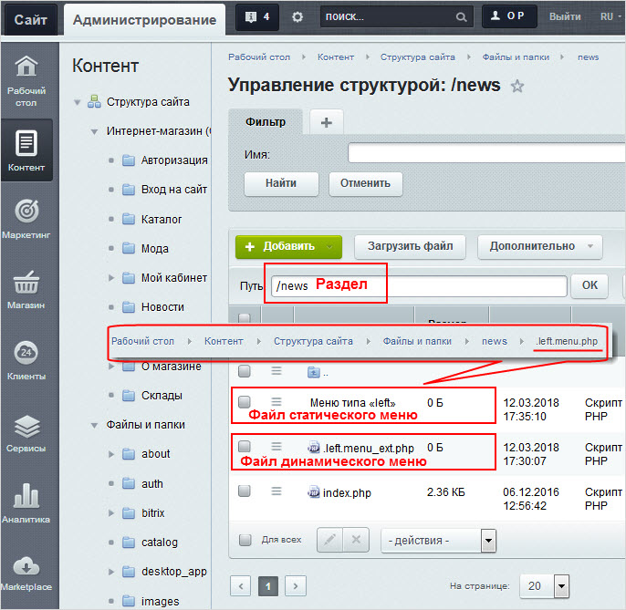

# Компоненты и файлы меню

**Навигация**
- [← Оглавление курса](index.md)
- [← Предыдущий: 10239 — Виды и типы меню](lesson_10239.md)
- [Следующий: 26242 — Наследование →](lesson_26242.md)

Официальная страница урока: https://dev.1c-bitrix.ru/learning/course/index.php?COURSE_ID=34&LESSON_ID=26240

### Видеоурок

Посмотрите видеоролик, где подробно показана разница между статическим и динамическим меню на нашем демо-сайте:

### О компонентах и файлах

Для вывода меню используется компонент

			Меню

                    Компонент выводит меню указанного типа. Компонент является стандартным и входит в дистрибутив модуля.

						[Описание компонента «Меню» в пользовательской документации.](http://dev.1c-bitrix.ru/user_help/detail.php?ID=133381)

		. Его можно настроить как на работу с файлами и папками, так и на инфоблок. Также можно легко изменить внешний вид представления информации, выбрав другой шаблон в настройках компонента.

Для динамического чаще всего используется

			Пункты меню

                    Компонент осуществляет дополнение созданного меню названиями разделов инфоблоков. Компонент является стандартным и входит в дистрибутив модуля.

						[Описание компонента «Пункты меню» в пользовательской документации.](http://dev.1c-bitrix.ru/user_help/detail.php?ID=133383)

		. Но, вообще говоря, для динамического меню можно использовать и некоторые другие компоненты, работающие с инфоблоками, например,

			Каталог

                     Комплексный компонент осуществляет вывод полного каталога товаров из определенного инфоблока.

						[Описание компонента «Каталог (комплексный компонент)» в пользовательской документации.](http://dev.1c-bitrix.ru/user_help/detail.php?ID=62978)

		,

			Новости

                    Комплексный компонент позволяет создать новостной раздел на сайте. Доступен просмотр детальной информации, списка элементов, настройка экспорта в rss, организация голосования за новости (или другие элементы инфоблоков), настройка отзывов, вывода материалов по темам, настройки ЧПУ и многое другое.

						[Описание компонента «Новости (комплексный компонент)» в пользовательской документации.](http://dev.1c-bitrix.ru/user_help/detail.php?ID=62967)

		 и др.

В административном разделе каждому меню соответствует свой файл. Он должен быть размещен в папке раздела. Для статического меню он имеет название **.тип_меню.menu.php.** (однако в Менеджере файлов имя файла данных автоматически представляется в виде ссылки **Меню типа "тип_меню"**), а для динамического - **.тип_меню.menu_ext.php**.

