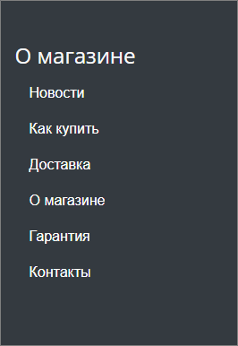
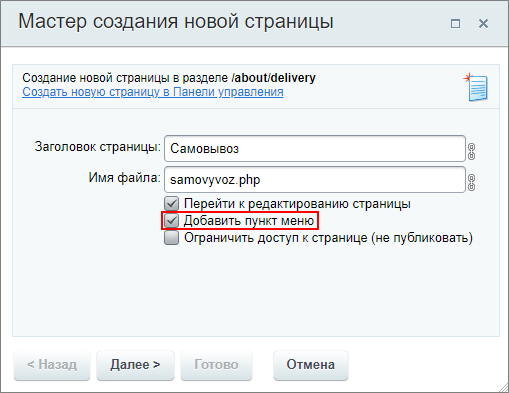
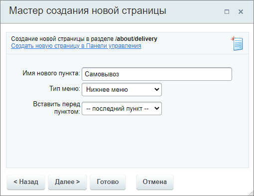
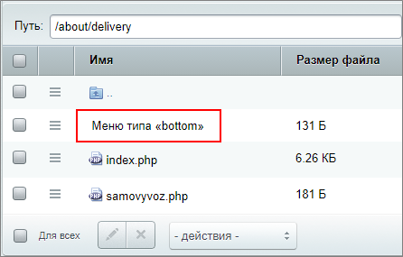
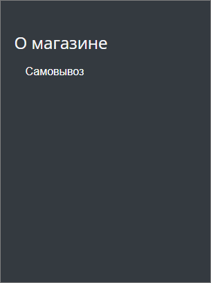
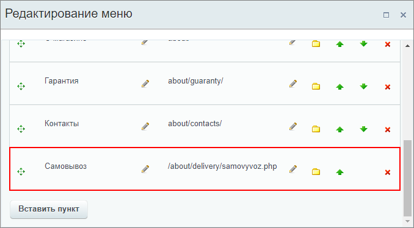

# Наследование

**Навигация**
- [← Оглавление курса](index.md)
- [← Предыдущий: 26240 — Компоненты и файлы меню](lesson_26240.md)
- [Следующий: 10247 — Пример создания статического меню →](lesson_10247.md)

Официальная страница урока: https://dev.1c-bitrix.ru/learning/course/index.php?COURSE_ID=34&LESSON_ID=26242

**Важно понять и запомнить:** меню в системе является наследуемым. Что это означает на практике?

### Основной принцип

> **Иерархическая наследуемость** означает, что если в разделе не создано собственное меню, то будет показываться первое встреченное меню из вышележащих разделов.

Принцип такой - основное меню с главной страницы транслируется на все разделы, подразделы и страницы сайта с этим шаблоном дизайна. Меню раздела, в свою очередь, транслируется на подразделы и страницы.

Если в разделе, в котором не создано собственное меню, вы воспользуетесь командой "Редактировать пункты меню", то фактически перейдете к редактированию вышестоящего меню.

|  | **Например:** посетитель находится в разделе `/ru/company/vakansii/`. Для показа меню типа left файл меню будет искаться в следующей последовательности: |
| --- | --- |

1. `/ru/company/vakansii/`
2. `/ru/company/`
3. `/ru/`
4. `/`

Если в одном из каталогов будет найден файл меню, то поиск останавливается и в последующих каталогах уже не ищется.

Если в каком-либо разделе создано своё меню, то оно заменяет основное. Это работает, даже если файл меню пустой. В таком случае в разделе не будет отображаться никакое меню.

Статическое меню заменяет статическое, а динамическое (основанное на инфоблоке) может быть заменено только динамическим.

Есть еще вариант применять для каждого раздела свой шаблон дизайна или прописать эту смену в шаблоне сайта, но для контент-менеджера это нетривиальная задача, поэтому лучше оставить её php-программистам. Для разработчиков наиболее подробная информация о меню дается в курсе [Разработчик Bitrix Framework](/learning/course/index.php?COURSE_ID=43&CHAPTER_ID=04708).

Мы же будем справляться с большинством задач методами, которые доступны контент-менеджеру.

В следующих уроках мы изменим основное меню и создадим собственные меню разделов - статическое и динамическое.

### Практический пример наследования меню

**Задача:** создать страницу в разделе сайта **Доставка** `/about/delivery/` и добавить её в нижнее меню **О магазине**.

Нижнее меню на сайте нашего магазина, к которому требуется добавить новый пункт, наследуется всеми страницами сайта (файл меню находится в корне сайта) и выглядит так:

Переходим в раздел **Доставка** и создаём страницу **Самовывоз**. Если мы оставим включенной опцию

			Добавить пункт меню

                    

		, то на

			втором шаге

                    

		 мастера создания страницы в разделе **Доставка** создастся своё собственное меню (если его не было ранее). И в файловой структуре мы увидим, что появился файл

			Меню типа «bottom»

                    

		.

В результате находясь на сайте в разделе **Доставка** мы увидим нижнее меню всего с одним пунктом - Самовывоз:

**Примечание:** обратите внимание, что новое пустое меню будет видно только в разделе Доставка. В других разделах отобразится основное меню по правилам наследования. Если это не так, рекомендуем отключить кеш в настройках

			 компонента меню

                    Материал о работе с компонентами Вы ещё не изучали. Если такая настройка покажется Вам
сложной,  можете вернуться к ней позже.
Подробнее в уроке [Как настроить компонент](lesson_9165.md)

		.

Чтобы избежать такой ситуации, при создании страницы отключайте опцию **Добавить пункт меню**, если Вам не требуется создание собственного меню в разделе.

Если же уже случилась описанная выше ситуация, то вновь созданное меню легко удалить. Для этого воспользуйтесь соответствующей кнопкой на панели находясь в разделе (например, Доставка):

Меню будет удалено и в разделе вновь отобразится основное меню по правилам наследования. В него и добавим нашу страницу перейдя в режим правки и нажав "Редактировать пункты меню":

