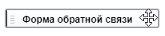
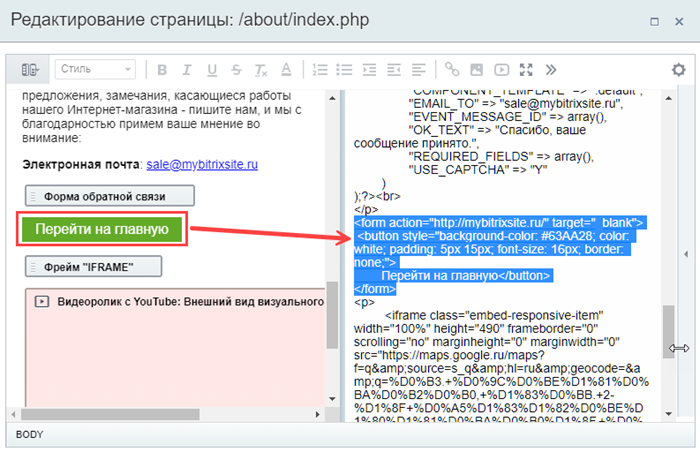

# Управление объектами в редакторе

**Навигация**
- [← Оглавление курса](index.md)
- [← Предыдущий: 9249 — Как разместить видео](lesson_9249.md)
- [Следующий: 10187 — Проверьте себя →](lesson_10187.md)

Официальная страница урока: https://dev.1c-bitrix.ru/learning/course/index.php?COURSE_ID=34&LESSON_ID=26244

Итак, вы научились размещать и редактировать различные объекты в визуальном редакторе: текст, изображения и видео, таблицы и ссылки, и т.д. А как же перемещать по странице все это многообразие?

### Видеоурок

### Как перемещать объекты на странице

Различные объекты в редакторе визуально представлены по-разному, чтобы их можно было легко отличить друг от друга. Способы перемещения их по странице тоже несколько различаются:

- **Перетаскивание объекта**. Зажмите левую кнопку мыши на объекте и перетащите в новое место, ориентируясь на вертикальную метку **|**. Причем для компонентов, видеороликов, блоков с кодом PHP или HTML отобразится курсор в виде
                      Например, при наведении на компонент:
  
  		. Для изображений, выделенного текста и ссылок такой курсор не показывается, но и для них перемещение мышкой работает;
- **Горячие клавиши
  			Ctrl+X
                      Вырезать выделенный фрагмент.
  		 и
  			Ctrl+V
                      Вставить выделенный фрагмент.**. Используйте горячие клавиши для переноса текста, ссылок, таблиц и изображений. Для этого выделите нужный фрагмент, вырежете его (Ctrl+X), установите курсор в новое место и вставьте (Ctrl+V);
- **Режим исходного кода**. Некоторые объекты не совсем удобно перемещать в режиме визуального редактора. Например, с помощью языка разметки HTML на странице может быть расположена кнопка со ссылкой, а на языке программирования PHP прописана дополнительная логика. В режиме исходного кода все объекты будут представлены в виде текста, кода и разметки. А значит станут актуальны способы, описанные выше. Любую часть страницы легко получится вырезать и вставить в другом месте.
  
  **Внимание!** Режим исходного кода предназначен для опытных пользователей, умеющих читать код и работать с ним.
