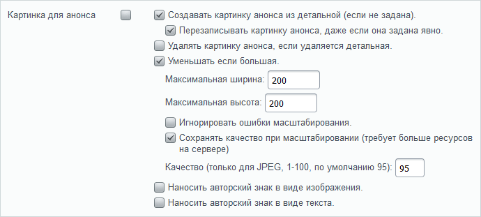

# Системная обработка фотографий

**Навигация**
- [← Оглавление курса](index.md)
- [← Предыдущий: 1912 — Предустановленные данные для полей элементов и разделов](lesson_1912.md)
- [Следующий: 13272 — Нанесение авторского знака →](lesson_13272.md)

Официальная страница урока: https://dev.1c-bitrix.ru/learning/course/index.php?COURSE_ID=34&LESSON_ID=26248

Как правило, для элемента инфоблока используется несколько изображений: маленькая превьюшка и большая фотография. Если элементов много, то приходится тратить усилия на создание маленьких картинок из больших. Экономьте свое время, загружайте только одну большую картинку.

### Видеоурок

### Как выполнять настройки?

В свойствах вкладки **Поля** укажите правила обработки и создания анонсовой картинки:

- Установите флажок **Создавать картинку анонса из детальной**.
  **Примечание:** при отмеченной опции картинка анонса создается в момент добавления или редактирования детальной картинки. Поэтому, если необходимо пересоздать картинку анонса, следует обновить детальное изображение элемента инфоблока.
  Если картинка анонса уже была задана, но при этом должна создаться заново из детальной картинки, то отметьте опцию **Перезаписывать картинку анонса, даже если она задана явно**.
- Установите флажок **Уменьшать если большая**. Картинка будет уменьшаться до размеров, заданных в полях ниже.
- В полях **Максимальная ширина** и **Максимальная высота** выставьте размер изображения в пикселях. Изменение размера происходит пропорционально. Задание размеров в этих полях дает гарантию, что анонсовая картинка случайно не испортит дизайн страницы.
- Установите флажок **Игнорировать ошибки масштабирования**, чтобы выводилась картинка как есть, если она не обработалась.
  **Примечание:** программный механизм изменения размера изображений умеет «работать» с традиционными графическими форматами: **jpg, gif, png, webp**. Если вы загрузите изображение в другом формате, **bmp**, например, то обработки не произойдет. Система либо выведет картинку в исходном размере, либо выведет сообщение о невозможности её обработки. Какое из этих двух «либо» сработает – зависит от флажка **Игнорировать ошибки масштабирования**.
- Для настройки качества обработки вы также можете использовать другие параметры вкладки **Поля**. Но учтите, что их использование требует свободных ресурсов сервера:

  - Установите флажок **Сохранять качество при масштабировании**.
  - Задайте приемлемый уровень качества в процентах в поле **Качество**.

О нанесении **авторского знака** читайте в [следующем уроке главы](lesson_13272.md).

Аналогичные настройки произведите в поле **Детальная картинка** для настройки отображения картинки, показываемой при детальном просмотре.
