# Работа с компонентами

**Навигация**
- [← Оглавление курса](index.md)
- [← Предыдущий: 8597 — Вывод данных в публичной части](lesson_8597.md)
- [Следующий: 2740 — Рабочий стол, веб-стикеры →](lesson_2740.md)

Официальная страница урока: https://dev.1c-bitrix.ru/learning/course/index.php?COURSE_ID=34&LESSON_ID=2701

|  | **Справочные материалы:** 
 [Размещение и настройка компонентов в визуальном редакторе](lesson_9163.md) 
 [Параметры компонентов](lesson_9165.md) 
 [Настройка компонентов на работу с информационными блоками](lesson_1884.md) 
 [Работа с включаемыми областями](lesson_1879.md) 
 [Описание параметров настроек](https://dev.1c-bitrix.ru/user_help/store/sale/components_2/products/sale_bestsellers.php) компонента Самые продаваемые товары 
 [Описание параметров настроек](https://dev.1c-bitrix.ru/user_help/components/content/photogallery/photo.php) компонента Фотогалерея 
 [Включение ЧПУ](lesson_3579.md) |
| --- | --- |

Компоненты - инструмент вывода информации в 1С-Битрикс: Управление сайтом. Выполним задания для освоения работы с ними.

#### Задание первое: Изменение включаемой области

В шаблоне сайта Интернет-магазин задано много включаемых областей. Для выполнения задания используем область с текстовым содержанием расположенную

			в правой колонке

                    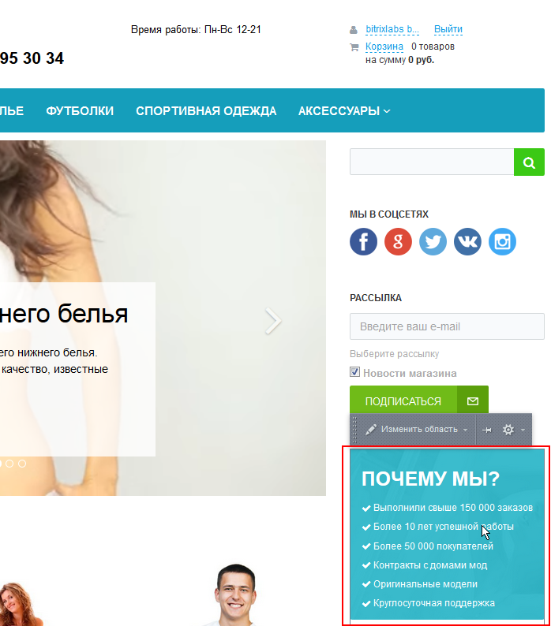

		 под формой подписки на рассылки. Для выполнения задания перейдите на главную страницу сайта.

1. В настройках компонента задайте условие показа - для раздела.
  ## Результат выполнения первого пункта
  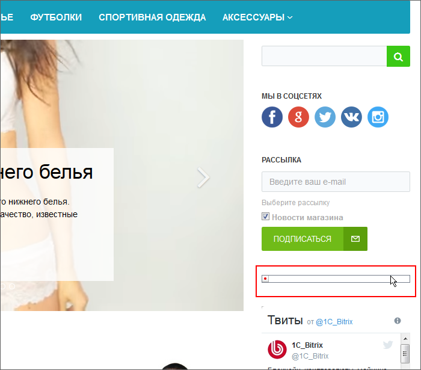
2. Перейдите в Тестовый раздел и создайте там включаемую область. В неё
  			добавьте
                      
   Где:
  1 - произвольный текст (статическая информация)
   2 - компонент (динамичная информация)
  		 компонент **Самые продаваемые товары** и произвольный текст. Настраивать компонент не будем, так как продаж не было и при любых настройках не будет выведено ни одного товара. Это задание просто для получения представления о том как это делается.
  ## Результат выполнения второго пункта
  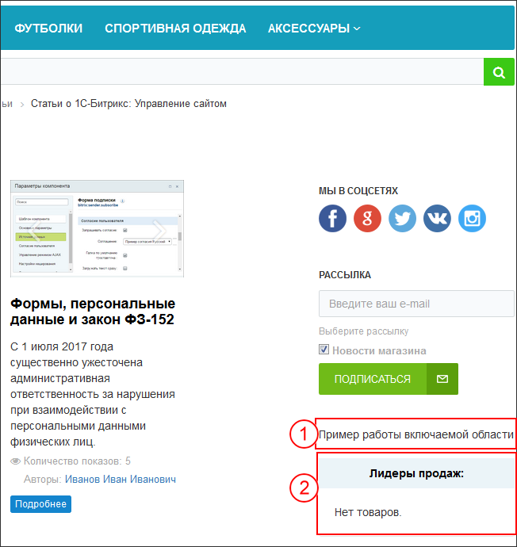
  Где:
  1 - произвольный текст (статическая информация)
   2 - компонент (динамичная информация)
  Вопрос на понимание: если перейти в другой раздел сайта, например О компании, то вы не увидите созданной только что включаемой области с информацией. Почему?
  ## Ответ
  Потому что Включаемая область создана только для Тестового раздела и отображается только в нём.
3. Верните прежние настройки для компонента, чтобы всё отображалось как раньше.

#### Задание второе: настройка компонента

Задание выполним на основе комплексного компонента **Фотогалерея** (Не Фотогалерея 2.0 !!). Для выполнения задания удалите из тестового раздела компонент Новости.

1. Создайте информационный блок **Фотогалерея** с параметрами:
  Скачайте и распакуйте [архив фотографий](/images/content_manager/examples/practical-tasks/practic_2.zip) для размещения в элементах инфоблока.
  Создайте разделы **Мой альбом** и **Отпуск** в инфоблоке. Создайте в разделе Отпуск - один элемент инфоблока, а в Мой альбом  все остальные элементы, загружая одно и тоже фото в свойство Оригинал и в анонсовую и подробную картинки элемента. Анонсовые картинки ограничьте по высоте в
  			150 пикселей
                      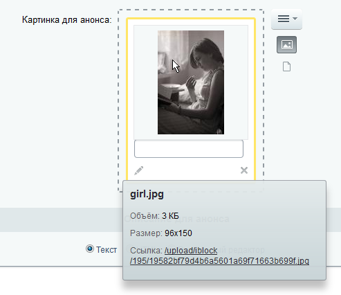
  		, а подробную картинку в
  			400 пикселей
                      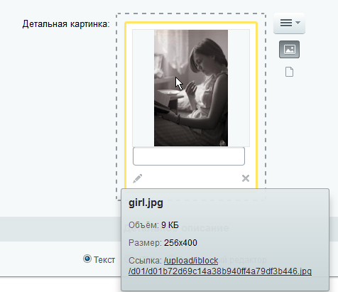
  		. Название элементам дайте сами, в символьный код вставьте название файла, в анонсовом описании продублируйте название элемента.
  ## Результат выполнения третьего пункта
  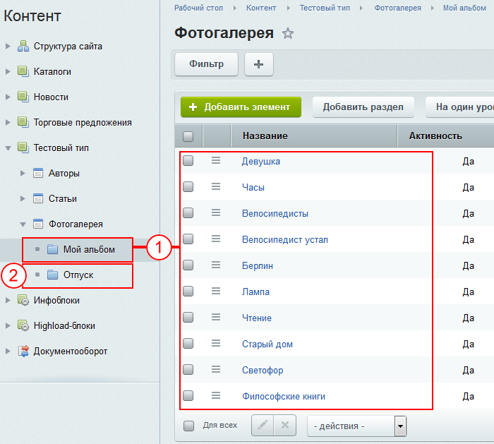
  Где:
  1 - раздел инфоблока Мой альбом и элементы в нём;
  2 - раздел инфоблока Отпуск.
  На странице **Фотогалерея** разместите комплексный компонент **Фотогалерея** и настройте его на инфоблок **Фотогалерея**.
  ## Результат выполнения четвёртого пункта
  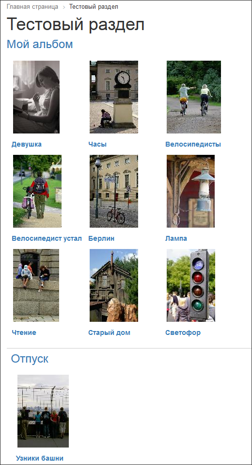
  Настройте компонент таким образом, чтобы:
  ## Страница Фотогалерея выглядела так:
  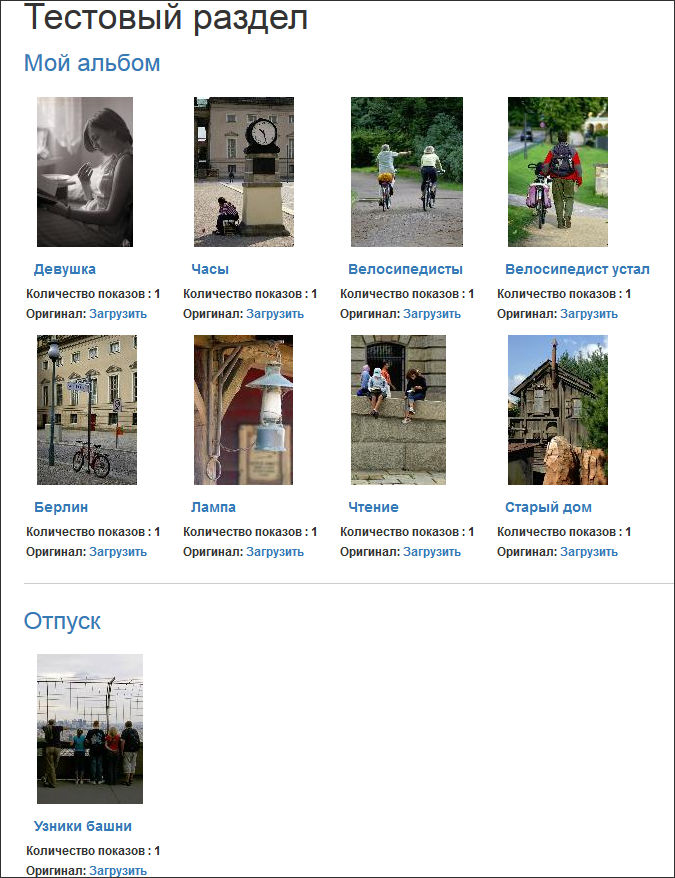
  ## Страница альбома выглядела так:
  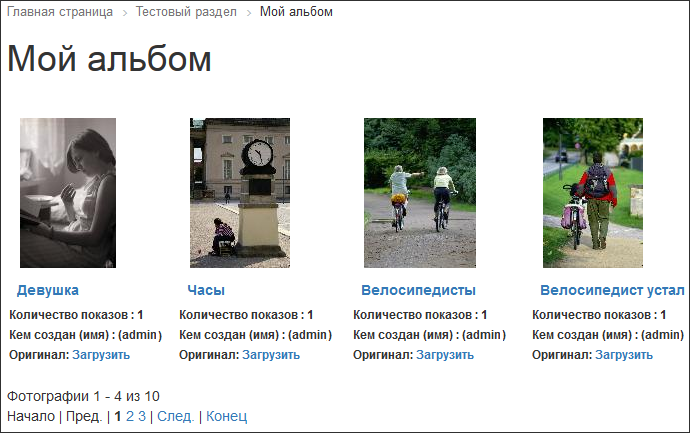
  ## Страница конкретной фотографии выглядела так:
  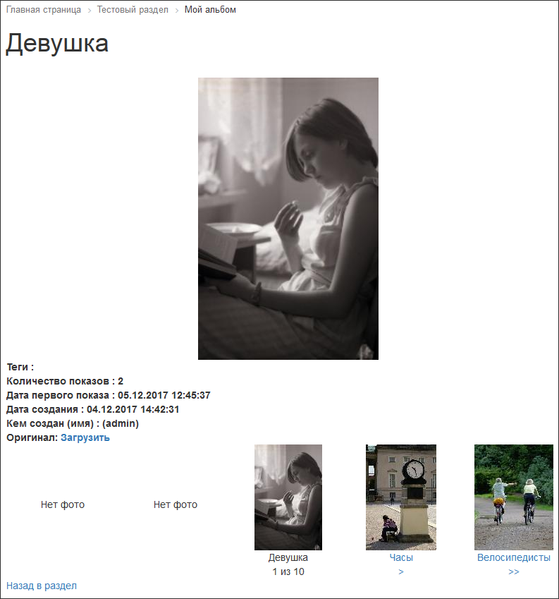
  Заголовок окна браузера тоже изменён:
  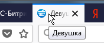
  * Подсказка: свойство для отображения в настройках компонента можно добавлять
  			вручную
                      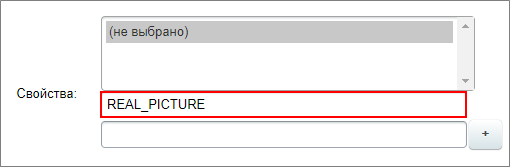
  		, а не выбирать из списка.

  - **Название** - Фотогалерея
  - **Символьный код** - test_gallery
  - **Привязка** - к действующему сайту
  - Свойства:

    - **Оригинал**: Тип - файл, обязательное, Код - REAL_PICTURE.

#### Задание третье: настройка ЧПУ

Пока адреса страниц в фотогалерее у нас такого вида (цифры, конечно же, другие):

- [ваш_сайт]/test/?SECTION_ID=18&ELEMENT_ID=277 - для страницы отдельной картинки;
- [ваш_сайт]/test/?SECTION_ID=18 - для страницы альбома

Это не ЧПУ адреса. Включите ЧПУ и настройте компонент так, чтобы адреса выглядели:

- [ваш_сайт]/test/my_album/girl.jpg/ - для страницы отдельной картинки;
- [ваш_сайт]/test/my_album/ - для страницы альбома

**Внимание!** Для получения такого результата одной настройки компонента будет мало, внесите изменения и в параметры альбома.

|  |
| --- |
