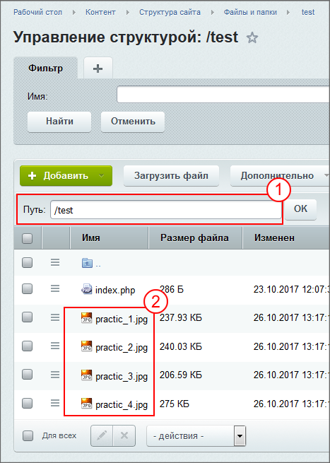
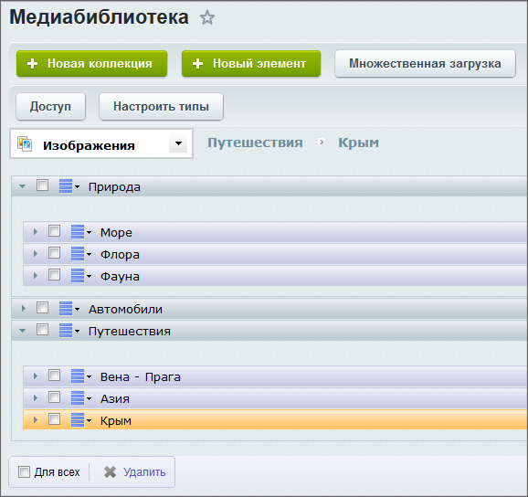
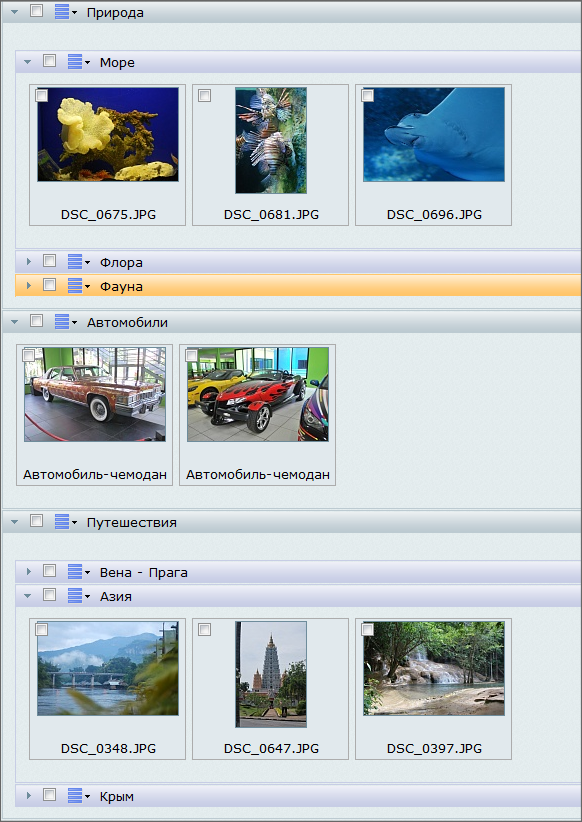

# Загрузка файлов и Медиабиблиотека

**Навигация**
- [← Оглавление курса](index.md)
- [← Предыдущий: 7719 — Права доступа на статические страницы](lesson_7719.md)
- [Следующий: 2739 — Работа с текстом →](lesson_2739.md)

Официальная страница урока: https://dev.1c-bitrix.ru/learning/course/index.php?COURSE_ID=34&LESSON_ID=2738

|  | **Справочная информация:** 
 [Загрузка файлов на сайт](lesson_1880.md) 
 [Медиабиблиотека](https://dev.1c-bitrix.ru/learning/course/index.php?COURSE_ID=34&CHAPTER_ID=04471&LESSON_PATH=3905.4460.4471) |
| --- | --- |

Выполнение заданий этого урока даст практический опыт работы с файлами в системе.

#### Первое задание: загрузка файлов на сайт

- Скачайте [архив](https://dev.1c-bitrix.ru/images/content_manager/examples/practical-tasks/pracitc.zip) на локальный компьютер, распакуйте его и загрузите фотографии в созданную в предыдущем задании папку `/test`. (Эти файлы будут использоваться в практическом задании при работе с текстом.)
  ## Результат выполнения первого задания
  |  | Где:  
   
   1 в папку `\test`  
   2 загружено 4 файла из архива. |
  | --- | --- |

#### Второе задание: создание коллекций в медиабиблиотеке

- Загрузите [архив демоданных](https://dev.1c-bitrix.ru/docs/chm_files/demo_photo.zip) на локальный компьютер, распакуйте архив. Эти фото нужны будут для работы с Медиабиблиотекой.
- Создайте в Медиабиблиотеке коллекции типа **Изображение**: Природа, Автомобили, Путешествия на верхнем уровне. И коллекции Море, Флора и Фауна в коллекции Природа, а коллекции Вена-Прага, Азия, Крым - в коллекции Путешествия.
  ## Результат выполнения второго задания
  

#### Третье задание: загрузка файлов в медиабиблиотеку

- Загрузите фотографии из архива демоданных с разнесением их по библиотекам. Задайте описание и нужные имена для элементов коллекции.
  ## Результат выполнения третьего задания
  

#### Дополнительные задания

- Загрузите в разные коллекции одну и ту же фотографию. Удалите её в один клик из обеих коллекций.
- Попробуйте изменить свойства коллекций и фотографий (название, описание, расположение, ключевые слова).
- Попробуйте загрузить в коллекцию файл с расширением **doc**. Будет ли он загружен? И почему?
