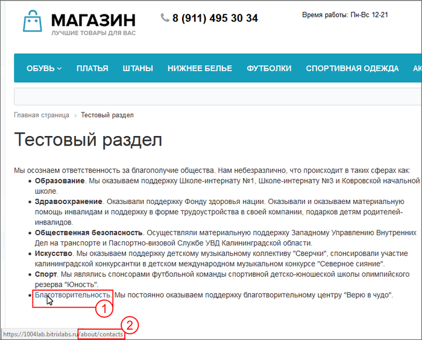
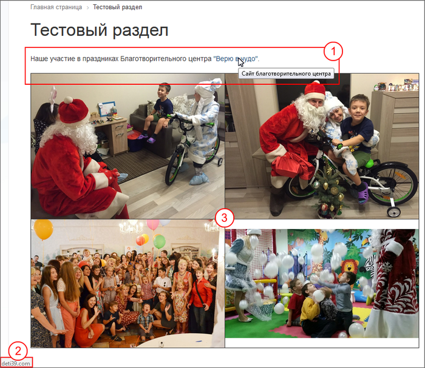
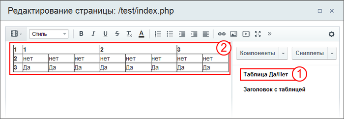

# Работа с текстом

**Навигация**
- [← Оглавление курса](index.md)
- [← Предыдущий: 2738 — Загрузка файлов и Медиабиблиотека](lesson_2738.md)
- [Следующий: 8655 — Создание и настройка Информационных блоков →](lesson_8655.md)

Официальная страница урока: https://dev.1c-bitrix.ru/learning/course/index.php?COURSE_ID=34&LESSON_ID=2739

|  | **Справочные материалы**:<br>
<br>[Визуальный редактор](https://dev.1c-bitrix.ru/learning/course/index.php?COURSE_ID=34&CHAPTER_ID=06299&LESSON_PATH=3905.6299)<br>
<br>[Управление структурой](https://dev.1c-bitrix.ru/learning/course/index.php?COURSE_ID=34&CHAPTER_ID=04460&LESSON_PATH=3905.4460) <br>
<br>[Управление адресами страниц](lesson_3080.md) |
| --- | --- |


Упражнения для работы с текстом. Вы получите практику работы в Визуальном редакторе.


#### Первое задание: добавление текста и ссылки


- Заполните страницу **Тестового раздела** текстовой информацией из спойлера и отформатируйте её так же как в образце.
  ## Текст для выполнения задания
  Мы осознаем ответственность за благополучие общества. Нам небезразлично, что происходит в таких сферах как:
  - **Образование**. Мы оказываем поддержку Школе-интернату №1, Школе-интернату №3 и Ковровской начальной школе.
  - **Здравоохранение**. Оказывали поддержку Фонду здоровья нации. Оказывали и оказываем материальную помощь инвалидам и поддержку в форме трудоустройства в своей компании, подарков детям родителей-инвалидов.
  - **Общественная безопасность**. Осуществляли материальную поддержку Западному Управлению Внутренних Дел на транспорте и Паспортно-визовой Службе УВД Калининградской области.
  - **Искусство**. Мы оказываем поддержку детскому музыкальному коллективу "Сверчки", спонсировали участие калининградской конкурсантки в детском международном музыкальном конкурсе "Северное сияние".
  - **Спорт**. Мы являлись спонсорами футбольной команды спортивной детско-юношеской школы олимпийского резерва "Юность".
  - **Благотворительность**. Мы постоянно оказываем поддержку благотворительному центру "Верю в чудо".
- Создайте во вставленном тексте ссылку со слова **Благотворительность** на любую другую страницу сайта, например на страницу "Контакты".
  ## Результат выполнения первого задания
  
  Где:
  1 - ссылка вставленная в текст.
  2 - адрес ссылки.


#### Второе задание: размещение таблицы и изображений


Более сложное задание.


- В Тестовом разделе замените прежний текст на текст: "Наше участие в праздниках Благотворительного центра "Верю в чудо"." На название фонда разместите ссылку на сайт фонда (http://deti39.com). Страница должна открываться в новой закладке, текст подсказки по ссылке: "Сайт благотворительного центра".
- На этой же странице создайте таблицу в две строки и два столбца, и разместите в её ячейках фотографии загруженные в папку `/test`. При размещении фотографию  уменьшайте до 20% по размеру.
  ## Результат выполнения второго задания
  
  Где:
  1 - Текст со ссылкой.
  2 - Адрес ссылки.
  3 - Вставленные изображения.


#### Дополнительно


- Создайте сниппет, с кодом таблицы, например такой:
  | 1 | 1 | 2 | 3 |  |  |  |  |  |
  | --- | --- | --- | --- | --- | --- | --- | --- | --- |
  | 2 | нет | нет | нет | нет | нет | нет | нет | нет |
  | 3 | Да | Да | Да | Да | Да | Да | Да | Да |
  ## Для не владеющих HTML приведём код для сниппета в спойлере
  ```
  <table width="80%" cellspacing="0" border="1">
     <tr>
      <th>1</th>
      <th colspan="3">1</th>
      <th colspan="3">2</th>
      <th colspan="2">3</th>
     </tr>
     <tr>
      <th>2</th>
      <td>нет</td>
      <td>нет</td>
      <td>нет</td>
      <td>нет</td>
      <td>нет</td>
      <td>нет</td>
      <td>нет</td>
      <td>нет</td>
     </tr>
     <tr>
      <th>3</th>
      <td>Да</td>
      <td>Да</td>
      <td>Да</td>
      <td>Да</td>
      <td>Да</td>
      <td>Да</td>
      <td>Да</td>
      <td>Да</td>
     </tr>
    </table>
  ```
  И разместите код таблицы на странице.
  ## Результат выполнения дополнительного задания:
  В визуальном редакторе:
  
  Где:
  1 - сниппет в списке ваших сниппетов,
  2 - вставленный код таблицы из сниппета.
  Таблица в Тестовом разделе:
  
- Создайте короткую ссылку вида http://_ваш_сайт_/~тестовый_раздел на Тестовый раздел.
- Разместите эту короткую ссылку на любой странице Нижнего меню (например на странице "О компании") с произвольным текстом и проверьте работу ссылки.


Желательно это знать:


- [HTMLbook](http://htmlbook.ru/) - справочник по HTML
