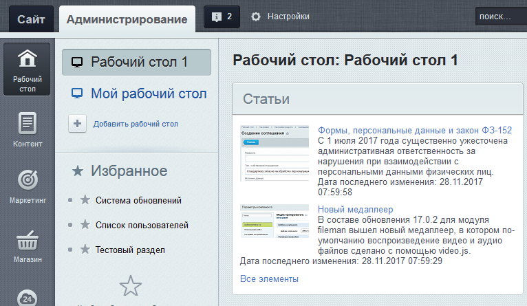
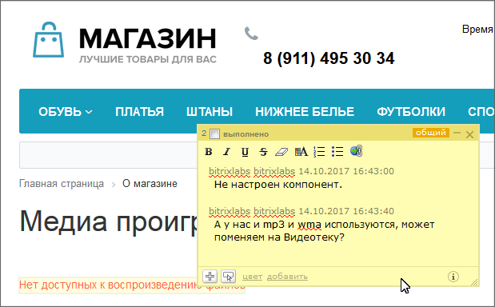

# Рабочий стол, веб-стикеры

**Навигация**
- [← Оглавление курса](index.md)
- [← Предыдущий: 2701 — Работа с компонентами](lesson_2701.md)
- [Следующий: 6 — Основные понятия →](lesson_6.md)

Официальная страница урока: https://dev.1c-bitrix.ru/learning/course/index.php?COURSE_ID=34&LESSON_ID=2740

|  | **Справочные материалы:** 
 [Рабочий стол](lesson_2531.md) 
 [Веб-стикеры](https://dev.1c-bitrix.ru/learning/course/index.php?COURSE_ID=34&CHAPTER_ID=04621&LESSON_PATH=3905.4478.4621) |
| --- | --- |

#### Рабочий стол

На Рабочий стол в Административной части добавьте гаджет Контент &gt; Элементы инфоблока.

Настройте гаджет на инфоблок **Статьи** таким образом:

- Название: Статьи.
- Сортировку по дате последнего изменения и показ даты изменения.
- Остальное - по умолчанию.

## Результат настройки гаджета

#### Вебстикеры

Добавьте вебстикер с указанным на картинке текстом, с нужной привязкой к области и повторным комментарием.

## Результат выполнения задания

