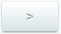
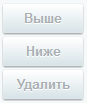

# Настройка списка элементов (старый интерфейс)

**Навигация**
- [← Оглавление курса](index.md)
- [← Предыдущий: 4568 — Порядок элементов в списке](lesson_4568.md)
- [Следующий: 11801 — Настройка списка элементов (новый интерфейс) →](lesson_11801.md)

Официальная страница урока: https://dev.1c-bitrix.ru/learning/course/index.php?COURSE_ID=34&LESSON_ID=2776

### Видеоурок

Удобство работы со списком элементов - один из факторов быстрой и производительной работы контент-менеджера. Но каждый сайт - это свои информационные блоки со своими параметрами, свои опросы, свои группы баннеров и так далее. Создать удобный для всех случаев интерфейс списка элементов - невозможно. Поэтому в 1С-Битрикс реализована возможность настройки списка элементов. Контент-менеджер может сделать видимым в списке только то, что ему нужно.

### Способ настройки

Кнопка **Настроить**  вызывает диалог, в котором пользователь выбирает колонки для показа в таблице отчёта данной формы, а также задаёт некоторые параметры, применяемые по умолчанию:

Из **Доступных колонок**

			перенесите

                    с помощью кнопки

		 в **Выбранные колонки** нужные вам колонки. В Выбранных колонках удалите ненужные, а остальные

			разместите

                    С помощью кнопок

		 в удобном для вас порядке.

**Примечание**:

- Системная колонка ID не удаляется из таблицы, даже если вы удалите её из **Выбранных колонок**.
- В инфоблоках можно настроить нужный вам вид для каждого инфоблока в отдельности.
- В рамках файловой системы настройка вида списка осуществляется для всех папок. Раздельно вид одной папки реализовать нельзя.
- В рамках списков элементов другого функционала каждый список настраивается отдельно, то есть можно настроить один вид для списка блогов, другой вид для списка учебных курсов и так далее.

Для применения выбранных настроек нажмите кнопку **Сохранить**. Для возврата к настройкам списка по умолчанию нажмите **Сбросить**.

### Важно запомнить!

Полностью удалять все параметры из поля **Выбранные колонки** - нельзя, должна оставаться хотя бы одна колонка.

**Колонку флажков** и **Меню действий** из Списка элементов удалить нельзя в принципе - это системные колонки.

По умолчанию настройки каждой таблицы сохраняются для текущего авторизованного пользователя. Установка флажка в поле **Установить данные настройки по умолчанию для всех пользователей** позволяет применить выбранные параметры формы для всех зарегистрированных пользователей, имеющих доступ к административному разделу.

|  | #### Заключение |
| --- | --- |

1С-Битрикс позволяет сделать работу Контент-менеджера удобной и производительной. Один из способов — настройка списка элементов, что позволяет держать перед глазами всегда только те данные, которые нужны.
