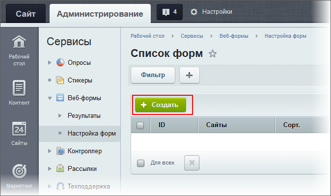
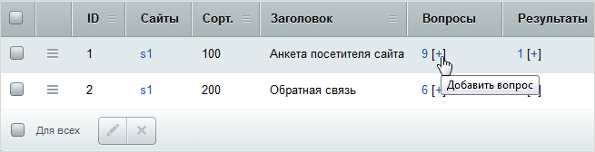

# Упрощенный режим

**Навигация**
- [← Оглавление курса](index.md)
- [← Предыдущий: 9923 — Основные понятия](lesson_9923.md)
- [Следующий: 5219 — Особенности режима →](lesson_5219.md)

Официальная страница урока: https://dev.1c-bitrix.ru/learning/course/index.php?COURSE_ID=34&LESSON_ID=2926

Упрощенный режим предназначен для решения простых задач, например, создания формы обратной связи.

### Если нет сложных потребностей

В этом режиме не используются поля и

			статусы веб-форм

                    В упрощенном режиме статус задается автоматически, однако он недоступен для просмотра. Присвоение статуса позволяет переключаться между режимами управления.

		.

Работа в упрощённом режиме возможна, если в

			настройках модуля

                    Настройка модуля **Веб-формы** осуществляется на странице Настройки &gt; Настройки продукта &gt; Настройки модулей &gt; Веб-формы.

 [Читать подробнее..](/learning/course/index.php?COURSE_ID=41&LESSON_ID=2858)

		 **Веб-формы** установлен флаг

			Использовать упрощённый режим редактирования форм

                    

		. Если вы работали в упрощённом режиме, а потом переключились в расширенный режим, то нежелательно возвращаться обратно в упрощенный режим. Данные, сохраненные в расширенном режиме, при переключении могут поменять структуру и сделать работу веб-формы неверной.

### Видеоурок

### Создание веб-формы

1. С помощью кнопки
  			Создать
                      
  		, расположенной на контекстной панели страницы **Список форм** (Сервисы &gt; Веб-формы &gt; Настройка форм) откройте форму создания:
  

  Заполните поля веб-формы. Значение полей понятно из их названия, если возникли вопросы, обратитесь к документации. Здесь поясним некоторые нюансы.

  - В блоке **Меню результатов в административном разделе** заполните поля **Название ссылки на результаты** на языках установки. Если этого  не сделать, то
    			ссылка на ответы формы
                        
    		 не появится в меню Сервисы &gt; Веб-формы &gt; Результаты.
  - Если нужно получать результаты заполнения формы на какой-то e-mail, установите флажок в поле **Отправлять результаты по email**. Будет автоматически сгенерирован почтовый шаблон. Ссылка **список шаблонов** позволяет открыть список созданных шаблонов и отредактировать их необходимым образом.
  - Создайте
    			шаблон
                        В режиме редактирования веб-формы перейдите на закладку **Шаблон формы** и создайте свой шаблон, выбрав пункт Использовать свой шаблон формы.
     [Читать подробнее...](lesson_2928.md)
    			веб-формы
                        Есть почтовый шаблон, то есть текст, который будет отправлен по электронной почте, и шаблон веб-формы – внешний вид формы, как она будет выглядеть на сайте.
    		 на закладке **Шаблон формы**.
    **Примечание**: закладка **Шаблон формы** доступна для сотрудников группы **Администраторы**.
  - Установите на закладке **Ограничения** ограничения на добавление результатов, это сделает результаты опроса более точными.
  - Закладка **Статистика** служит для задания идентификаторов для учёта события заполнения веб-формы в модуле Статистики. Это позволит анализировать динамику заполнения веб-форм, а также получать информацию о посетителях, заполнивших формы.
2. После сохранения веб-форма будет добавлена в список на странице **Список форм**.

### Создание вопросов

Самый простой способ создать вопрос – с помощью ссылки

			+

                    

		, расположенной в столбце **Вопросы**. Откроется форма создания (редактирования) вопроса:

Заполнение полей не должно вызвать сложностей, если они возникли, обратитесь к документации. Поясним несколько неявных моментов.

- Тип поля для ответа на данный вопрос определяет вид вопроса при показе формы посетителю. В зависимости от выбранного типа поля укажите дополнительные параметры в поле **Ответ** (на иллюстрации указана длина поля в знаках для ответа на вопрос).
- На закладке **Валидаторы** можете назначить имеющиеся
  			валидаторы
                      Валидатор в нашем случае – это инструмент, проверяющий как пользователь заполняет поле: не превышает ли установленные параметры. То есть в случае с иллюстрацией валидатор проверит, что посетитель ввёл в поле не более 50 знаков.
  		 для выбранного типа поля.
- Для сохранения вопроса нажмите кнопку **Сохранить**.

Например, для формы *Анкета посетителя сайта* могут быть созданы следующие вопросы:

### Дополнительно

#### Дополнительная информация

- [Создание и редактирование веб-формы (документация)](http://dev.1c-bitrix.ru/user_help/service/form/form_edit.php)
