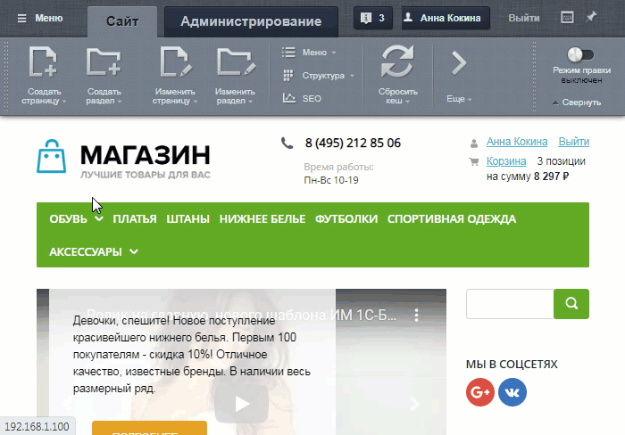
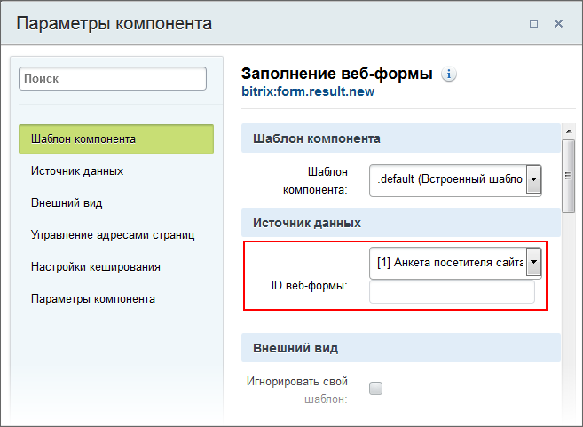
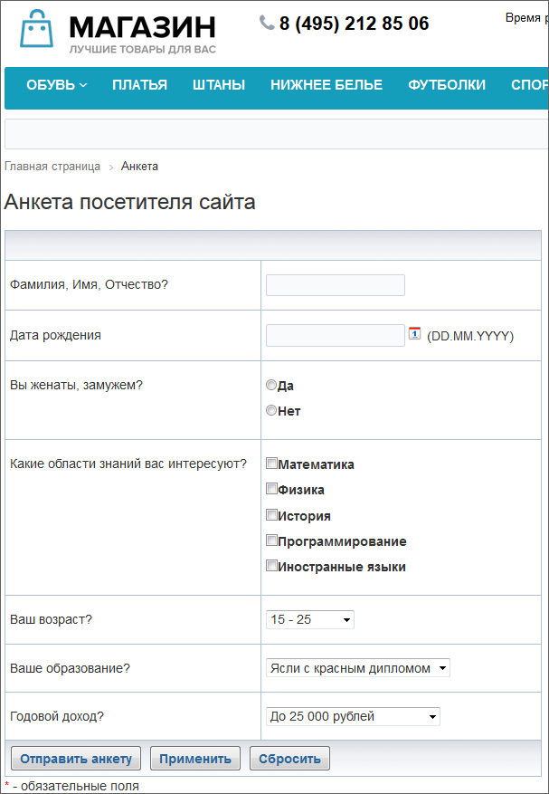

# Публикация веб-формы

**Навигация**
- [← Оглавление курса](index.md)
- [← Предыдущий: 2928 — Создание шаблона веб-формы](lesson_2928.md)
- [Следующий: 12645 — Пример для упрощенного режима: анкета регистрации →](lesson_12645.md)

Официальная страница урока: https://dev.1c-bitrix.ru/learning/course/index.php?COURSE_ID=34&LESSON_ID=2929

### Введение

Публикация веб-форм выполняется с использованием визуальных

			компонентов

                    Компонент – это программный код, оформленный в визуальную оболочку, выполняющий определённую функцию какого-либо модуля по выводу данных в Публичной части. Мы можем вставлять этот блок кода на страницы сайта без непосредственного написания кода. [Подробнее...](https://dev.1c-bitrix.ru/learning/course/index.php?COURSE_ID=34&CHAPTER_ID=04457)

		 модуля **Веб-формы**, традиционным для сайтов на CMS "1С-Битрикс: Управление сайтом"

			способом

                    Нужный компонент переносится на страницу в визуальном редакторе.

[Подробнее](lesson_9163.md#add_component)...

		, и затем настраивается на нужную веб-форму.

Рассмотрим пример публикации веб-формы **Анкета посетителя сайта**, например, в разделе **Веб-формы**. Посетитель может редактировать результаты своих ответов, а также создадим страницу со списком всех результатов веб-формы.

Пример реализуем на основе простых компонентов, а не комплексного. Это сложнее, но вы поймёте

			разницу между ними

                    Если публикацию веб-формы выполнять с помощью комплексного **Веб-форма (bitrix:form)**, то нужно создать всего лишь одну страницу. В теле этой страницы разместить комплексный компонент и настроить его параметры.

		.

### Видеоурок

Видео-пример публикации веб-формы на сайте (два способа: комплексным компонентом и простыми компонентами):

### Создание раздела в структуре сайта

Для удобства работы посетителей сайта с веб-формами создадим раздел, где разместим все необходимые страницы.

			Создайте раздел

                    Создание раздела производится с помощью кнопки **Создать раздел**:

[Подробнее](lesson_3450.md)...

		 **Анкета**, разместите его в нижнем меню.

			Создайте страницы

                    Для создания страницы с помощью Мастера нажмите **Создать страницу**.

[Подробнее](lesson_1911.md)...

		 в разделе:

- Главная страница раздела (имя файла - **index.php**), на ней размещается сама анкета (Страница создаётся вместе с созданием раздела, отдельно создавать не надо.);
- Список ответов (имя файла - **result_list.php**) - здесь будет выводиться
  			список
                      Чтобы посетители сайта могли перейти к просмотру ответов, ссылку на страницу Список ответов следует добавить в меню сайта.
  		 всех результатов опроса;
- Исправить ответ (имя файла - **result_edit.php**) - страница для редактирования ответов;
- Ответ (имя файла - **result_view.php**) - страница, где отображается чей-то конкретный ответ.

> **Примечание**: Лучше прописывать у создаваемых страниц  именно те имена файлов, которые указаны в примере, т. к. это облегчит дальнейшую настройку размещаемых компонентов (в параметрах компонентов по умолчанию указаны такие названия).

Еще рекомендуем создать страницу с сообщением об успешной отправке для того, чтобы посетители с ограниченными правами (только право заполнения формы) после, собственно, заполнения веб-формы могли удостовериться, что все сделали правильно. Здесь имя файла можно задать любое. Скопируйте

			часть URL

		 созданной страницы от конца домена и заканчивая расширением файла php (понадобится в следующем действии).

### Размещение и настройка компонентов

- **Главная страница раздела** выводит сам опрос.
  Откройте на редактирование главную страницу раздела и разместите на ней компонент **Заполнение веб-формы** (bitrix:form.result.new).
  В параметре **Страница с сообщениями об успешной отправке** укажите скопированную ранее часть URL созданной страницы.
  **Примечание**: Если после всех настроек ссылка не работает, попробуйте вручную указать в конце части URL
  			параметр
                      Может быть актуально для старых версий продукта (при настройке адресов без ЧПУ).
  
  		 `?WEB_FORM_ID=#FORM_ID#`.
  Укажите, какую веб-форму надо выводить на этой странице, остальные параметры компонента оставьте без изменений:
  
- **Список ответов** - на ней можно увидеть список всех ответивших на анкету.
  Откройте страницу на редактирование и разместите на ней компонент **Список результатов** (bitrix:form.result.list). В настройках, кроме выбора веб-формы нужно ещё исправить адрес в поле **Страница добавления результата** (группа параметров **Параметры компонента**) с того, что есть на **index.php**
- Страница **Ответ** -  для детального просмотра ответов выбранного посетителя.
  Откройте страницу на редактирование и разместите на ней компонент **Просмотр результата** (bitrix:form.result.view). Компонент настраивать не надо, он работает по умолчанию как надо.
- **Исправить ответ** - страница, где посетитель может подправить свой ответ.
  Откройте на редактирование страницу и разместите на ней компонент **Редактирование результата** (bitrix:form.result.edit). Компонент настраивать не надо, он работает по умолчанию как надо.

## Что мы увидим в результате? (нажмите на +, чтобы просмотреть)

Главная страница раздела с формой опроса:

Страница Список ответов:

Страница Ответ:

Страница Исправить ответ:

### Настройка ЧПУ

Если Вы хотите использовать

			ЧПУ

                    Средства «1С-Битрикс: Управление сайтом» позволяют сделать ссылки более понятными с помощью специальной функции. Функция встроена во все комплексные компоненты (и отдельные простые) и преобразует стандартный веб-адрес в так называемый человеко-понятный URL (сокращенно ЧПУ).
[Подробнее](lesson_3579.md)...

		 для веб-форм, то в настройках компонентов потребуется отметить опцию **Включить поддержку ЧПУ** в разделе

			Управление адресами страниц

                    Пример опции **Включить поддержку ЧПУ** для комплексного компонента **Веб-форма**:

		.

В качестве **Каталога ЧПУ** (относительно корня сайта) укажите раздел. В нашем примере это `/anketa/`.

Теперь переходим к настройке остальных страниц:

**Внимание**! Все пути к страницам при включенном ЧПУ указываются без раздела (каталога ЧПУ).

- Для комплексного компонента **Веб-форма** в разделе **Управление адресами страниц** при необходимости измените настройки отображения адресов страниц или оставьте их по умолчанию. А в разделе **Основные параметры** укажите в поле **Страница с сообщением об успешной отправке** путь к странице без `/anketa/`.
- Для простых компонентов потребуется выполнить настройки в разделе **Параметры компонента**. Укажите все
  			пути к страницам
                      Пример заполнения полей для компонента **Заполнение веб-формы**:
  
  		 без `/anketa/`.

### Дополнительно

- [Описание компонентов модуля (документация)](https://dev.1c-bitrix.ru/user_help/components/services/web_forms/index.php)
