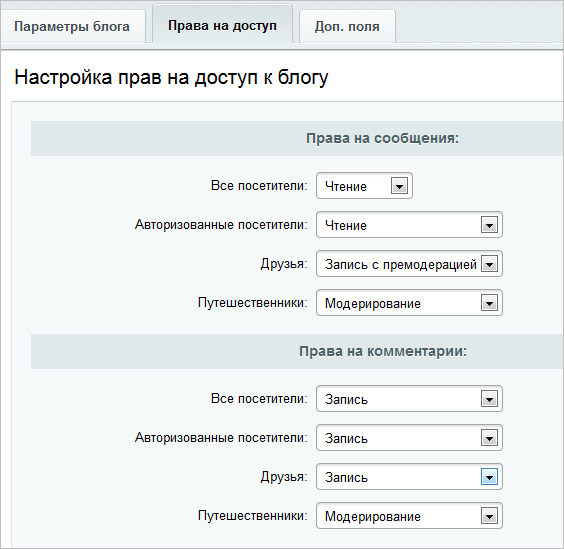
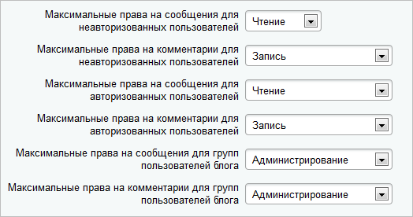
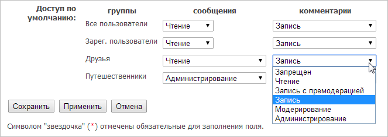

# Добавление модератора блога

**Навигация**
- [← Оглавление курса](index.md)
- [← Предыдущий: 3866 — Блоги с позиции блогера (как управлять своим блогом)](lesson_3866.md)
- [Следующий: 25948 — Проверьте себя →](lesson_25948.md)

Официальная страница урока: https://dev.1c-bitrix.ru/learning/course/index.php?COURSE_ID=34&LESSON_ID=2933

### Видеоурок

### Как добавить модератора блога

В созданном

			блоге

                    О том, как создать блог, читайте в уроке [Блог](lesson_2935.md).

		 по умолчанию для пользователей будет стоять запрет на публикацию сообщений, но разрешено оставлять комментарии. Настройку и модерацию может осуществлять

			владелец

                    **Владелец блога** - это пользователь, который ведет блог и модерирует его.

[Читать подробнее...](lesson_2935.md#blogger)

		 этого блога.

Добавить модераторов можно как из

			Административного раздела,

                    **Административный раздел** - раздел системы, недоступный для просмотра обычным посетителям сайта. В нём производятся настройки сайта и системы для работы.

[Подробнее...](https://dev.1c-bitrix.ru/learning/course/index.php?COURSE_ID=34&CHAPTER_ID=04459&LESSON_PATH=3905.4455.4459)

		 так и из

			Публичного.

                    **Публичный раздел** - это часть сайта, которая доступна всем пользователям ресурса. Иначе говоря, это сам сайт в том виде, в котором его видят посетители сайта. [Подробнее...](https://dev.1c-bitrix.ru/learning/course/index.php?COURSE_ID=34&CHAPTER_ID=04458&LESSON_PATH=3905.4455.4458)

- **Добавление модераторов из Административного раздела**
  Добавить модератора к блогу можно через настройки прав доступа конкретного блога (Сервисы &gt; Блоги &gt; Блоги &gt; Нужный блог), задав право **Модерирование** той группе пользователей, в которой находится потенциальный модератор (модераторами становятся все участники этой группы):
  
  Здесь отображены как стандартные группы пользователей (**Все посетители**, **Авторизованные посетители**, **Друзья**), так и
  			созданные владельцем блога
                      Владелец блога может настроить свои открытые группы.
  [Читать подробнее...](lesson_3866.md#open_groups)
  		 (Открытые группы, например, **Путешественники**).
  Можно задать один из шести уровней
  			прав доступа
                       Шесть уровней прав доступа:
  - **Запрещен** - запрет любых действий, включая просмотр.
  - **Чтение** - разрешен только просмотр.
  - **Запись с премодерацией** - можно создавать сообщения\комментарии в блог, которые будут опубликованы после проверки модератором.
  - **Запись** - можно публиковать сообщения\комментарии без последующей модерации.
  - **Модерирование** - дает возможность скрывать и публиковать сообщения\комментарии.
  - **Администрирование** - возможно редактирование и удаление сообщений, комментарии можно удалять, но не редактировать.
  		 (каждое последующее включает в себя возможности предыдущих).
- **Добавление модераторов из Публичного раздела**
  Каждый владелец блога может самостоятельно настраивать права доступа для него.
  Однако Администратор сайта задает максимальную глубину такой настройки, выставив соответствующие параметры в
  			настройках модуля Блоги.
   
  		 То есть если Администратор укажет в настройках модуля "Максимальные права на сообщения для групп пользователей блога" уровня **Запись**, то Контент-менеджер уже не сможет дать группам пользователей блога права **Модерирование** и **Администрирование**.
  В соответствии с установленными администратором ограничениями, владелец блога может настраивать права доступа к своему блогу (в том числе - добавлять модераторов) через настройки в публичной части:
  
