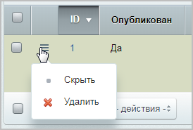

# Комментарии

**Навигация**
- [← Оглавление курса](index.md)
- [← Предыдущий: 2935 — Блоги](lesson_2935.md)
- [Следующий: 4798 — Публикация списка блогов →](lesson_4798.md)

Официальная страница урока: https://dev.1c-bitrix.ru/learning/course/index.php?COURSE_ID=34&LESSON_ID=2936

### Управление комментариями

Управление комментариями к записям блогов осуществляется на странице **Комментарии** (Сервисы &gt; Блоги &gt; Комментарии):

Чтобы **удалить** или **скрыть** комментарий, воспользуйтесь соответствующими пунктами

			меню действий.

 

<!-- &lt;p&gt;
На закладке &lt;b&gt;Спамер&lt;/b&gt; можно запретить или разрешить публикацию комментариев от определенного автора. Отфильтровать сообщения автора можно по логину, ФИО, IP-адресу или другим критериям.
&lt;/p&gt;
&lt;p&gt;
 &lt;img src="/images/admin_bisness/komm2.png" height="308" width="668"&gt; 
&lt;/p&gt; -->

### Документация по теме

- [Комментарии](https://dev.1c-bitrix.ru/user_help/service/blogs/blog_comment.php)
