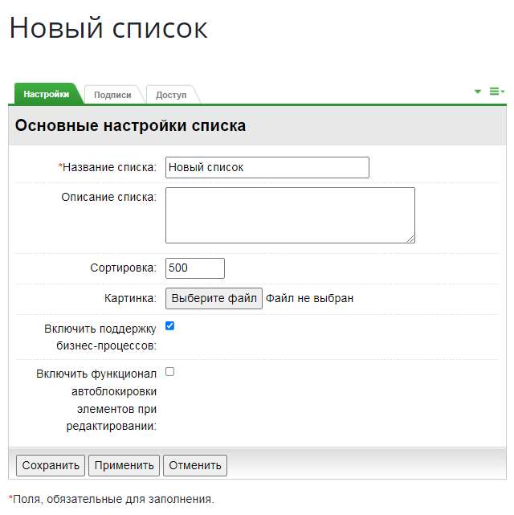
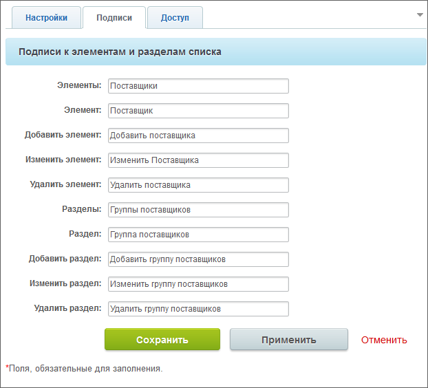

# Создание раздела списков и самих списков

**Навигация**
- [← Оглавление курса](index.md)
- [← Предыдущий: 4480 — Возможности модуля](lesson_4480.md)
- [Следующий: 2956 — Пример настройки Универсального списка →](lesson_2956.md)

Официальная страница урока: https://dev.1c-bitrix.ru/learning/course/index.php?COURSE_ID=34&LESSON_ID=2955

### Видеоурок

### Создание Универсального списка

Если на вашем сайте нет страницы, с которой непосредственно можно добавлять Универсальные списки и работать с ними, то создайте её самостоятельно. Для этого:

- Создайте тип инфоблока
                      Откройте страницу **Типы информационных блоков** (Контент &gt; Инфоблоки &gt; Типы инфоблоков) и
  нажмите кнопку **Добавить новый тип**.
   
   [Читать подробнее...](lesson_2010.md)
  		 специально для Универсальных списков.
- В настройках модуля Универсальные списки
  			укажите
                      Настройка модуля Универсальные списки производится в Административном разделе на странице Настройки &gt; Настройки продукта &gt; Настройки модулей &gt; Универсальные списки.
   [Читать подробнее...](/learning/course/index.php?COURSE_ID=41&LESSON_ID=9093)
  		 этот тип инфоблока как тип для списков.
- Создайте физическую страницу
                      В Публичном разделе есть удобный инструмент - Мастер создания новой страницы.
  Для создания страницы с помощью Мастера нажмите **Создать страницу**.
   
   [Читать подробнее...](lesson_1911.md)
  		 в нужном разделе сайта, укажите необходимые права доступа;
- в визуальном редакторе [поместите на созданную страницу](lesson_9163.md) комплексный компонент **Универсальные списки** и [настройте](lesson_9165.md) его на созданный инфоблок;
- сохраните внесенные изменения.

Для создания списка воспользуйтесь кнопкой . Откроется форма следующего вида:

### Поля формы

Заполните поля вкладок формы создания списка. Значения большинство полей понятно из их названия, поясним только то, что может вызвать непонимание.

#### Вкладка Настройки

- **Сортировка** - введите число, определяющее порядок создаваемого списка в общем порядке всех списков. Чем выше число, тем ниже в общем порядке будет создаваемый список.
- **Картинка** - с помощью кнопки **Обзор** можно задать картинку, соответствующую списку. Картинка автоматически будет изменена в размере под дизайн сайта без искажения пропорций сторон. Если не будет использована собственная картинка, то будет установлена картинка по умолчанию из дистрибутива программы.
- **Включить поддержку бизнес-процессов** - если в работе создаваемого списка планируется использование стандартных или собственных
  			бизнес-процессов
                      Если пункт отсутствует, значит у вас не установлен модуль **Бизнес-процессы**. Модуль не доступен в редакциях *Старт, Стандарт, Малый бизнес*.
  		, то установка этого флажка необходима.
- **Включить функционал автоблокировки элементов при редактировании** - если опция отмечена, то при редактировании элемента будет показано сообщение о том, что элемент заблокирован. Блокировка будет снята после сохранения изменений, либо же её можно снять вручную из меню действий.

#### Вкладка Подписи

На вкладке можно задать название элементов и разделов создаваемого списка, чтобы облегчить пользователям работу. Например, если создается список **Поставщики**, то логично будет заменить слово **элемент** на **поставщик**, а слово **раздел**, на **группа поставщиков**, и

			так далее

                    

		.

#### Вкладка Доступ

На этой

			вкладке

                    

		 нужно обязательно дать доступ тем, кто будет работать с этим списком. Иначе эти пользователи даже не увидят нужный список на странице раздела Универсальные списки (для просмотра списка достаточно указать право **Чтение**).

## Права, которые можно задать

- Чтобы пользователи с определенным уровнем прав не видели создаваемый список вообще нужно просто не включить данную группу в этой вкладке.
- Чтобы пользователи из нужной группы могли только просматривать список, но не могли изменять состав списка, то эту группу нужно включить в список и дать ей право **Чтение**.
- Чтобы пользователи из нужной группы могли не только просматривать список, но и изменять состав списка, то эту группу нужно включить в список и дать ей право **Изменение**.
- Чтобы сотрудники из нужной группы могли просматривать список и добавлять в неё элементы, то эту группу нужно включить в список и дать ей право **Добавление**.
- Чтобы пользователи из нужной группы могли не только изменять список, но запускать бизнес-процессы по элементам списка, то эту группу нужно включить в список и дать ей право **Изменение с ограничениями**.
- Чтобы определенная группа пользователей могла менять статус участия списка в документообороте, то эту группу нужно включить в список и дать ей право **Документооборот**.

**Примечание**: В настройках инфоблока в административной части портала тоже можно задать нужные права доступа (Контент &gt; Информ. блоки &gt; Типы информ. блоков &gt; Списки, форма редактирования инфоблока, вкладка

			Доступ

                    Заданные здесь права отобразятся в вкладке **Доступ** списка в публичной части сайта. И наоборот, права заданные из списка, вы увидите в настройках инфоблока

		).

### Документация по теме

- [Универсальные списки](https://dev.1c-bitrix.ru/user_help/components/content/lists/lists.php)
