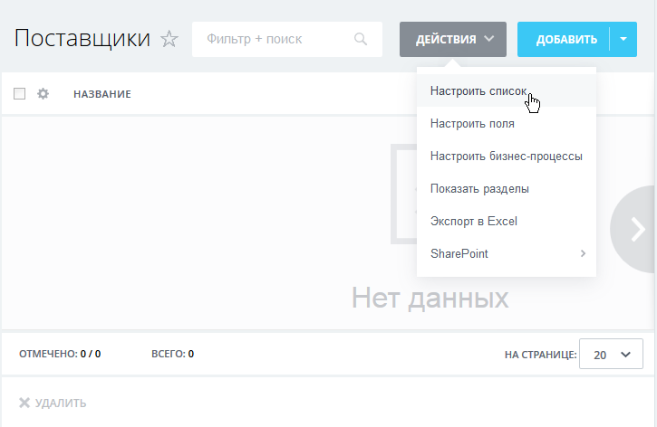
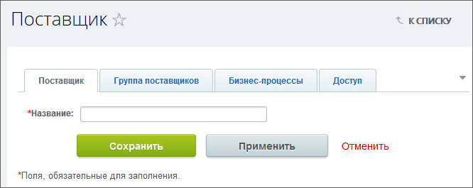

# Пример настройки Универсального списка

**Навигация**
- [← Оглавление курса](index.md)
- [← Предыдущий: 2955 — Создание раздела списков и самих списков](lesson_2955.md)
- [Следующий: 4746 — Пример создания полей →](lesson_4746.md)

Официальная страница урока: https://dev.1c-bitrix.ru/learning/course/index.php?COURSE_ID=34&LESSON_ID=2956

Практический пример: создадим список поставщиков продукции для нашей компании.

**Внимание!** Интерфейс сервиса в видеороликах и на изображениях учебного курса может отличаться по дизайну. Функционал сервиса при этом не меняется.

### Видеоурок

### Список поставщиков продукции

Настроить список - изменить параметры Универсального списка под конкретный сценарий использования. Действия по настройке списка выполняются с помощью команд кнопки **Действия**.

Поясним некоторые команды этого перечня.

- Настроить список - общие настройки списка.
- Настроить поля - добавить или изменить поля списка. Так как разработчики *«1С-Битрикс: Управление сайтом»* заранее не знают какие поля потребуются вам в той или иной ситуации, то при создании Универсального списка в его элементах задается только одно поле -
  			Название
                      
  		. Остальные поля вы создаёте самостоятельно. Созданные поля  будут отображаться в форме создания/редактирования элемента списка.
  Например: если создается список **Поставщики**, то необходим один специфический набор полей: форма организации, адрес, реквизиты, виды поставляемой продукции и другие. Если создается список **Комплектующие**, то нужен другой набор полей: количество комплектующих, цена, срок службы и так далее.
- Настроить бизнес-процессы - настроить работу списка с бизнес-процессами. Эта опция нужна, если создание элемента списка сочетается с выполнением каких-то других действий в системе. Детальнее можно познакомится с этим в примере [KPI для отдела организации](https://dev.1c-bitrix.ru/learning/course/index.php?COURSE_ID=53&LESSON_ID=3827).
- Показать разделы/скрыть разделы - включить/отключить отображение разделов в списке. Размещение элементов списка по разделам помогают в их поиске.
- Экспорт в Excel - экспорт созданного списка в Excel.

|  |
| --- |

Последний шаг - создание новых полей. Он рассматривается в следующем уроке.
