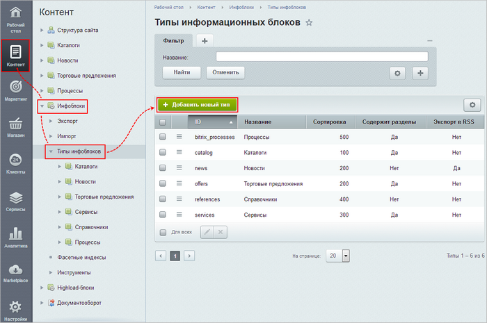
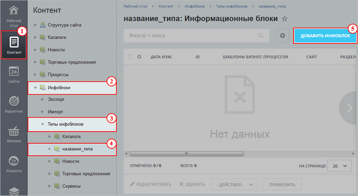
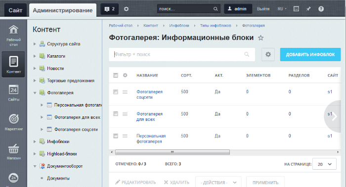
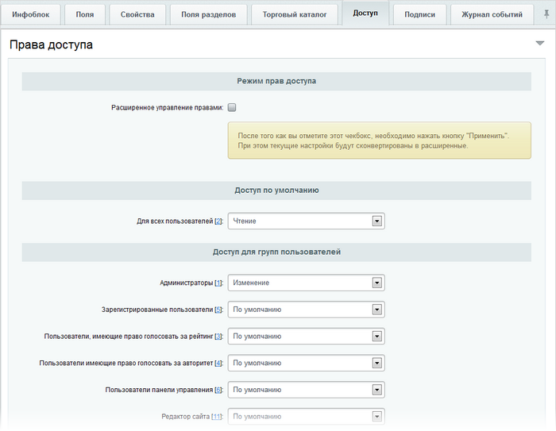
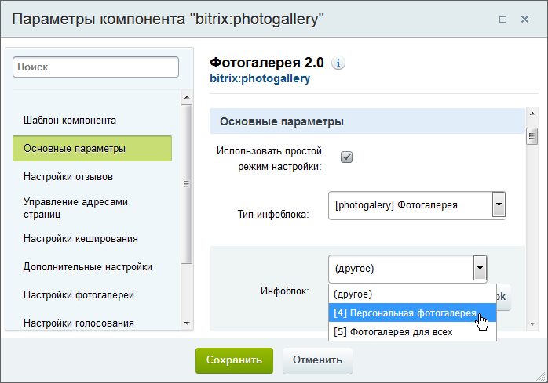

# Основные понятия

**Навигация**
- [← Оглавление курса](index.md)
- [← Предыдущий: 5277 — Модератор форума](lesson_5277.md)
- [Следующий: 5365 — Настройка простой фотогалереи →](lesson_5365.md)

Официальная страница урока: https://dev.1c-bitrix.ru/learning/course/index.php?COURSE_ID=34&LESSON_ID=2980

Модуль Фотогалерея 2.0 - это современный и удобный инструмент для создания и управления галереями и фотоальбомами пользователей, групп пользователей и сайта в целом.

### Как устроена фотогалерея

Фотогалереи бывают разные:

- Простая фотогалерея - это галерея, которой управляет один пользователь. Только он может загружать в неё изображения и определять права доступа к ним.
- Многопользовательская фотогалерея - галерея, которой управляют разные пользователи. Каждому из пользователей "подвластен" свой собственный альбом, в который они загружают изображения и управляют правами просмотра.

Любая из этих фотогалерей работает на

			информационных блоках

                    Информационный блок (или Инфоблок) – специальный инструмент "1С-Битрикс: Управление сайтом" с помощью которого заносится информация в Базу данных.
 [Подробнее...](https://dev.1c-bitrix.ru/learning/course/index.php?COURSE_ID=34&CHAPTER_ID=04477&LESSON_PATH=3905.4477)

		. Альбомы и фотографии галерей пользователей хранятся как разделы и элементы инфоблока.

Следовательно, для работы фотогалереи

			создайте тип инфоблока

                    Тип инфоблока создаётся в административном разделе на странице **Типы информационных блоков**
 (Контент &gt; Инфоблоки &gt; Типы инфоблоков)

[Подробнее...](lesson_2010.md)

		, например **Фотогалерея**, а для всех видов фотогалерей сайта -

			создайте инфоблоки

                    Инфоблок создаётся на странице Контент 1 &gt; Инфоблоки 2 &gt; Типы инфоблоков 3 &gt; название_типа 4,
 где вместо *название_типа* у вас отображается реальное название нужного типа инфоблоков.

[Подробнее...](https://dev.1c-bitrix.ru/learning/course/index.php?COURSE_ID=34&CHAPTER_ID=02011&LESSON_PATH=3905.4477.2011)

		. Например:

- Информационный блок **Фотогалерея** - для хранения альбомов и фотографий простой фотогалереи. Разделами инфоблока являются альбомы, а элементами – фотографии.
- Информационный блок **Фотогалерея для всех** - для хранения альбомов и фотографий в многопользовательской фотогалерее. Разделами инфоблока являются персональные галереи пользователей, подразделами - альбомы пользователя, а элементами - фотографии.

В результате:

Доступ к просмотру фотогалереи задайте в

			настройках доступа

                    

		 выбранного инфоблока.

### Как вывести фотогалерею на сайте

Публикация фотогалерей выполняется с использованием визуальных

			компонентов

                    Компонент – это программный код, оформленный в визуальную оболочку, выполняющий определённую функцию какого-либо модуля по выводу данных в Публичной части. Мы можем вставлять этот блок кода на страницы сайта без непосредственного написания кода. [Подробнее...](https://dev.1c-bitrix.ru/learning/course/index.php?COURSE_ID=34&CHAPTER_ID=04457)

		 модуля **Фотогалерея 2.0**, традиционным для сайтов на CMS "1С-Битрикс: Управление сайтом"

			способом

                    Нужный компонент переносится на страницу в визуальном редакторе.

[Подробнее](lesson_9163.md#add_component)...

		 и, затем, компонент настраивается на нужный

			инфоблок

                    

		.

Для многопользовательской галереи дополнительно в настройках компонента указываются группы пользователей, которым разрешено создавать галерею.

### Возможности Фотогалереи 2.0

Модуль позволяет:

- Создавать и выводить для показа фотогалереи: простые и многопользовательские;
- Выполнять массовую загрузку фотографий;
- Проводить голосование и обсуждение по фотографиям.

### Администрирование модуля

Настройка модуля описана в курсе [Администратор. Модули](https://dev.1c-bitrix.ru/learning/course/index.php?COURSE_ID=41&CHAPTER_ID=04561&LESSON_PATH=3911.4561).

### Документация по теме

- [Настройки модуля](https://dev.1c-bitrix.ru/user_help/content/iblock/photogallery/settings.php)
- [Описание компонентов модуля](http://dev.1c-bitrix.ru/user_help/service/photogallery/components_2/index.php)
