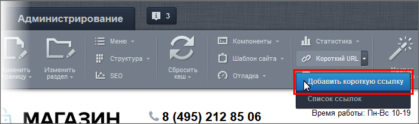
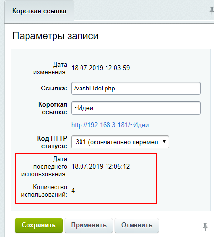

# Короткие ссылки

**Навигация**
- [← Оглавление курса](index.md)
- [← Предыдущий: 3579 — Человеко-понятные URL](lesson_3579.md)
- [Следующий: 1879 — Включаемые области →](lesson_1879.md)

Официальная страница урока: https://dev.1c-bitrix.ru/learning/course/index.php?COURSE_ID=34&LESSON_ID=3080

Адреса страниц бывают очень

			длинными

                    Например: http://ваш_сайт.ru/catalog/sportswear/sports-suit-evening-activities/

		. Их сложно запомнить, они не влезают в короткие сообщения Твиттера и неудобны ещё в ряде случаев. Вот если бы адрес был http://ваш_сайт.ru/~Вечерний спорт... Для решения этих проблем используйте полезный функционал *"1С-Битрикс: Управление сайтом"* - **Короткие ссылки**. Этот инструмент создаст ссылку с одним единственным

			слешем

                    Слеш - косая черта, которая используется для разделения слов в адресе сайта

		 после домена. Адрес после слеша вы задаёте сами.

> **Короткая ссылка** – функционал, позволяющий
>
> 			изменить вид
>
>
>
>                     То есть ссылка вида:
>  http://dev.1c-bitrix.ru/learning/course/index.php?COURSE_ID=34&CHAPTER_ID=637
> может выглядеть как http://dev.1c-bitrix.ru/Эрмитаж.
>
>
>
> 		 адреса любой страницы в рамках
>
> 			домена сайта
>
>
>
>                     Домен сайта - адрес по которому открывается самая главная страница. Например: yandex.ru
>
>
>
> 		.

### Видеоурок

### Несложный способ создания короткой ссылки

Для создания короткой ссылки перейдите на страницу, для которой вы хотите создать новый адрес. Нажмите на

			Панели управления

                    На Панели управления собраны все команды, которые доступны контент-менеджеру при работе с сайтом. [Подробнее](lesson_1831.md)...

		 кнопку

			Добавить короткую ссылку

                    

		. Откроется форма настройки ссылки:

В полях формы:

- **Ссылка** - сюда система автоматически добавит реальный адрес страницы. Адрес не меняем.
- **Короткая ссылка** - укажите тот
  			текст
                      Система автоматически предложит вариант короткой ссылки из набора случайных знаков в котором на первом месте стоит знак **~** (тильда). Этот знак - отличие **Короткой ссылки** от других адресов. Использование тильды не обязательно, но **рекомендуется**. Например, заменим **~AzUSE** на **~Вечерний спорт**.
  		, который вы хотите видеть после слеша в адресе страницы.
- **Код HTTP статуса** - выбор конкретного
  			статуса
                      Доступно два варианта статусов:
  1. **301 (окончательно перемещено)** - используется, когда запрашиваемый URL перемещен на новое место и необходимо перенаправить на новый URL. Иначе при открытии старого URL, отобразится страница с кодом ошибки 404. Пример: товара нет в наличии и пополнения не планируется, можно настроить 301 редирект на аналогичную модель.
  2. **302 (временно перемещено)** - это временное перенаправление на другой адрес. Означает, что ресурс временно находится где-то в другом месте, и клиент/браузер должен продолжать запрашивать исходный URL. Пример: организация перенаправления. если товара временно нет в наличии.
  Выбор статуса рекомендуется согласовывать с SEO-специалистом.
  		 для конкретной страницы рекомендуется согласовывать с SEO-специалистом. Если не уверены в выборе статуса - оставьте то, что поставит система.

Результат: ссылка http://ваш_сайт.ru/~Вечерний спорт вместо http://ваш_сайт.ru/catalog/sportswear/sports-suit-evening-activities/. Эту ссылку легко запомнить и сообщить кому-то.

**Примечание**: Технически **Короткая ссылка** - это просто

			редирект

                    Редирект - пересылка с одного адреса на другой.

		 адреса. При её использовании вы попадёте на нужную страницу, но в адресной строке браузера останется **реальный адрес** страницы.

### Где хранится Список ссылок

Для просмотра списка созданных коротких ссылок воспользуйтесь кнопкой **Список ссылок** на Панели управления. Вы попадёте на страницу Настройки &gt; Настройки продукта &gt; Обработка адресов &gt; Короткие ссылки в

			административном разделе

                    **Административный раздел** - раздел системы, недоступный для просмотра обычным посетителям сайта. В нём производятся настройки сайта и системы для работы. У контент-менеджера есть к нему доступ, но работать там не рекомендуется. [Подробнее...](https://dev.1c-bitrix.ru/learning/course/index.php?COURSE_ID=34&CHAPTER_ID=04459&LESSON_PATH=3905.4455.4459)

		. Доступно изменение имеющихся ссылок и создание новых (аналогично работе со

			списком элементов

                    **Список элементов** - универсальный для "1С-Битрикс: Управление сайтом" способ представления списка элементов чего-либо (файлов, элементов инфоблока, товаров каталога) в Административном разделе.
[Подробнее](https://dev.1c-bitrix.ru/learning/course/index.php?COURSE_ID=34&CHAPTER_ID=01840&LESSON_PATH=3905.4455.4459.1840)...

		).

Также по каждой ссылке доступна

			информация

                    

		 о **количестве использований** и **дате последнего использования**.

### Важно запомнить!

- Короткие ссылки могут не работать, если на главной странице сайта используется какой-либо комплексный компонент.
- Короткая ссылка не заменяет реальный адрес страницы. Технически - это просто редирект внутри системы.
- В Короткой ссылке рекомендуется использовать знак тильда: `~`.

|  | #### Заключение |
| --- | --- |

Вы познакомились с удобным и полезным функционалом *"1С-Битрикс: Управление сайтом"* - **Короткими ссылками**, и способом их создания.
