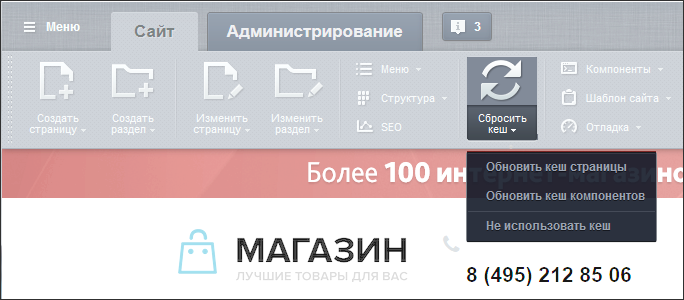
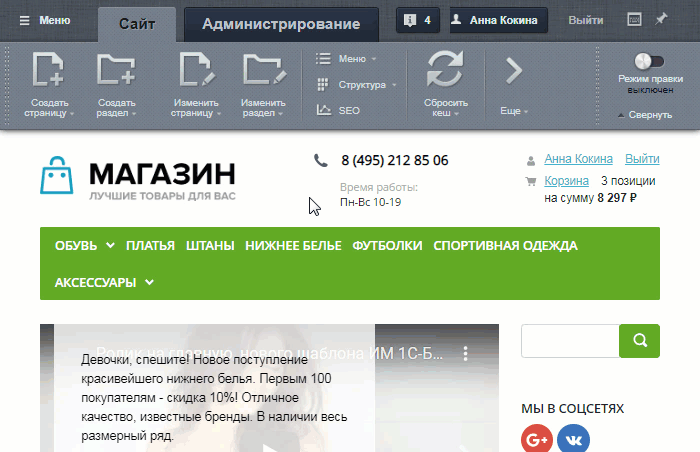

# Кеш, документооборот и информация

**Навигация**
- [← Оглавление курса](index.md)
- [← Предыдущий: 8595 — Примеры работы прав доступа](lesson_8595.md)
- [Следующий: 12838 — Как формируются ссылки →](lesson_12838.md)

Официальная страница урока: https://dev.1c-bitrix.ru/learning/course/index.php?COURSE_ID=34&LESSON_ID=3270

Вы отредактировали страницу сайта, элемент инфоблока, но открыв их с публичной части изменения не отобразились? Не паникуйте, скорее всего причина этого - технологии кеширования или документооборот.

### Что же такое кеширование?

Если страница открывается долго, это нервирует. Причин такого небыстрого отображения много. Часто это – высокая нагрузка на сервер, где расположен сайт. Если сайт пользуется популярностью и на него заходит много посетителей, то у сервера в обработке запросов посетителей возникают сложности. Один из способов избежать это – технология кеширования.

> **Кеширование** – технология, позволяющая выводить на сайте информацию не путём программной обработки, а из специального хранилища. Другими словами, виртуальная страница, созданная один раз сайтом, не пропадает после того, как с неё ушёл пользователь, а сохраняется в виде файла. При повторном заходе посетителя на эту страницу сервер не создаёт её заново, а показывает сохранённый вариант.

На самом деле всё немного сложнее, чем описано в определении, но для начального понятия о кешировании этого достаточно.

На сайтах, созданных на "1С-Битрикс: Управление сайтом", применяется несколько типов технологий кеширования. При желании узнать больше почитайте об этих технологиях

			подробнее

                    Система Bitrix Framework включают в себя разные технологии кеширования:

Кеширование компонентов и меню,

Неуправляемое и управляемое кеширование,

HTML кеш.

[Подробнее ...](https://dev.1c-bitrix.ru/learning/course/index.php?COURSE_ID=35&CHAPTER_ID=02129&LESSON_PATH=3906.6663.2129)

		.

Работа кеширования для Контент-менеджера, как правило, отображается в виде той неприятной ситуации, с которой мы начали описание. Неотображённые изменения бывают как в тексте самой страницы, так и изменения в настройках

			компонента

**Компонент** – это программный код, оформленный в визуальную оболочку, выполняющий определённую функцию какого-либо модуля по выводу данных в Публичной части.

[Подробнее](lesson_1992.md)...

		. В обоих случаях решение проблемы одинаковое – сбросить кеш.

### Видеоурок

### Кеширование и работа Контент-менеджера

Есть разные уровни сброса кеша. Это связано с тем, что на странице, как правило, используются компоненты, в которых можно задать собственные параметры обновления кеша.

Физический смысл этого действия – это удаление из хранилища кеша файла той страницы, которую вы отредактировали. Для удаления не ищите этот файл в файловой системе, просто воспользуйтесь специальной командой. Для этого:

1. Включите
  			режим Правки
                      Режим Правки - специальный режим работы "1С-Битрикс: Управление сайтом", в котором
  происходит изменение информации на сайте.
  
  [Подробнее...](lesson_1832.md)
  		.
2. С помощью кнопки **Сбросить кеш** сбросьте кеш либо страницы, либо компонентов, в зависимости от того, что вы меняли.
  

**Примечание**: Обновление кеша всех компонентов, использованных на текущей странице, доступно только при включенном режиме Правки. Иначе доступно только

			обновление

		 закешированных данных самой страницы, без компонентов. Пример ситуации, когда нужно выполнить обновление кеша всех компонентов, будет рассмотрен позже в уроке [Каталог товаров на простых компонентах](lesson_7250.md).

Команда **Не использовать кеш** не рекомендуется, так как это может плохо сказаться на работе сайта, если кеш не используется на большом числе страниц.

Существует так же автоматическое обновление кеша компонентов. Для этого нужно будет настроить [соответствующие параметры](lesson_9165.md#cache) компонента.

### Документооборот

Документооборот тоже может дать описанную в начале проблему. Но о работе через документооборот обычно предупреждает администратор сайта и рассказывает весь порядок работы.

> **Документооборот** - последовательность движения страницы или элемента инфоблока от момента создания (или редактирования) до момента публикации с обязательным ведением истории изменений и сохранением копий документов на каждом из этапов.

Пример работы через документооборот описан

			здесь

                    Документооборот - полезная функция, если требуется организовать процесс создания, наполнения и публикации страниц с контролем со стороны заказчика или администратора сайта.

[Подробнее ...](lesson_3447.md)

		. Подробнее о работе модуля Документооборот читайте

			здесь

                    Модуль позволяет:

    Организовать поэтапную работу над документами с помощью статусов.

    Вести историю изменений.

    Сохранять копии документов на каждом из этапов.

[Подробнее ...](https://dev.1c-bitrix.ru/learning/course/index.php?COURSE_ID=41&CHAPTER_ID=04548)

		.
